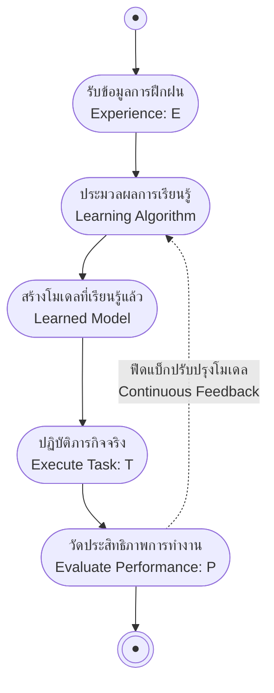

# ภาพรวมและการกำหนดปัญหาการเรียนรู้ (Introduction & Well-Posed Learning Problems)

arrow_back กลับไปที่ [[Week01-MOC|MOC สัปดาห์ 01]]

## key Keyword

- **Machine Learning (ML)** — การพัฒนาโปรแกรมคอมพิวเตอร์ที่สามารถเพิ่มพูนความสามารถในการทำงานจากประสบการณ์หรือข้อมูลโดยไม่ต้องเขียนกฎตายตัว
- **Well-Posed Learning Problem** — ปัญหาการเรียนรู้ที่มีการกำหนดกรอบชัดเจน 3 องค์ประกอบหลัก ได้แก่ Task ($T$), Performance Measure ($P$) และ Experience ($E$)
- **Task ($T$)** — ประเภทหรือลักษณะของงานที่ระบบต้องดำเนินการแก้ปัญหา
- **Performance Measure ($P$)** — มาตรวัดเชิงปริมาณที่ใช้ประเมินประสิทธิภาพหรือคุณภาพการทำงานของระบบ
- **Training Experience ($E$)** — ข้อมูลหรือประสบการณ์ในอดีตที่ระบบนำมาใช้เพื่อปรับปรุงความสามารถ

## menu_book Theory (เข้าใจง่าย)

### 1. นิยามของการเรียนรู้ของเครื่อง (Definitions of Machine Learning)

การเรียนรู้ของเครื่องสามารถนิยามได้ 2 ระดับ:

1. **นิยามอย่างไม่เป็นทางการ (Informal Definition):**  
   โปรแกรมคอมพิวเตอร์ใดก็ตามที่สามารถปรับปรุงประสิทธิภาพ (Performance) ในการทำภารกิจใดภารกิจหนึ่งให้ดีขึ้นได้โดยอาศัยประสบการณ์ (Experience) และ/หรือข้อมูล (Data)
2. **นิยามเชิงรูปนัยของ Tom M. Mitchell (Formal Definition):**  
   > "โปรแกรมคอมพิวเตอร์จะถือว่าเกิดการเรียนรู้จากประสบการณ์ $E$ ที่สัมพันธ์กับคลาสของงาน $T$ และมาตรวัดประสิทธิภาพ $P$ ก็ต่อเมื่อ ประสิทธิภาพในการทำงาน $T$ ซึ่งวัดโดย $P$ นั้น ได้รับการปรับปรุงให้ดีขึ้นจากประสบการณ์ $E$"

### 2. ทำไมและเมื่อไหร่ที่ควรใช้ Machine Learning?

- **เหตุผลที่ควรใช้ (Why ML?):**
  - **ลดภาระของมนุษย์ (Easier for us):** เขียนอัลกอริทึมการเรียนรู้เพียงครั้งเดียว และปล่อยให้คอมพิวเตอร์เรียนรู้รายละเอียดและโครงสร้างความสัมพันธ์จากข้อมูลเอง ไม่จำเป็นต้องรู้กฎทั้งหมดล่วงหน้า
  - **เพิ่มประสิทธิภาพ (Better Performance):** มนุษย์มักมีอคติ (Biases) ในการตัดสินใจและข้อจำกัดในการประมวลผลข้อมูลหลายมิติ อัลกอริทึม ML สามารถค้นหารูปแบบที่ซับซ้อนในข้อมูลขนาดใหญ่ได้อย่างเป็นกลางและแม่นยำกว่า
- **สถานการณ์ที่เหมาะกับการใช้ ML (When to use ML?):**
  - เมื่อเราไม่มีความรู้หรือทฤษฎีที่ชัดเจนเกี่ยวกับปัญหานั้น (Don't know much about the problem)
  - เมื่อมีข้อมูลเชิงประจักษ์ปริมาณมาก (A lot of empirical data)
  - เมื่อการเขียนกฎด้วยตนเอง (Manual Rules) ซับซ้อนเกินกว่าจะดูแลรักษาได้

### 3. การกำหนดกรอบ Well-Posed Learning Problems ($T, P, E$)

การจะแก้ปัญหาด้วย Machine Learning ได้อย่างมีประสิทธิภาพ เราต้องแปลงโจทย์ทั่วไปให้อยู่ในรูป **Well-Posed Learning Problem** โดยระบุองค์ประกอบ $T, P, E$ ให้ชัดเจน:

| ปัญหาการเรียนรู้                                  | Task ($T$)                                          | Performance ($P$)                                                                | Experience ($E$)                                                          |
| :------------------------------------------------ | :-------------------------------------------------- | :------------------------------------------------------------------------------- | :------------------------------------------------------------------------ |
| **ระบบรู้จำลายมือ (Handwriting Recognition)**     | จำแนกและอ่านคำที่เขียนด้วยลายมือจากรูปภาพ           | อัตราร้อยละของคำที่จำแนกถูกต้อง (% of words correctly classified)                | ฐานข้อมูลภาพคำที่เขียนด้วยลายมือพร้อมป้ายกำกับเฉลย (Database with labels) |
| **ระบบขับเคลื่อนรถยนต์อัตโนมัติ (Robot Driving)** | ขับขี่บนทางหลวงสาธารณะโดยใช้กล้องและเซ็นเซอร์รับภาพ | ระยะทางเฉลี่ยที่เดินทางได้ก่อนเกิดข้อผิดพลาด (Average distance before error)     | ลำดับภาพและคำสั่งควบคุมพวงมาลัยที่บันทึกจากการขับขี่ของมนุษย์             |
| **ระบบเล่นหมากฮอส (Checkers Learning)**           | เล่นเกมกระดานหมากฮอสตามกฎกติกา                      | อัตราร้อยละของเกมที่ชนะในการแข่งขันระดับโลก (% of games won in world tournament) | ประสบการณ์จากการเล่นแข่งกับตนเอง (Self-play games)                        |

> [!tip] เคล็ดลับการจำและวิเคราะห์โจทย์สอบ
> เมื่อเจอโจทย์ถามหา $T, P, E$:
> 1. **$T$** ต้องเป็น "กริยา/งาน" ที่โมเดลต้องทำตอนนำไปรันจริง (Inference phase)
> 2. **$P$** ต้องเป็น "ตัวเลขหรือเปอร์เซ็นต์" ที่วัดผลสำเร็จได้อย่างเป็นรูปธรรม (Metric)
> 3. **$E$** ต้องเป็น "แหล่งข้อมูลหรือประวัติ" ที่ใช้ตอนเทรนโมเดล (Training phase)

## schema Diagram

**ตัวอย่าง:** ในระบบเล่นหมากฮอส การเล่นแข่งกับตัวเอง ($E$) ส่งผลให้ Learner ปรับปรุงฟังก์ชันประเมินตาเดิน เมื่อนำโมเดลไปแข่งขันในทัวร์นาเมนต์ ($T$) สัดส่วนการชนะ ($P$) จะสูงขึ้นเรื่อย ๆ

---
arrow_forward ต่อไป: [[02-Designing-a-Learning-System]]
