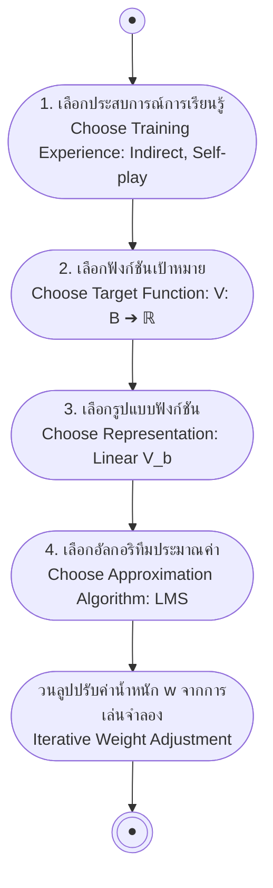

# การออกแบบระบบการเรียนรู้ (Designing a Learning System)

arrow_back กลับไปที่ [[Week01-MOC|MOC สัปดาห์ 01]] | ก่อนหน้า: [[01-Introduction-and-Well-Posed-Learning-Problems]]

## key Keyword

- **Target Function ($V$)** — ฟังก์ชันเป้าหมายที่แท้จริงในอุดมคติที่ต้องการให้ระบบเรียนรู้ เพื่อใช้ตัดสินใจแก้ปัญหา
- **Hypothesis ($\hat{V}$ or $V'$)** — ฟังก์ชันประมาณการที่โปรแกรมเรียนรู้ขึ้นมาได้จริงในปัจจุบัน
- **Direct vs Indirect Experience** — ประสบการณ์แบบตรงที่เฉลยตาเดินที่ดีที่สุดในแต่ละตา เปรียบเทียบกับแบบอ้อมที่ให้เฉพาะผลลัพธ์แพ้/ชนะเมื่อจบเกม
- **Credit Assignment Problem** — ความท้าทายในการระบุว่าตาเดินใดในบรรดาตาเดินนับร้อยตาที่เป็นปัจจัยสำคัญทำให้ชนะหรือแพ้เกม
- **Function Representation** — รูปแบบโครงสร้างทางคณิตศาสตร์ที่ใช้แทนฟังก์ชันเป้าหมาย เช่น ฟังก์ชันเชิงเส้น ตาราง หรือโครงข่ายประสาทเทียม

## menu_book Theory (เข้าใจง่าย)

กระบวนการออกแบบระบบ Machine Learning ตามแนวทางคลาสสิกของ Tom Mitchell มี 4 ขั้นตอนหลักที่ต้องตัดสินใจอย่างเป็นระบบ โดยใช้กรณีศึกษา **"ระบบเรียนรู้การเล่นหมากฮอส (Checkers Learning System)"**:

### ขั้นตอนที่ 1: การเลือกประสบการณ์การฝึกฝน (Choose Training Experience)

1. **Direct vs Indirect Feedback:**
   - **Direct Experience:** มีผู้เชี่ยวชาญหรืออาจารย์คอยกำกับบอกว่าในกระดานนี้ ตาเดินที่ถูกต้องคืออะไร ($Board\ State \to Move$) เหมาะกับ Supervised Learning เรียนรู้ง่าย
   - **Indirect Experience:** รู้เพียงผลลัพธ์สุดท้ายเมื่อจบเกมว่าแพ้ ชนะ หรือเสมอ ผู้เรียนต้องแก้ไขปัญหา **Credit Assignment Problem** เองว่าตาเดินใดก่อนหน้านี้มีส่วนช่วยให้ชนะ
2. **ระดับการควบคุมสภาพแวดล้อม (Degree of Control):**
   - มีผู้สอนคัดเลือกสถานะกระดานมาให้ฝึก (Teacher-driven)
   - โปรแกรมสามารถสุ่มหรือเลือกทดลองสถานะกระดานด้วยตนเอง (Learner-driven / Active learning)
3. **ความสอดคล้องกับเป้าหมาย (Representativeness):**
   - ประสบการณ์ที่ใช้เทรนมีความใกล้เคียงกับสถานการณ์จริงเพียงใด เช่น หากเทรนโดยเล่นกับตนเอง (Self-play) แต่ออกไปแข่งขันกับแชมป์โลก อาจเกิดปัญหาข้อมูลไม่ครอบคลุมกลยุทธ์ของคู่แข่ง

### ขั้นตอนที่ 2: การเลือกฟังก์ชันเป้าหมาย (Choose Target Function)

การกำหนดว่าระบบต้องเรียนรู้ฟังก์ชันคณิตศาสตร์อะไรเพื่อใช้เล่นเกม:

- **ทางเลือก A: $ChooseMove: B \to M$**  
  รับกระดาน $B$ แล้วให้ผลลัพธ์เป็นตาเดินที่ถูกต้อง $M$ ทางเลือกนี้เรียนรู้ยากมากหากไม่มี Direct Feedback จากผู้สอน
- **ทางเลือก B: $Evaluate: B \to \mathbb{R}$ (กำหนดฟังก์ชันมูลค่ากระดาน $V(b)$)**  
  ประเมินสถานะกระดานใด ๆ ให้เป็นตัวเลขคะแนนเชิงปริมาณ ยิ่งสถานะได้เปรียบยิ่งได้คะแนนสูง จากนั้นเวลาเล่นจริงจะจำลองตาเดินที่เป็นไปได้ทั้งหมด แล้วเลือกตาเดินที่นำไปสู่สถานะที่มีคะแนนสูงสุด ($V$)

#### การกำหนดค่าของฟังก์ชันเป้าหมาย $V(b)$ ตามสไลด์ (มุมมองฝ่ายน้ำเงิน):
- ถ้า $b$ เป็นกระดานสุดท้ายที่ฝ่ายเราชนะ: $V(b) = -100$
- ถ้า $b$ เป็นกระดานสุดท้ายที่ฝ่ายเราแพ้: $V(b) = +100$
- ถ้า $b$ เป็นกระดานสุดท้ายที่เสมอกัน: $V(b) = 0$
- ถ้า $b$ ไม่ใช่กระดานสุดท้าย: $V(b) = V(b')$ โดยที่ $b'$ คือสถานะสุดท้ายที่ดีที่สุดที่สามารถบรรลุได้เมื่อทั้งสองฝ่ายเล่นอย่างดีที่สุด (Optimal Play)

### ขั้นตอนที่ 3: การเลือกรูปแบบแทนฟังก์ชัน (Choose Representation)

ต้องเลือกว่าจะใช้โมเดลโครงสร้างใดในการประมาณค่าฟังก์ชัน $V(b)$ เช่น ตาราง (Table Lookup), กฎเงื่อนไข (Rules), โครงข่ายประสาทเทียม (Neural Networks) หรือฟังก์ชันพหุนาม (Polynomial)

ในกรณีศึกษานี้ เลือกใช้ **ฟังก์ชันเชิงเส้น (Linear Function / Polynomial Degree 1)**:
$$V(b) = w_0 + w_1 rp(b) + w_2 bp(b)$$
โดย:
- $rp(b)$ = จำนวนตัวหมากสีแดง (Red pieces) บนกระดาน $b$
- $bp(b)$ = จำนวนตัวหมากสีน้ำเงิน (Blue pieces) บนกระดาน $b$
- $w_0$ = ค่าคงที่อิสระ (Bias weight)
- $w_1, w_2$ = ค่าน้ำหนักความสำคัญของหมากแต่ละฝ่าย

> [!important] Trade-off ในการเลือก Representation
> - **Expressiveness สูง:** โมเดลซับซ้อน (เช่น Deep Neural Net) ประมาณค่าฟังก์ชันที่ซับซ้อนได้แม่นยำ แต่ต้องใช้ข้อมูลตัวอย่าง ($E$) จำนวนมหาศาล และเสี่ยง Overfitting
> - **Expressiveness ต่ำ:** โมเดลเรียบง่าย (เช่น Linear Model) เรียนรู้เร็ว ใช้ข้อมูลน้อย แต่มีข้อจำกัดในการจับความสัมพันธ์ที่ไม่เป็นเชิงเส้น

### ขั้นตอนที่ 4: การเลือกอัลกอริทึมประมาณค่าฟังก์ชัน (Choose Function Approximation Algorithm)

เมื่อไม่มีค่า $V(b)$ ที่แท้จริงระหว่างเล่นเกม เราจะประมาณค่าตัวอย่างฝึกฝน ($V_{train}(b)$) ด้วยการนำค่าประเมินของกระดานถัดไป ($Successor(b)$) มาเป็นเป้าหมาย:
$$V_{train}(b) \leftarrow \hat{V}(Successor(b))$$

จากนั้นปรับค่าน้ำหนักด้วย **กฎการปรับค่าน้ำหนัก Least Mean Square (LMS):**
1. คำนวณค่าความผิดพลาด (Error):
   $$error(b) = V_{train}(b) - \hat{V}(b) = \hat{V}(Successor(b)) - \hat{V}(b)$$
2. ปรับค่าน้ำหนัก $w_i$ สำหรับแต่ละ Feature $f_i$:
   $$w_i \leftarrow w_i + \eta \cdot f_i \cdot error(b)$$
   โดย $\eta$ (Eta) คืออัตราการเรียนรู้ (Learning Rate เช่น $0.1$) และกำหนดให้ $f_0 = 1$ เสมอสำหรับ Bias weight $w_0$

## schema Diagram

**ตัวอย่าง:** ระบบประเมินหมากฮอสในสไลด์ตัดสินใจเลือก: Experience = Indirect (เล่นกับตัวเอง), Target Function = Evaluate, Representation = Linear Polynomial, Algorithm = LMS

---
arrow_forward ต่อไป: [[03-LMS-Weight-Update-and-Checkers-Example]]
