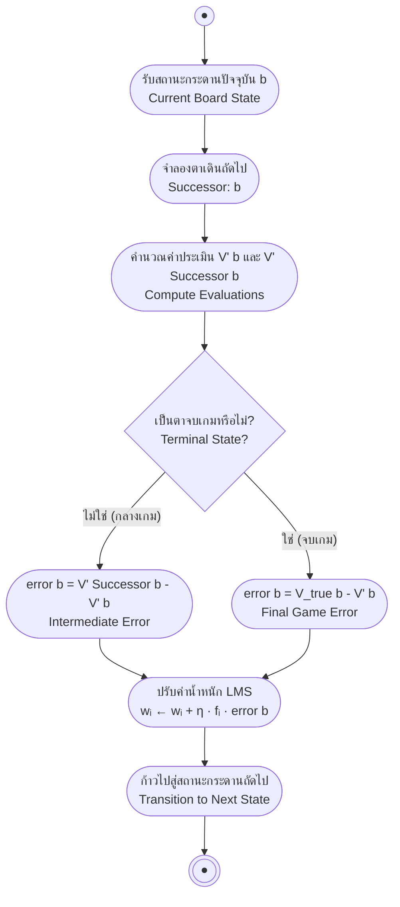

# การปรับค่าน้ำหนักด้วย LMS และตัวอย่างการคำนวณหมากฮอส (LMS Algorithm & Checkers Walkthrough)

arrow_back กลับไปที่ [[Week01-MOC|MOC สัปดาห์ 01]] | ก่อนหน้า: [[02-Designing-a-Learning-System]]

## key Keyword

- **Least Mean Square (LMS) Rule** — กฎการปรับค่าน้ำหนักแบบเกรเดียนต์เพื่อลดค่าความผิดพลาดกำลังสองเฉลี่ยระหว่างค่าจริงกับค่าทำนาย
- **Successor State** — สถานะกระดานถัดไป ($b' = Successor(b)$) ที่เกิดขึ้นหลังจากมีการเดินหมาก
- **Learning Rate ($\eta$)** — ค่าสัมประสิทธิ์ที่ควบคุมขนาดก้าวในการปรับค่าน้ำหนักในแต่ละรอบ (โดยทั่วไปใช้ค่าประมาณ 0.1)
- **Weight Convergence** — การลู่เข้าของค่าน้ำหนักเมื่อโมเดลผ่านการฝึกฝนหลาย ๆ เกม จนกระทั่งค่าความผิดพลาดลดลงใกล้ศูนย์

## menu_book Theory (เข้าใจง่าย)

### 1. กฎการปรับค่าน้ำหนัก LMS (Weight Update Formulation)

ฟังก์ชันการประเมินคะแนนกระดานหมากฮอสเชิงเส้น:
$$\hat{V}(b) = w_0 + w_1 \cdot rp(b) + w_2 \cdot bp(b)$$
โดยที่:
- $rp(b)$ = จำนวนตัวหมากสีแดง (Red pieces)
- $bp(b)$ = จำนวนตัวหมากสีน้ำเงิน (Blue pieces)
- เวกเตอร์คุณลักษณะคือ $\mathbf{f} = [f_0, f_1, f_2] = [1, rp(b), bp(b)]$

#### สูตรการปรับค่าน้ำหนัก:
1. **คำนวณค่าความคลาดเคลื่อน (Error):**
   - สำหรับสถานะทั่วไปที่ไม่ใช่ตอนจบเกม:
     $$error(b) = \hat{V}(Successor(b)) - \hat{V}(b)$$
   - สำหรับสถานะกระดานสุดท้ายตอนจบเกม (Final Board State):
     $$error(b) = V_{true}(b) - \hat{V}(b)$$
2. **ปรับค่าน้ำหนักแต่ละตัว ($w_i$):**
   $$w_i \leftarrow w_i + \eta \cdot f_i \cdot error(b)$$

---

### 2. ตัวอย่างการคำนวณทีละขั้นตอนตามสไลด์ (Step-by-Step Calculation)

กำหนดค่าเริ่มต้น:
- อัตราการเรียนรู้: $\eta = 0.1$
- ค่าน้ำหนักเริ่มต้น: $w_0 = -10,\; w_1 = 75,\; w_2 = -60$
- ฝ่ายเราเล่นตัวหมากสีน้ำเงิน (Blue) โดยเป้าหมายคือต้องการให้ $\hat{V}(b)$ มีค่าติดลบมากที่สุด (ชนะ = $-100$, แพ้ = $+100$)

#### สเต็ปที่ 1: การเปลี่ยนสถานะ $b_0 \to b_1$
- สถานะ $b_0$: $rp(b_0) = 2,\; bp(b_0) = 2$
  $$\hat{V}(b_0) = -10 + (75 \times 2) + (-60 \times 2) = -10 + 150 - 120 = 20$$
- สถานะ $b_1$: $rp(b_1) = 2,\; bp(b_1) = 2 \implies \hat{V}(b_1) = 20$
- คำนวณ Error:
  $$error(b_0) = \hat{V}(b_1) - \hat{V}(b_0) = 20 - 20 = 0$$
- ปรับค่าน้ำหนัก:
  - $w_0 \leftarrow -10 + 0.1(1)(0) = -10$
  - $w_1 \leftarrow 75 + 0.1(2)(0) = 75$
  - $w_2 \leftarrow -60 + 0.1(2)(0) = -60$
  *(ค่าน้ำหนักไม่เปลี่ยนแปลง)*

#### สเต็ปที่ 2: การเปลี่ยนสถานะ $b_3 \to b_4$
- สถานะ $b_3$: $rp(b_3) = 2,\; bp(b_3) = 2 \implies \hat{V}(b_3) = 20$
- สถานะ $b_4$: เกิดความเสียเปรียบหรือสถานะเปลี่ยนไปจนคำนวณได้ $\hat{V}(b_4) = -55$
- คำนวณ Error:
  $$error(b_3) = \hat{V}(b_4) - \hat{V}(b_3) = -55 - 20 = -75$$
- ปรับค่าน้ำหนักจากสถานะ $b_3$ ($f_0 = 1, f_1 = 2, f_2 = 2$):
  - $w_0 \leftarrow -10 + 0.1 \times 1 \times (-75) = -10 - 7.5 = \mathbf{-17.5}$
  - $w_1 \leftarrow 75 + 0.1 \times 2 \times (-75) = 75 - 15 = \mathbf{60}$
  - $w_2 \leftarrow -60 + 0.1 \times 2 \times (-75) = -60 - 15 = \mathbf{-75}$
- ค่าน้ำหนักชุดใหม่: $w_0 = -17.5,\; w_1 = 60,\; w_2 = -75$

#### สเต็ปที่ 3: การเปลี่ยนสถานะ $b_5 \to b_6$
- สถานะ $b_5$: มี $rp(b_5) = 1,\; bp(b_5) = 2 \implies \hat{V}(b_5) = -17.5 + 60(1) - 75(2) = -107.5$
- สถานะ $b_6$: มีการประเมินสถานะถัดไปได้ $\hat{V}(b_6) = -167.5$
- คำนวณ Error:
  $$error(b_5) = \hat{V}(b_6) - \hat{V}(b_5) = -167.5 - (-107.5) = -60$$
- ปรับค่าน้ำหนักจากสถานะ $b_5$ ($f_0 = 1, f_1 = 1, f_2 = 2$):
  - $w_0 \leftarrow -17.5 + 0.1 \times 1 \times (-60) = -17.5 - 6 = \mathbf{-23.5}$
  - $w_1 \leftarrow 60 + 0.1 \times 1 \times (-60) = 60 - 6 = \mathbf{54}$
  - $w_2 \leftarrow -75 + 0.1 \times 2 \times (-60) = -75 - 12 = \mathbf{-87}$
- ค่าน้ำหนักชุดใหม่: $w_0 = -23.5,\; w_1 = 54,\; w_2 = -87$

#### สเต็ปที่ 4: สถานะจบเกม (Final Board State $b_6$)
- สถานะสุดท้าย $b_6$: ฝ่ายสีน้ำเงินเป็นผู้ชนะ (Blue won)
- ค่าจริงตามทฤษฎี: $V_{true}(b_6) = -100$
- สถานะกระดาน $b_6$ มี $rp(b_6) = 0,\; bp(b_6) = 2$
- ค่าประเมินปัจจุบัน:
  $$\hat{V}(b_6) = -23.5 + 54(0) + (-87)(2) = -23.5 - 174 = -197.5$$
- คำนวณ Error:
  $$error(b_6) = V_{true}(b_6) - \hat{V}(b_6) = -100 - (-197.5) = \mathbf{+97.5}$$
- ปรับค่าน้ำหนักครั้งสุดท้ายของเกม ($f_0 = 1, f_1 = 0, f_2 = 2$):
  - $w_0 \leftarrow -23.5 + 0.1 \times 1 \times 97.5 = -23.5 + 9.75 = \mathbf{-13.75}$
  - $w_1 \leftarrow 54 + 0.1 \times 0 \times 97.5 = 54 + 0 = \mathbf{54}$
  - $w_2 \leftarrow -87 + 0.1 \times 2 \times 97.5 = -87 + 19.5 = \mathbf{-67.5}$

> [!important] สรุปผลลัพธ์ของค่าน้ำหนัก
> เมื่อเริ่มฝึกจาก $w = [-10, 75, -60]$ หลังจากผ่านเกมนี้ค่าน้ำหนักปรับตัวเป็น:
> $$w_0 = -13.75,\quad w_1 = 54,\quad w_2 = -67.5$$
> สังเกตว่า $w_2$ มีค่าติดลบมากขึ้น แสดงว่าโมเดลเริ่มให้น้ำหนักว่า "ยิ่งมีตัวหมากสีน้ำเงินมาก ยิ่งนำไปสู่ผลลัพธ์ชัยชนะ (ค่าประเมินติดลบ)"

---

### 3. การนำโมเดลไปทดสอบเล่นจริง (Testing & Inference)

เมื่อนำค่าน้ำหนักที่เรียนรู้แล้วไปเล่นจริง:
1. ให้ฝ่ายตรงข้าม (Red) เดินก่อน
2. เมื่อถึงตาฝ่ายเรา (Blue):
   - สร้างรายการตาเดินที่ถูกกติกาที่เป็นไปได้ทั้งหมด (All legal moves)
   - จำลองสถานะกระดานผลลัพธ์ ($b_{candidate}$) ของแต่ละตาเดิน
   - คำนวณคะแนน $\hat{V}(b_{candidate}) = w_0 + w_1 rp(b) + w_2 bp(b)$
   - **เลือกตาเดินที่ให้คะแนน $\hat{V}$ ต่ำที่สุด** (เนื่องจากค่าน้ำหนักติดลบคือสถานะที่ดีที่สุดของ Blue)

---

### 4. กิจกรรมท้ายบท: การออกแบบ Tic-Tac-Toe (Class Work)

การนำกระบวนการข้างต้นไปประยุกต์กับเกม Tic-Tac-Toe (X-O):
- **Task ($T$):** เล่นเกม Tic-Tac-Toe เพื่อไม่ให้แพ้ใคร (Never lose)
- **Target Function ($V$):** 
  - $V(b) = +100$ เมื่อฝ่ายเราชนะ
  - $V(b) = -100$ เมื่อฝ่ายเราแพ้
  - $V(b) = 0$ เมื่อเสมอกัน
- **Features ที่แนะนำสำหรับ Linear Representation:**
  - $x_1$: จำนวนแถว/หลัก/แนวทแยงที่มีสัญลักษณ์ฝ่ายเรา 2 ตัวและช่องว่าง 1 ช่อง (ตาเดินที่จะชนะ)
  - $x_2$: จำนวนแถว/หลัก/แนวทแยงที่มีสัญลักษณ์คู่ต่อสู้ 2 ตัวและช่องว่าง 1 ช่อง (จุดอันตรายที่ต้องบล็อก)
  - $x_3$: การยึดตำแหน่งจุดศูนย์กลางกระดาน (Center square)
  - $x_4$: การยึดตำแหน่งมุมทั้งสี่ (Corner squares)

## schema Diagram

**ตัวอย่าง:** ผังขั้นตอนการวนลูปปรับค่าน้ำหนัก LMS ในแต่ละตาเดิน โดยสลับสูตร Error ระหว่างตากลางเกมและตาจบเกม

---
arrow_forward กลับไปที่: [[Week01-MOC|MOC สัปดาห์ 01]]
