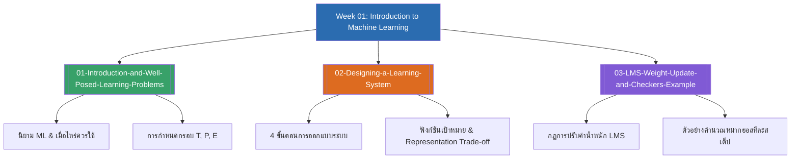

# Week 01 — Introduction to Machine Learning (MOC)

<!-- สัปดาห์แรกของรายวิชา (ไม่มีสัปดาห์ก่อนหน้า) -->

## check_circle เช็คลิสต์ก่อนเข้าเรียน

- [ ] ทำความเข้าใจความแตกต่างระหว่างการเขียนโปรแกรมแบบดั้งเดิม (Rule-based) กับ Machine Learning — ดู [[01-Introduction-and-Well-Posed-Learning-Problems]]
- [ ] ฝึกจำแนกและระบุองค์ประกอบ $T, P, E$ จากโจทย์ปัญหาจริง — ดู [[01-Introduction-and-Well-Posed-Learning-Problems]]
- [ ] ทบทวนแนวคิด 4 ขั้นตอนการออกแบบระบบการเรียนรู้ (Mitchell's Framework) — ดู [[02-Designing-a-Learning-System]]
- [ ] เตรียมความพร้อมเรื่องแคลคูลัสพื้นฐานและการปรับค่าน้ำหนักเกรเดียนต์ (LMS Algorithm) — ดู [[03-LMS-Weight-Update-and-Checkers-Example]]

## assignment ภาพรวมสัปดาห์ 01 (สรุปย่อ)

สัปดาห์แรกเป็นการปูพื้นฐานแนวคิดสำคัญที่สุดของการเรียนรู้ของเครื่อง (Machine Learning Foundation):
1. **นิยามและการกำหนดกรอบปัญหา (Well-Posed Learning Problems):** นิยามตามทฤษฎีของ Tom M. Mitchell ที่ระบุว่าการเรียนรู้ต้องวัดผลได้ผ่าน 3 เสาหลัก คือ Task ($T$), Performance Measure ($P$), และ Training Experience ($E$)
2. **พิมพ์เขียวการออกแบบระบบการเรียนรู้ (Designing a Learning System):** เจาะลึก 4 การตัดสินใจเชิงวิศวกรรม ได้แก่ การเลือกประสบการณ์ (Direct vs Indirect), การเลือกฟังก์ชันเป้าหมาย ($ChooseMove$ vs $Evaluate$), การเลือกรูปแบบแทนฟังก์ชัน (Linear Representation), และการเลือกอัลกอริทึมประมาณค่า (LMS Rule)
3. **การทำงานเชิงปฏิบัติและการคำนวณจริง (LMS Walkthrough):** การแกะรอยการคำนวณปรับค่าน้ำหนักหมากฮอส ($w_0, w_1, w_2$) ทีละสถานะ ($b_0 \to b_1 \to b_3 \to b_4 \to b_5 \to b_6$) จนกระทั่งจบเกม พร้อมแนวทางการประยุกต์ใช้กับเกม Tic-Tac-Toe

## map แผนที่หัวข้อสัปดาห์ 01

## collections_bookmark โน้ตรายหัวข้อ

| หัวข้อ | เนื้อหาหลัก | หน้าสไลด์ |
| :--- | :--- | :--- |
| [[01-Introduction-and-Well-Posed-Learning-Problems]] | นิยามทางการของ ML, ทำไม/เมื่อไหร่ที่ควรใช้ ML, โครงสร้าง Well-Posed Problems ($T, P, E$) พร้อมตัวอย่างจริง | สไลด์ 1–10 |
| [[02-Designing-a-Learning-System]] | สถาปัตยกรรมการออกแบบ 4 ขั้นตอน, Direct vs Indirect Experience, ฟังก์ชันเป้าหมาย $V(b)$, Linear Representation และ Trade-off | สไลด์ 11–26 |
| [[03-LMS-Weight-Update-and-Checkers-Example]] | กฎ Least Mean Square (LMS), การแกะรอยคำนวณค่าน้ำหนัก $w_0, w_1, w_2$ สดทีละกระดาน, การทดสอบโมเดล, และโจทย์ Tic-Tac-Toe | สไลด์ 27–35 |

> [!tip] เคล็ดลับการเตรียมสอบสัปดาห์ที่ 01
> ข้อสอบกลางภาคมักออก 2 ประเด็นหลักเสมอ:
> 1. **การเขียนแจกแจง $T, P, E$:** ระวังอย่าเขียน $T$ และ $P$ สลับกัน ($T$ คืองานที่ทำ ส่วน $P$ คือตัวชี้วัดที่เป็นเกณฑ์ประเมิน)
> 2. **การคำนวณปรับค่าน้ำหนัก LMS:** ต้องเช็คเครื่องหมาย Error ให้ดีว่านำสถานะใดลบด้วยสถานะใด ($V_{train}(b) - \hat{V}(b)$) และอย่าลืมว่าค่า Bias $w_0$ จะมีตัวคูณ $f_0 = 1$ เสมอ

---
arrow_forward สัปดาห์ถัดไป: [[Week02-MOC|MOC สัปดาห์ 02]]
