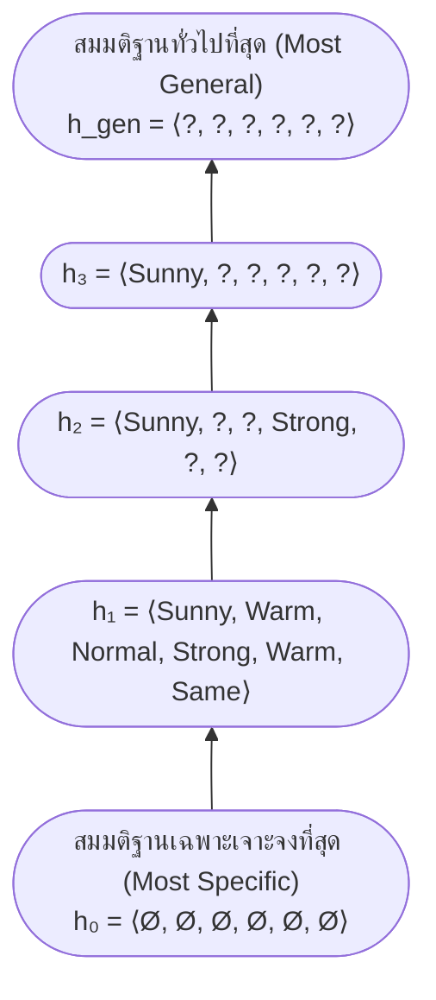

# การเรียนรู้มโนทัศน์และลำดับจากทั่วไปสู่เฉพาะเจาะจง (Concept Learning & General-to-Specific Ordering)

arrow_back กลับไปที่ [[Week02-MOC|MOC สัปดาห์ 02]]

## key Keyword

- **Concept Learning** — การอนุมานฟังก์ชันค่าบูลีน (Boolean-valued function) จากตัวอย่างสอนที่มีป้ายกำกับบวก/ลบ เพื่อหาขอบเขตนิยามของมโนทัศน์นั้น
- **Instance Space ($X$)** — ปริภูมิของอินสแตนซ์หรือตัวอย่างทั้งหมดที่เป็นไปได้ ซึ่งนิยามโดยแอตทริบิวต์ต่าง ๆ
- **Hypothesis Space ($H$)** — ปริภูมิของสมมติฐานทั้งหมดที่ระบบสามารถสร้างขึ้นเพื่อประมาณค่า Target Concept
- **General-to-Specific Ordering ($\ge$)** — ลำดับความสัมพันธ์แบบกึ่งอันดับ (Partial order) บน $H$ โดย $h_j \ge h_k$ หมายถึง $h_j$ มีความทั่วไปมากกว่าหรือเท่ากับ $h_k$
- **Inductive Learning Hypothesis** — สมมติฐานที่เชื่อว่าสมมติฐานใดที่ประมาณค่าฟังก์ชันเป้าหมายได้ดีบนข้อมูลสอน จะประมาณค่าได้ดีบนข้อมูลที่ยังไม่เคยพบเช่นกัน

## menu_book Theory (เข้าใจง่าย)

### 1. ปัญหาการเรียนรู้มโนทัศน์ (Concept Learning Task)

Concept Learning คือการเรียนรู้แบบมีผู้สอน (Supervised Learning) สำหรับโจทย์การจำแนกประเภทแบบสองกลุ่ม (Binary Classification):
- กำหนดให้ฟังก์ชันเป้าหมายคือ $c: X \to \{0, 1\}$ โดย $c(x) = 1$ แทนตัวอย่างบวก (Positive instance) และ $c(x) = 0$ แทนตัวอย่างลบ (Negative instance)
- ระบบได้รับชุดข้อมูลฝึกฝน $D = \{\langle x_1, c(x_1)\rangle, \dots, \langle x_n, c(x_n)\rangle\}$
- เป้าหมายคือการค้นหา Hypothesis $h \in H$ ที่สอดคล้องกับข้อมูล $D$ มากที่สุด ($h(x) = c(x)$ สำหรับทุก $x \in D$)

#### ตัวอย่างมโนทัศน์ "Enjoy Sport":
พิจารณาว่าเพื่อน (Aldo) จะไปเล่นกีฬาทางน้ำหรือไม่ จาก 6 แอตทริบิวต์:
1. `Sky` $\in$ {Sunny, Cloudy, Rainy} (3 ค่า)
2. `AirTemp` $\in$ {Warm, Cold} (2 ค่า)
3. `Humidity` $\in$ {Normal, High} (2 ค่า)
4. `Wind` $\in$ {Strong, Weak} (2 ค่า)
5. `Water` $\in$ {Warm, Cool} (2 ค่า)
6. `Forecast` $\in$ {Same, Change} (2 ค่า)

---

### 2. การคำนวณขนาดของ Instance Space และ Hypothesis Space

การวิเคราะห์เชิงการจัด (Combinatorics) ของปริภูมิมักเป็นข้อสอบข้อเขียนที่พบบ่อย:

1. **จำนวน Instance ทั้งหมด ($|X|$):**
   $$|X| = 3 \times 2 \times 2 \times 2 \times 2 \times 2 = 96 \text{ instances}$$
2. **จำนวน Concept ที่เป็นไปได้ทั้งหมด ($|C|$):**
   เนื่องจากแต่ละ instance สามารถให้ผลลัพธ์เป็น 0 หรือ 1 ได้อย่างอิสระ:
   $$|C| = 2^{|X|} = 2^{96} \approx 7.92 \times 10^{28} \text{ concepts}$$
3. **จำนวน Syntactically Distinct Hypotheses ($|H_{syntax}|$):**
   ในการแทนสมมติฐานแบบ Conjunction แต่ละแอตทริบิวต์สามารถใส่ได้:
   - ค่าเจาะจงตามโดเมน
   - เครื่องหมาย `?` (Don't care / ค่าใดก็ได้)
   - เครื่องหมาย `Ø` (Null / ห้ามมีค่าใดเลย)
   ดังนั้น:
   $$|H_{syntax}| = (3+2) \times (2+2) \times (2+2) \times (2+2) \times (2+2) \times (2+2) = 5 \times 4^5 = 5,120$$
4. **จำนวน Semantically Distinct Hypotheses ($|H_{semantic}|$):**
   สมมติฐานใดก็ตามที่มี `Ø` แม้แต่ตำแหน่งเดียว จะไม่ยอมรับอินสแตนซ์ใดเลย ($h(x) = 0$ สำหรับทุก $x$) ซึ่งทั้งหมดมีความหมายเทียบเท่ากันเป็น 1 คอนเซปต์ว่างเปล่า:
   $$|H_{semantic}| = 1 + (3+1) \times (2+1)^5 = 1 + 4 \times 3^5 = 1 + 972 = 973$$

---

### 3. ลำดับจากทั่วไปสู่เฉพาะเจาะจง (General-to-Specific Ordering)

กำหนดให้ $h_j$ และ $h_k$ เป็นฟังก์ชันค่าบูลีนบน $X$:
$$h_j \ge h_k \iff \forall x \in X: (h_k(x) = 1 \implies h_j(x) = 1)$$
- อ่านว่า: **"$h_j$ ทั่วไปมากกว่าหรือเท่ากับ $h_k$"**
- ความหมายคือ เซตของอินสแตนซ์ที่ $h_j$ ครอบคลุม เป็นซุปเปอร์เซตของอินสแตนซ์ที่ $h_k$ ครอบคลุม

#### ตัวอย่างเปรียบเทียบ:
- $h_1 = \langle Sunny, ?, ?, Strong, ?, ? \rangle$
- $h_2 = \langle Sunny, ?, ?, ?, ?, ? \rangle$
- จะเห็นว่า $h_2$ มีข้อจำกัด (Constraints) น้อยกว่า $h_1$ ดังนั้นทุกอินสแตนซ์ที่ $h_1$ มองเป็นบวก $h_2$ ย่อมมองเป็นบวกด้วย $\implies h_2 \ge h_1$ ($h_2$ ทั่วไปกว่า $h_1$)

## schema Diagram

**ตัวอย่าง:** ผังลำดับความเป็น General-to-Specific โดยล่างสุดไม่ยอมรับตัวอย่างใดเลย และบนสุดยอมรับทุกตัวอย่างในโลก

---
arrow_forward ต่อไป: [[02-Find-S-Algorithm]]
