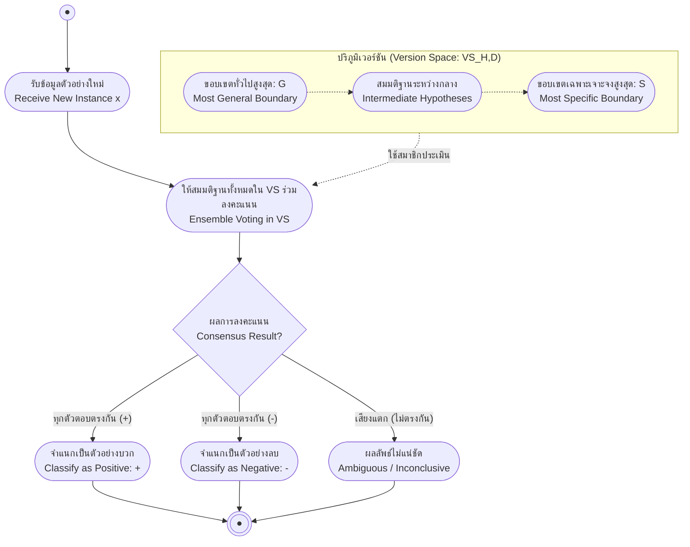

# อัลกอริทึม Candidate Elimination และอคติในการอุปนัย (Candidate Elimination & Inductive Bias)

arrow_back กลับไปที่ [[Week02-MOC|MOC สัปดาห์ 02]] | ก่อนหน้า: [[02-Find-S-Algorithm]]

## key Keyword

- **Version Space ($VS_{H,D}$)** — เซตย่อยของสมมติฐานทั้งหมดใน $H$ ที่สอดคล้องอย่างสมบูรณ์ (Consistent) กับข้อมูลฝึกฝน $D$ ทุกตัวอย่าง
- **Specific Boundary ($S$)** — เซตของสมมติฐานที่มีความเฉพาะเจาะจงสูงสุดใน Version Space
- **General Boundary ($G$)** — เซตของสมมติฐานที่มีความครอบคลุมทั่วไปสูงสุดใน Version Space
- **Candidate Elimination Algorithm** — อัลกอริทึมที่ปรับบีบขอบเขต $S$ และ $G$ เข้าหากันเมื่อป้อนข้อมูลบวกและลบ
- **Inductive Bias** — ข้อสมมติฐานเบื้องต้นที่อัลกอริทึมใช้เพิ่มเติมจากข้อมูล เพื่อให้สามารถอนุมานทำนายข้อมูลตัวอย่างใหม่ได้

## menu_book Theory (เข้าใจง่าย)

### 1. โครงสร้างของ Version Space ($S$ และ $G$ Boundaries)

สมมติฐาน $h$ จะถือว่า **Consistent** กับชุดข้อมูล $D$ ก็ต่อเมื่อ:
$$Consistent(h, D) \iff \forall \langle x, c(x) \rangle \in D: h(x) = c(x)$$

Version Space ถูกกำหนดขอบเขตด้วย 2 ขอบเขตหลัก:
$$VS_{H,D} = \{h \in H \mid (\exists s \in S)(\exists g \in G) : g \ge h \ge s\}$$
- **$G$ (General Boundary):** ควบคุมไม่ให้สมมติฐานกว้างจนไปครอบคลุมตัวอย่างลบ (Negative Examples)
- **$S$ (Specific Boundary):** ควบคุมไม่ให้สมมติฐานแคบจนตกหล่นตัวอย่างบวก (Positive Examples)

---

### 2. กลไก Candidate Elimination Algorithm

1. **เริ่มต้น:**
   $$G_0 = \{\langle ?, ?, ?, ?, ?, ? \rangle\},\quad S_0 = \{\langle \varnothing, \varnothing, \varnothing, \varnothing, \varnothing, \varnothing \rangle\}$$
2. **เมื่อพบตัวอย่างบวก ($d = \langle x, + \rangle$):**
   - ลบ $g \in G$ ที่ไม่สอดคล้องกับ $d$ ออก
   - ปรับขยาย $s \in S$ ที่ไม่สอดคล้องกับ $d$ ให้ทั่วไปขึ้นขั้นต่ำสุด (Minimal Generalization) ให้ครอบคลุม $d$ โดยต้องคงความเป็นสับเซตของสมาชิกใน $G$
3. **เมื่อพบตัวอย่างลบ ($d = \langle x, - \rangle$):**
   - ลบ $s \in S$ ที่ไม่สอดคล้องกับ $d$ ออก (ที่ไปเผลอทำนายเป็น $+$)
   - ปรับจำกัด $g \in G$ ที่ไม่สอดคล้องกับ $d$ ให้เฉพาะเจาะจงขึ้นขั้นต่ำสุด (Minimal Specialization) เพื่อปฏิเสธ $d$ โดยต้องคงความเป็นซุปเปอร์เซตของสมาชิกใน $S$

---

### 3. การแกะรอยการทำงานทีละขั้นตอน (Step-by-Step Trace)

- $x_1 = \langle Sunny, Warm, Normal, Strong, Warm, Same \rangle \to \mathbf{+}$
- $x_2 = \langle Sunny, Warm, High, Strong, Warm, Same \rangle \to \mathbf{+}$
- $x_3 = \langle Rainy, Cold, High, Strong, Warm, Change \rangle \to \mathbf{-}$
- $x_4 = \langle Sunny, Warm, High, Strong, Cool, Change \rangle \to \mathbf{+}$

#### สเต็ปที่ 0: สถานะเริ่มต้น
$$S_0 = \{\langle \varnothing, \varnothing, \varnothing, \varnothing, \varnothing, \varnothing \rangle\}$$
$$G_0 = \{\langle ?, ?, ?, ?, ?, ? \rangle\}$$

#### สเต็ปที่ 1: ประมวลผล $x_1$ ($+$)
- $S_1 = \{\langle Sunny, Warm, Normal, Strong, Warm, Same \rangle\}$
- $G_1 = \{\langle ?, ?, ?, ?, ?, ? \rangle\}$

#### สเต็ปที่ 2: ประมวลผล $x_2$ ($+$)
- ปรับขยาย `Humidity` ใน $S_1$ จาก `Normal` เป็น `?`:
  $$S_2 = \{\langle Sunny, Warm, \mathbf{?}, Strong, Warm, Same \rangle\}$$
- $G_2 = G_1$

#### สเต็ปที่ 3: ประมวลผล $x_3$ ($-$)
- $S_3 = S_2$ (ไม่เปลี่ยนเพราะเป็นตัวอย่างลบและ $S_2$ ปฏิเสธ $x_3$ อยู่แล้ว)
- $G_2$ ต้องจำกัดเงื่อนไขให้ปฏิเสธ $x_3$ โดยพิจารณาแอตทริบิวต์ที่ต่างจาก $x_3$ และสอดคล้องกับ $S_2$:
  $$G_3 = \{\langle Sunny, ?, ?, ?, ?, ? \rangle,\; \langle ?, Warm, ?, ?, ?, ? \rangle,\; \langle ?, ?, ?, ?, ?, Same \rangle\}$$

#### สเต็ปที่ 4: ประมวลผล $x_4$ ($+$)
- ปรับขยาย $S_3$: `Water` กลายเป็น `?` และ `Forecast` กลายเป็น `?`:
  $$S_4 = \{\langle Sunny, Warm, ?, Strong, \mathbf{?}, \mathbf{?} \rangle\}$$
- ใน $G_3$: สมาชิก $\langle ?, ?, ?, ?, ?, Same \rangle$ ขัดแย้งกับ $x_4$ (เพราะ $x_4$ มี `Forecast=Change`) จึงถูกกำจัดออก:
  $$G_4 = \{\langle Sunny, ?, ?, ?, ?, ? \rangle,\; \langle ?, Warm, ?, ?, ?, ? \rangle\}$$

> [!important] สรุปสมาชิกทั้งหมดใน Version Space สุดท้าย ($VS_{H,D}$)
> ขอบเขตสุดท้ายคือ:
> - $S_4 = \{\langle Sunny, Warm, ?, Strong, ?, ? \rangle\}$
> - $G_4 = \{\langle Sunny, ?, ?, ?, ?, ? \rangle,\; \langle ?, Warm, ?, ?, ?, ? \rangle\}$
> และมีสมมติฐานที่อยู่ระหว่างกลางอีก 4 ตัว รวมเป็น 6 สมมติฐานที่สอดคล้องกับข้อมูล 100%

---

### 4. การจำแนกประเภทข้อมูลใหม่ด้วยการโหวต (Classification of New Data)

เมื่อมีอินสแตนซ์ใหม่ที่ไม่เคยพบ ให้ทุกสมมติฐานใน $VS_{H,D}$ ทำการลงคะแนน (Majority Voting):
- $x_5 = \langle Sunny, Warm, Normal, Strong, Cool, Change \rangle \implies$ ทุกสมมติฐานทาย $+$ ($6/6 \to \mathbf{+}$)
- $x_6 = \langle Rainy, Cold, Normal, Light, Warm, Same \rangle \implies$ ทุกสมมติฐานทาย $-$ ($0/6 \to \mathbf{-}$)
- $x_7 = \langle Sunny, Warm, Normal, Light, Warm, Same \rangle \implies$ คะแนนเสียงก้ำกึ่ง ($3/3 \to \mathbf{?}$ ยังตัดสินไม่ได้)
- $x_8 = \langle Sunny, Cold, Normal, Strong, Warm, Same \rangle \implies$ ทำนาย $-$ ($2/4 \to \mathbf{-}$)

---

### 5. ทำไมการเรียนรู้ต้องมี Inductive Bias? (Unbiased Learner)

หากเราต้องการสร้างตัวเรียนรู้ที่ไม่มีอคติเลย (**Unbiased Learner**) โดยให้ $H$ สามารถนิยามมโนทัศน์ได้ทุกรูปแบบในโลก ($H = \mathcal{P}(X)$ หรือ Power Set):
- ขนาดของ $H$ จะเท่ากับ $2^{|X|} = 2^{96} \approx 10^{28}$ concepts
- ขอบเขต $S$ จะทำได้เพียงจำตัวอย่างบวกทั้งหมด ($x_1 \lor x_2 \lor x_3$)
- ขอบเขต $G$ จะทำได้เพียงปฏิเสธตัวอย่างลบทั้งหมด ($\neg(x_4 \lor x_5)$)
- **ผลลัพธ์:** สำหรับข้อมูลตัวอย่างใหม่ใด ๆ ที่ไม่เคยพบในชุดฝึกฝน ครึ่งหนึ่งของสมมติฐานใน $VS$ จะทายบวก และอีกครึ่งหนึ่งจะทายลบเสมอ ทำให้**ไม่สามารถทำนายข้อมูลใหม่ได้ดีกว่าการสุ่มเดา**

| อัลกอริทึม | Inductive Bias |
| :--- | :--- |
| **Rote Learner** | ไม่มี Bias เลย (จำเฉพาะสิ่งที่เคยเห็น ตอบไม่ได้เมื่อเจอสิ่งใหม่) |
| **Candidate Elimination** | สมมติว่า Target Concept มีอยู่จริงใน Hypothesis Space ($c \in H$) |
| **Find-S** | สมมติว่า $c \in H$ และตั้งสมมติฐานล่วงหน้าว่าทุกตัวอย่างเป็นลบ เว้นแต่จะมีหลักฐานชัดเจนว่าเป็นบวก |

## schema Diagram

**ตัวอย่าง:** โครงสร้าง Version Space ที่ถูกบีบด้วยขอบเขตบน ($G$) และขอบเขตล่าง ($S$) พร้อมการประเมินอินสแตนซ์ใหม่ด้วย Voting

---
arrow_forward กลับไปที่: [[Week02-MOC|MOC สัปดาห์ 02]]
