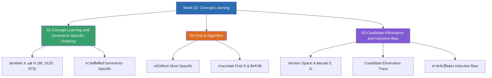

# Week 02 — Concept Learning & Version Space (MOC)

arrow_back สัปดาห์ก่อนหน้า: [[Week01-MOC|MOC สัปดาห์ 01]]

## check_circle เช็คลิสต์ก่อนเข้าเรียน

- [ ] ทำความเข้าใจการคำนวณขนาดของ Instance Space ($|X|$) และ Hypothesis Space ($|H|$) — ดู [[01-Concept-Learning-and-General-to-Specific-Ordering]]
- [ ] ฝึกไล่สเต็ปของอัลกอริทึม Find-S และจำข้อจำกัด 4 ประการ — ดู [[02-Find-S-Algorithm]]
- [ ] ทำความเข้าใจนิยามของ Version Space ขอบเขต $S$ และ $G$ — ดู [[03-Candidate-Elimination-and-Inductive-Bias]]
- [ ] เข้าใจเหตุผลว่าทำไม Unbiased Learner จึงไม่สามารถเรียนรู้เพื่อทำนายอนาคตได้ (No Free Lunch) — ดู [[03-Candidate-Elimination-and-Inductive-Bias]]

## assignment ภาพรวมสัปดาห์ 02 (สรุปย่อ)

สัปดาห์ที่ 2 มุ่งเน้นการเรียนรู้มโนทัศน์ (Concept Learning) ซึ่งเป็นรากฐานเชิงตรรกะของ Supervised Classification:
1. **ปริภูมิสมมติฐานและลำดับ (Hypothesis Spaces & Ordering):** การแทนสมมติฐานด้วย Conjunction of literals, การคำนวณจำนวนสมมติฐานเชิงไวยากรณ์ (5,120) และเชิงความหมาย (973) บนโดเมน EnjoySport และความสัมพันธ์ General-to-Specific ($\ge$)
2. **อัลกอริทึม Find-S (Specific-to-General Search):** การเรียนรู้โดยค้นหาสมมติฐานที่แคบที่สุดที่ยอมรับเฉพาะตัวอย่างบวก และการวิเคราะห์ข้อจำกัดในการใช้งานจริง
3. **อัลกอริทึม Candidate Elimination & Inductive Bias:** การรักษาปริภูมิคำตอบด้วย Version Space ($S$ และ $G$), การไล่สเต็ปปรับขอบเขต $S$ และ $G$, การทำนายข้อมูลใหม่ด้วย Voting, และบทบาทสำคัญยิ่งยวดของ Inductive Bias ใน Machine Learning

## map แผนที่หัวข้อสัปดาห์ 02

## collections_bookmark โน้ตรายหัวข้อ

| หัวข้อ | เนื้อหาหลัก | หน้าสไลด์ |
| :--- | :--- | :--- |
| [[01-Concept-Learning-and-General-to-Specific-Ordering]] | นิยาม Concept Learning, การคำนวณขนาดของ $|X|, |H_{syntax}|, |H_{semantic}|$, และลำดับ $\ge$ | สไลด์ 1–10 |
| [[02-Find-S-Algorithm]] | กลไก Find-S, การแกะรอย $h_0 \to h_4$ ด้วยตัวอย่าง EnjoySport, คุณสมบัติและข้อบกพร่อง 4 ข้อ | สไลด์ 11–15 |
| [[03-Candidate-Elimination-and-Inductive-Bias]] | นิยาม Version Space, อัลกอริทึม Candidate Elimination, การไล่ Trace $S$ และ $G$, การโหวตทำนายข้อมูลใหม่, และทฤษฎี Inductive Bias | สไลด์ 16–33 |

> [!tip] เคล็ดลับการทำข้อสอบสัปดาห์ที่ 02
> จุดที่มักเสียคะแนน:
> 1. ตอนคำนวณ $|H_{semantic}|$ ต้องบวก 1 สำหรับเคสที่มี $\varnothing$ เสมอ (เพราะทุกรูปแบบที่มี $\varnothing$ ให้ผลลัพธ์เป็นฟังก์ชันว่างเหมือนกันหมด)
> 2. ตอนทำ Candidate Elimination เมื่อเจอตัวอย่างลบ ($x_3$) การแตกเงื่อนไขใน $G$ จะต้องเลือกเฉพาะแอตทริบิวต์ที่ **ต่างจากตัวอย่างลบ** และยังต้องครอบคลุม $S$ อยู่ด้วย

---
arrow_forward สัปดาห์ถัดไป: [[Week03-MOC|MOC สัปดาห์ 03]]
