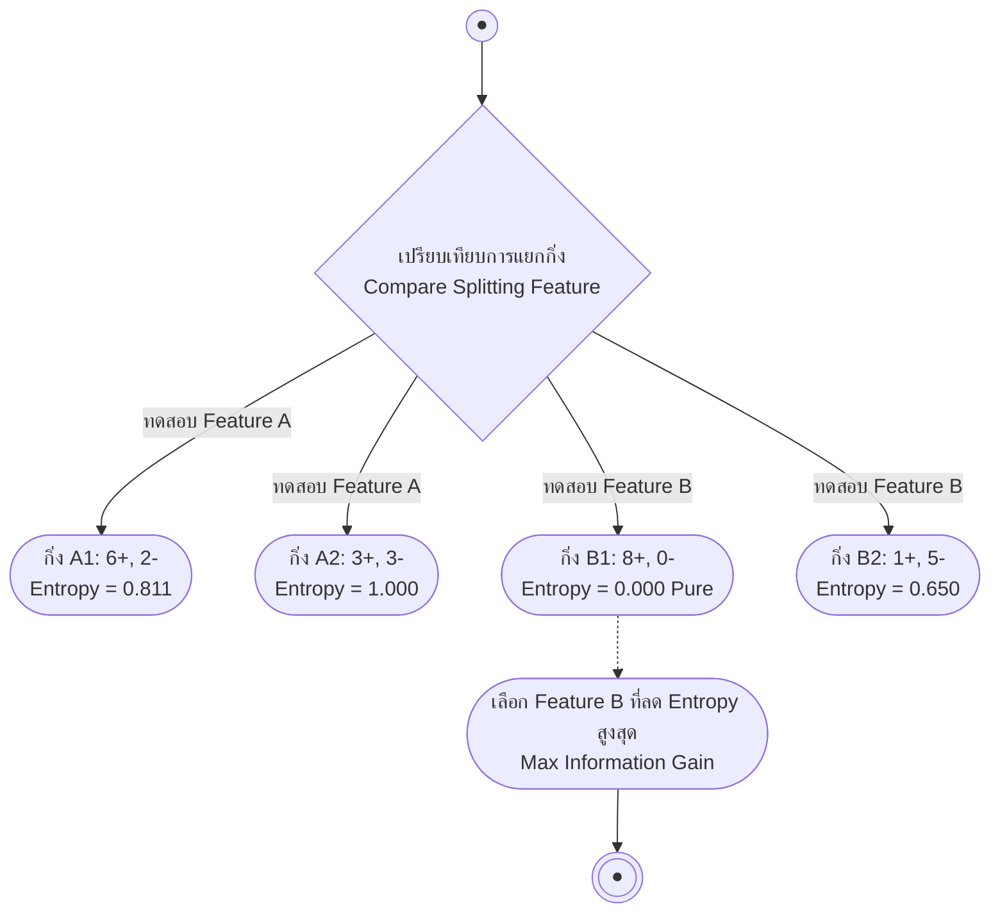

# พื้นฐานต้นไม้ตัดสินใจ เอนโทรปี และอัตราการได้สารสนเทศ (Decision Tree, Entropy & Information Gain)

arrow_back กลับไปที่ [[Week03-MOC|MOC สัปดาห์ 03]]

## key Keyword

- **Decision Tree** — โครงสร้างลำดับชั้นแบบต้นไม้ที่ใช้ตัดสินใจจำแนกประเภท โดยแต่ละโหนดภายในแทนการทดสอบแอตทริบิวต์ แต่ละกิ่งแทนค่าที่เป็นไปได้ และแต่ละโหนดใบแทนคลาสคำตอบ
- **Purity / Impurity** — ความบริสุทธิ์ของกลุ่มข้อมูลในโหนด หากมีตัวอย่างจากคลาสเดียวทั้งหมดถือว่า Pure (Impurity = 0)
- **Entropy ($H(S)$)** — มาตรวัดระดับความไม่เป็นระเบียบหรือความไม่แน่นอนของข้อมูลตามทฤษฎีสารสนเทศของ Shannon
- **Information Gain ($Gain(S, A)$)** — ค่าการลดลงของเอนโทรปีที่คาดหวังเมื่อทำการแยกกลุ่มข้อมูล $S$ ด้วยแอตทริบิวต์ $A$
- **Occam's Razor** — ปรัชญาการเรียนรู้ที่สนับสนุนให้เลือกโมเดลหรือสมมติฐานที่เรียบง่ายที่สุดที่สามารถอธิบายข้อมูลได้อย่างถูกต้อง

## menu_book Theory (เข้าใจง่าย)

### 1. โครงสร้างและการแทนความรู้ของต้นไม้ตัดสินใจ

ต้นไม้ตัดสินใจ (Decision Tree) เป็นหนึ่งในโมเดลการเรียนรู้แบบ Supervised Learning ที่ตีความได้ง่ายที่สุด (White-box model):
- **Internal Node (โหนดภายใน):** ระบุการทดสอบคุณลักษณะ (Attribute test เช่น `Outlook == Sunny`)
- **Branch (กิ่งก้าน):** ค่าที่เป็นไปได้ของแอตทริบิวต์นั้น (เช่น Sunny, Overcast, Rain)
- **Leaf Node (โหนดใบ):** ผลลัพธ์การจำแนกประเภทสุดท้าย (Class label เช่น Yes หรือ No)

#### ความสัมพันธ์กับตรรกศาสตร์บูลีน:
ต้นไม้ตัดสินใจทุกต้นสามารถแปลงเป็นประโยคตรรกศาสตร์ในรูป **Disjunctive Normal Form (DNF)** ได้ โดยแต่ละเส้นทางจาก Root สู่ Leaf คือ Conjunction ($\land$) ของเงื่อนไข และนำแต่ละเส้นทางมารวมกันด้วย Disjunction ($\lor$):
$$\text{PlayTennis} = (\text{Outlook=Sunny} \land \text{Humidity=Normal}) \lor (\text{Outlook=Overcast}) \lor (\text{Outlook=Rain} \land \text{Wind=Weak})$$

---

### 2. มาตรวัดเอนโทรปี (Entropy)

ในการสร้างต้นไม้ตัดสินใจ เราต้องการเลือกแอตทริบิวต์ที่แบ่งข้อมูลแล้วทำให้โหนดย่อยมีความ "บริสุทธิ์ (Pure)" มากที่สุด เอนโทรปีของชุดข้อมูล $S$ สำหรับปัญหา 2 คลาส ($+$ และ $-$) นิยามโดย:

$$Entropy(S) \equiv -p_+ \log_2(p_+) - p_- \log_2(p_-)$$

โดยที่:
- $p_+$ คือสัดส่วนของตัวอย่างบวกใน $S$ ($p_+ = \frac{|S_+|}{|S|}$)
- $p_-$ คือสัดส่วนของตัวอย่างลบใน $S$ ($p_- = \frac{|S_-|}{|S|}$)
- กำหนดตามหลักการลิมิตว่า $0 \log_2(0) \equiv 0$

#### คุณสมบัติของ Entropy:
- ถ้าข้อมูลทั้งหมดอยู่ในคลาสเดียวกัน ($p_+ = 1, p_- = 0$): $Entropy(S) = 0$ (บริสุทธิ์สมบูรณ์ ข้อมูลไม่มีความไม่แน่นอน)
- ถ้าข้อมูลมีสัดส่วนเท่ากันครึ่งต่อครึ่ง ($p_+ = 0.5, p_- = 0.5$):
  $$Entropy(S) = -0.5 \log_2(0.5) - 0.5 \log_2(0.5) = -0.5(-1) - 0.5(-1) = 1.0 \text{ bit}$$
  (มีความไม่แน่นอนสูงสุด)

สำหรับกรณีทั่วไปที่มี $c$ คลาส:
$$Entropy(S) = \sum_{i=1}^{c} -p_i \log_2(p_i)$$

---

### 3. อัตราการได้สารสนเทศ (Information Gain)

Information Gain คือปริมาณความไม่แน่นอนที่ลดลงหลังจากที่แบ่งข้อมูล $S$ ด้วยแอตทริบิวต์ $A$:

$$Gain(S, A) \equiv Entropy(S) - \sum_{v \in Values(A)} \frac{|S_v|}{|S|} Entropy(S_v)$$

โดยที่:
- $Values(A)$ คือเซตของค่าที่เป็นไปได้ทั้งหมดของแอตทริบิวต์ $A$
- $S_v$ คือเซตย่อยของ $S$ ที่มีค่าแอตทริบิวต์ $A = v$
- เทอมขวาคือ **เอนโทรปีเฉลี่ยถ่วงน้ำหนัก (Weighted Average Entropy)** หลังการแยกข้อมูล

> [!tip] หลักการตัดสินใจเลือกฟีเจอร์แยกกิ่ง (Splitting Criterion)
> อัลกอริทึมจะคำนวณ $Gain(S, A)$ สำหรับทุกแอตทริบิวต์ที่ยังว่างอยู่ แล้วเลือกแอตทริบิวต์ที่ให้ค่า **$Gain(S, A)$ สูงที่สุด** มาเป็นโหนดแยกกิ่งถัดไป

## schema Diagram

**ตัวอย่าง:** การเปรียบเทียบการแยกกิ่งระหว่างฟีเจอร์ A และ B โดยเลือกฟีเจอร์ที่สร้างโหนดย่อยที่ Pure ที่สุด

---
arrow_forward ต่อไป: [[02-ID3-Algorithm-and-PlayTennis-Walkthrough]]
