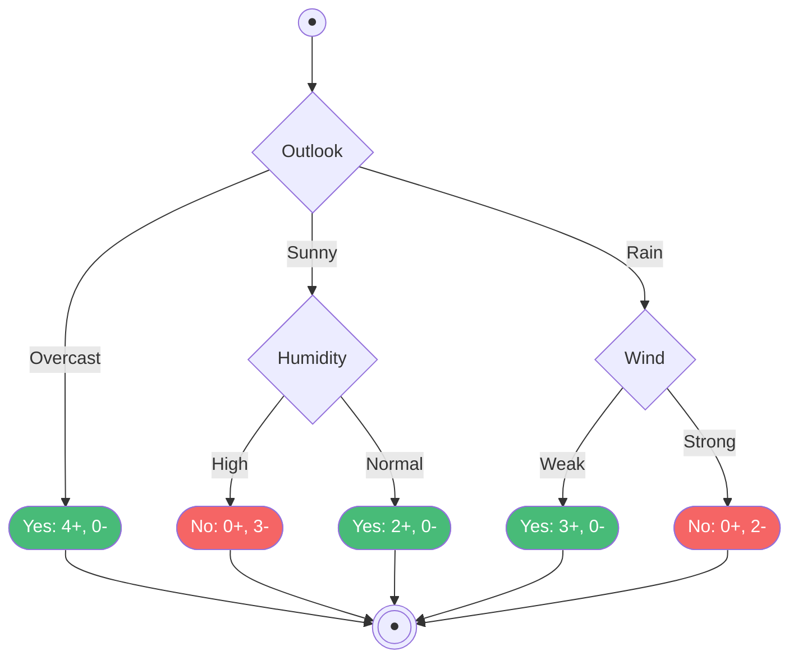

# อัลกอริทึม ID3 และการแกะรอยการคำนวณ PlayTennis (ID3 Algorithm & PlayTennis Walkthrough)

arrow_back กลับไปที่ [[Week03-MOC|MOC สัปดาห์ 03]] | ก่อนหน้า: [[01-Decision-Tree-Fundamentals-and-Entropy]]

## key Keyword

- **Iterative Dichotomiser 3 (ID3)** — อัลกอริทึมสร้างต้นไม้ตัดสินใจแบบเรียกซ้ำ (Recursive) คิดค้นโดย Ross Quinlan โดยใช้ Information Gain เป็นเกณฑ์คัดเลือก
- **Greedy Search** — กลยุทธ์การค้นหาแบบละโมบที่เลือกทางเลือกที่ดีที่สุดในแต่ละขั้นตอนเฉพาะหน้าโดยไม่มีการย้อนกลับ (No Backtracking)
- **Stopping Criteria** — เงื่อนไขหยุดสร้างต้นไม้ เช่น ตัวอย่างในโหนดเป็นคลาสเดียวกันทั้งหมด หรือไม่มีแอตทริบิวต์เหลือให้ทดสอบ
- **Target Concept Completeness** — คุณสมบัติของปริภูมิสมมติฐานของต้นไม้ตัดสินใจที่มีความสมบูรณ์ สามารถแทนฟังก์ชันบูลีนไม่จำกัด

## menu_book Theory (เข้าใจง่าย)

### 1. รหัสเทียมของอัลกอริทึม ID3 (ID3 Pseudocode)

อัลกอริทึม `ID3(Examples, Target_Attribute, Attributes)`:
1. สร้างโหนดราก `Root`
2. **เงื่อนไขหยุด (Base Cases):**
   - ถ้าทุกตัวอย่างใน `Examples` เป็นบวกทั้งหมด $\to$ คืนค่าโหนดใบป้ายกำกับ `+`
   - ถ้าทุกตัวอย่างใน `Examples` เป็นลบทั้งหมด $\to$ คืนค่าโหนดใบป้ายกำกับ `-`
   - ถ้า `Attributes` ว่างเปล่า $\to$ คืนค่าโหนดใบด้วยคลาสเสียงข้างมากใน `Examples` (Majority Vote)
3. **ขั้นตอนการแยกกิ่ง (Recursive Step):**
   - คำนวณ $Gain(Examples, A)$ สำหรับทุกแอตทริบิวต์ $A \in Attributes$
   - เลือกแอตทริบิวต์ $A_{best}$ ที่ให้ค่า Gain สูงสุดมาเป็นชื่อโหนด `Root`
   - สำหรับแต่ละค่า $v$ ที่เป็นไปได้ของ $A_{best}$:
     - แตกกิ่งก้านใหม่ออกจาก `Root` สำหรับเงื่อนไข $A_{best} = v$
     - กำหนด $Examples_v$ เป็นเซตย่อยที่มี $A_{best} = v$
     - ถ้า $Examples_v$ ว่าง $\to$ สร้างโหนดใบด้วยคลาสเสียงข้างมากของ `Examples`
     - ถ้าไม่ว่าง $\to$ เรียกซ้ำ: `ID3(Examples_v, Target_Attribute, Attributes - {A_best})`
4. คืนค่าโหนด `Root`

---

### 2. การแกะรอยการคำนวณสดจากชุดข้อมูล PlayTennis (14 Days)

ข้อมูล 14 วัน มีผลลัพธ์ $PlayTennis$:
- $Yes (+): 9$ วัน (D3, D4, D5, D7, D8, D9, D10, D11, D12, D13)
- $No (-): 5$ วัน (D1, D2, D6, D8, D14)

#### ขั้นที่ 1: คำนวณเอนโทรปีของโหนดราก $S$ ($|S| = 14$)
$$Entropy(S) = -\frac{9}{14} \log_2\left(\frac{9}{14}\right) - \frac{5}{14} \log_2\left(\frac{5}{14}\right) \approx \mathbf{0.940}$$

#### ขั้นที่ 2: คำนวณ Information Gain ของแอตทริบิวต์ทั้ง 4 ตัวที่โหนดราก

1. **แอตทริบิวต์ `Outlook` (Sunny, Overcast, Rain):**
   - $S_{Sunny} (5 \text{ วัน}): [2+, 3-] \implies Entropy = -\frac{2}{5}\log_2\frac{2}{5} - \frac{3}{5}\log_2\frac{3}{5} \approx 0.971$
   - $S_{Overcast} (4 \text{ วัน}): [4+, 0-] \implies Entropy = 0.000$ (Pure)
   - $S_{Rain} (5 \text{ วัน}): [3+, 2-] \implies Entropy = -\frac{3}{5}\log_2\frac{3}{5} - \frac{2}{5}\log_2\frac{2}{5} \approx 0.971$
   - $Gain(S, Outlook) = 0.940 - \left[\frac{5}{14}(0.971) + \frac{4}{14}(0.0) + \frac{5}{14}(0.971)\right] = 0.940 - 0.694 = \mathbf{0.246}$

2. **แอตทริบิวต์ `Temperature` (Hot, Mild, Cool):**
   - $S_{Hot} (4): [2+, 2-] \to E = 1.000$
   - $S_{Mild} (6): [4+, 2-] \to E = 0.918$
   - $S_{Cool} (4): [3+, 1-] \to E = 0.811$
   - $Gain(S, Temp) = 0.940 - \left[\frac{4}{14}(1.0) + \frac{6}{14}(0.918) + \frac{4}{14}(0.811)\right] = 0.940 - 0.911 = \mathbf{0.029}$

3. **แอตทริบิวต์ `Humidity` (High, Normal):**
   - $S_{High} (7): [3+, 4-] \to E = 0.985$
   - $S_{Normal} (7): [6+, 1-] \to E = 0.592$
   - $Gain(S, Humidity) = 0.940 - \left[\frac{7}{14}(0.985) + \frac{7}{14}(0.592)\right] = 0.940 - 0.788 = \mathbf{0.151}$

4. **แอตทริบิวต์ `Wind` (Weak, Strong):**
   - $S_{Weak} (8): [6+, 2-] \to E = 0.811$
   - $S_{Strong} (6): [3+, 3-] \to E = 1.000$
   - $Gain(S, Wind) = 0.940 - \left[\frac{8}{14}(0.811) + \frac{6}{14}(1.0)\right] = 0.940 - 0.892 = \mathbf{0.048}$

> [!important] สรุปการเลือกที่โหนดราก
> เปรียบเทียบ Gain:
> $$Gain(Outlook) = 0.246 > Gain(Humidity) = 0.151 > Gain(Wind) = 0.048 > Gain(Temp) = 0.029$$
> ดังนั้น **เลือก `Outlook` เป็นโหนดราก (Root Node)**

---

#### ขั้นที่ 3: แตกกิ่งย่อยของ `Outlook`
- **กิ่ง `Overcast` (D3, D7, D12, D13):**  
  ข้อมูลทั้งหมด 4 ตัวอย่างเป็นคลาส $Yes$ ทั้งหมด ($[4+, 0-]$) เป็นโหนดบริสุทธิ์ $\to$ **คืนค่าโหนดใบ: Yes ทันที**
- **กิ่ง `Sunny` (D1, D2, D8, D9, D11):**  
  ข้อมูลมี 5 ตัวอย่าง ($[2+, 3-]$) ยังไม่บริสุทธิ์ ทำการคำนวณ Gain ของฟีเจอร์ที่เหลือ:
  - $Gain(S_{Sunny}, Humidity) = \mathbf{0.971}$ (High เป็น No ทั้งหมด 3 ตัว, Normal เป็น Yes ทั้งหมด 2 ตัว $\to$ แยกแล้ว Pure 100%)
  - ดังนั้นแตกกิ่งด้วย **`Humidity`**: ถ้า `High` ตอบ **No**, ถ้า `Normal` ตอบ **Yes**
- **กิ่ง `Rain` (D4, D5, D6, D10, D14):**  
  ข้อมูลมี 5 ตัวอย่าง ($[3+, 2-]$) คำนวณ Gain พบว่า:
  - $Gain(S_{Rain}, Wind) = \mathbf{0.971}$ (Weak เป็น Yes 3 ตัว, Strong เป็น No 2 ตัว $\to$ Pure 100%)
  - ดังนั้นแตกกิ่งด้วย **`Wind`**: ถ้า `Weak` ตอบ **Yes**, ถ้า `Strong` ตอบ **No**

## schema Diagram

**ตัวอย่าง:** ต้นไม้ตัดสินใจสุดท้ายที่สร้างจากอัลกอริทึม ID3 บนชุดข้อมูล PlayTennis ครอบคลุมข้อมูลสอนถูกต้อง 100%

---
arrow_forward ต่อไป: [[03-Overfitting-and-Pruning-Techniques]]
