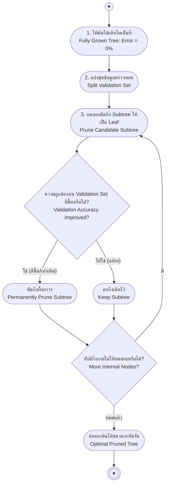

# การเกิดภาวะ Overfitting และเทคนิคการตัดแต่งกิ่งต้นไม้ (Overfitting & Pruning Techniques)

arrow_back กลับไปที่ [[Week03-MOC|MOC สัปดาห์ 03]] | ก่อนหน้า: [[02-ID3-Algorithm-and-PlayTennis-Walkthrough]]

## key Keyword

- **Overfitting** — สภาวะที่โมเดลจดจำข้อมูลฝึกฝนได้แม่นยำสูงมากแต่ไม่สามารถทำนายข้อมูลใหม่ที่ไม่เคยพบได้อย่างถูกต้อง (Generalization Error สูง)
- **Generalization Error** — ความคลาดเคลื่อนที่แท้จริงของโมเดลเมื่อนำไปใช้งานกับประชากรข้อมูลทั้งหมด
- **Pre-pruning (Early Stopping)** — การหยุดขยายกิ่งก้านต้นไม้ตั้งแต่ระหว่างขั้นตอนการสร้าง หากไม่ผ่านเกณฑ์สถิติที่กำหนด
- **Post-pruning** — การปล่อยให้ต้นไม้เติบโตจนลึกเต็มที่ แล้วจึงทำการตัดแต่งกิ่งย้อนหลังเพื่อลดความซับซ้อน
- **Reduced-Error Pruning** — เทคนิคการตัดกิ่งหลังการเทรนโดยประเมินประสิทธิภาพเทียบกับชุดข้อมูลตรวจสอบ (Validation Set)
- **Rule Post-Pruning** — การแปลงต้นไม้เป็นชุดกฎ If-Then แล้วตัดทอนเงื่อนไขย่อยในระดับประโยคกฎ

## menu_book Theory (เข้าใจง่าย)

### 1. นิยามเชิงรูปนัยของ Overfitting (Formal Definition)

กำหนดให้ปริภูมิสมมติฐานคือ $H$ สมมติฐาน $h \in H$ จะถือว่าเกิดภาวะ **Overfit ข้อมูลฝึกฝน** ก็ต่อเมื่อ มีสมมติฐานทางเลือก $h' \in H$ อื่น ที่ทำให้:

$$error_{train}(h) < error_{train}(h')$$
และ
$$error_{D}(h) > error_{D}(h')$$

โดยที่:
- $error_{train}(h)$ คือค่าความผิดพลาดบนชุดข้อมูลสอน
- $error_{D}(h)$ คือค่าความผิดพลาดที่แท้จริงบนการแจกแจงประชากรทั้งหมด $D$

#### สาเหตุที่ทำให้เกิด Overfitting:
1. **สัญญาณรบกวนในข้อมูล (Noise / Mislabeling):** การมีข้อมูลที่ป้ายกำกับผิดพลาดหรือผิดปกติ ทำให้ต้นไม้แตกกิ่งลึกเพื่อจดจำจุดแปลกแยกเหล่านั้น
2. **ขนาดข้อมูลตัวอย่างน้อยเกินไป (Small Sample Size):** ทำให้เกิดรูปแบบบังเอิญ (Coincidental Regularities) ที่ไม่สะท้อนความเป็นจริงของระบบ

---

### 2. แนวทางการแก้ไข Overfitting ในต้นไม้ตัดสินใจ

มี 2 ยุทธวิธีหลัก:
- **Pre-pruning (การตัดกิ่งล่วงหน้า):** หยุดแตกกิ่งเมื่อ Information Gain ต่ำกว่าค่าขีดเริ่มเปลี่ยน หรือเมื่อจำนวนตัวอย่างในโหนดน้อยกว่าเกณฑ์ที่กำหนด (ข้อเสีย: มักติดกับดัก Horizon Effect ไม่รู้ว่าการแตกกิ่งถัดไปอาจมี Gain มหาศาล)
- **Post-pruning (การตัดแต่งกิ่งย้อนหลัง):** ปล่อยให้ต้นไม้โตเต็มที่จนใบ Pure 100% จากนั้นใช้ข้อมูลชุดที่สองมาตรวจสอบและตัดกิ่งที่ไม่จำเป็นทิ้ง เป็นวิธีที่นิยมและมีประสิทธิภาพสูงกว่า

---

### 3. เทคนิค Reduced-Error Pruning

ใช้ชุดข้อมูลแยกต่างหากเรียกว่า **Validation Set** ในการตัดสินใจ:
1. สำหรับแต่ละโหนดภายใน (Internal Node) ใด ๆ:
   - ทดลองจำลองการตัดกิ่งของโหนดนั้นออก แล้วเปลี่ยนโหนดนั้นให้กลายเป็น **โหนดใบ (Leaf)**
   - กำหนดป้ายกำกับของโหนดใบใหม่ด้วย **คลาสเสียงข้างมาก** ของตัวอย่างที่ตกมาถึงโหนดนั้น
2. วัดผลความแม่นยำบน Validation Set:
   - ถ้าความแม่นยำบน Validation Set **ดีขึ้นหรือเท่าเดิม** $\to$ ทำการตัดกิ่งนั้นทิ้งอย่างถาวร
   - ถ้าความแม่นยำลดลง $\to$ คงกิ่งเดิมไว้
3. ทำซ้ำวนลูปแบบ Bottom-up จนกระทั่งไม่มีกิ่งใดที่ตัดแล้วให้ผลดีขึ้น

---

### 4. เทคนิค Rule Post-Pruning (ใช้ใน C4.5)

เป็นวิธีที่มีความยืดหยุ่นสูงสุด:
1. **แปลงต้นไม้เป็นกฎ:** เดินตามแต่ละเส้นทางจาก Root ไปยัง Leaf เพื่อสร้างกฎ `If-Then` เช่น:
   $$\text{IF } (Outlook = Sunny) \land (Humidity = High) \text{ THEN } PlayTennis = No$$
2. **ตัดเงื่อนไขในกฎ (Prune Preconditions):** ทดลองลบเงื่อนไขย่อยทีละตัวในส่วน `IF` ออก หากการลบเงื่อนไขนั้นทำให้ความแม่นยำโดยประมาณไม่ลดลง
3. **จัดเรียงลำดับกฎ:** นำกฎที่ผ่านการตัดแต่งแล้วมาเรียงลำดับตามความน่าเชื่อถือ เพื่อใช้จำแนกประเภทข้อมูลใหม่

## schema Diagram

**ตัวอย่าง:** ผังขั้นตอนของ Reduced-Error Pruning ที่ใช้ Validation Set เป็นเกณฑ์คัดกรองกิ่งไม้ที่ไม่จำเป็นออก

---
arrow_forward ต่อไป: [[04-Advanced-Issues-and-C45-Extensions]]
