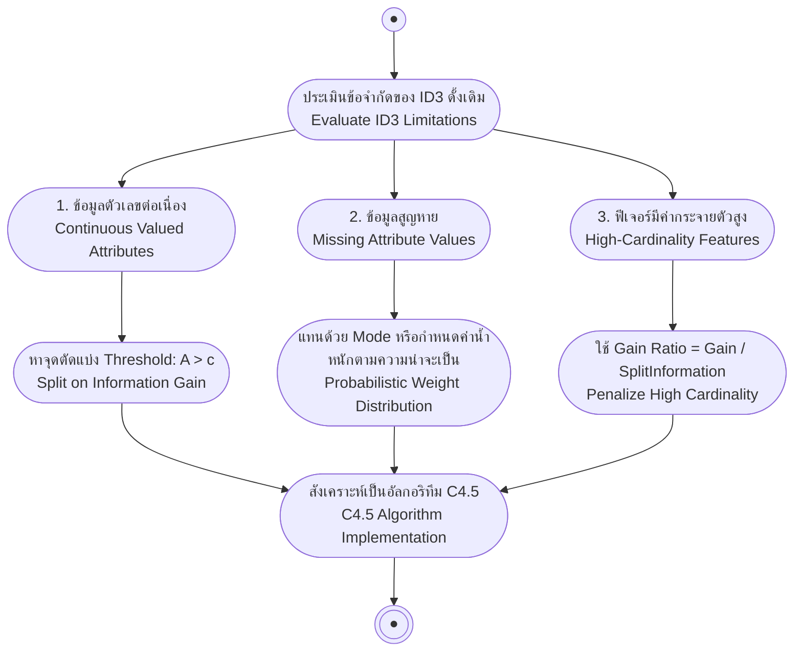

# ประเด็นขั้นสูงและการต่อยอดสู่อัลกอริทึม C4.5 (Advanced Issues & C4.5 Extensions)

arrow_back กลับไปที่ [[Week03-MOC|MOC สัปดาห์ 03]] | ก่อนหน้า: [[03-Overfitting-and-Pruning-Techniques]]

## key Keyword

- **C4.5 Algorithm** — อัลกอริทึมต้นไม้ตัดสินใจรุ่นต่อยอดจาก ID3 โดย Ross Quinlan ซึ่งสามารถจัดการข้อมูลต่อเนื่อง ค่าสูญหาย และแก้ปัญหาอคติของจำนวนค่าแอตทริบิวต์
- **Discretization Threshold** — ค่าจุดกึ่งกลางระหว่างค่าตัวเลขสองค่าที่อยู่ติดกันและมีการเปลี่ยนคลาสเป้าหมาย ใช้สำหรับแปลงฟีเจอร์ต่อเนื่องเป็นเงื่อนไขบูลีน
- **Missing Value Imputation** — กลยุทธ์การจัดการค่าว่างหรือสูญหาย ทั้งแบบแทนที่ด้วยค่าฐานนิยม (Mode) และแบบกระจายน้ำหนักความน่าจะเป็น
- **Gain Ratio** — ดัชนีคัดเลือกฟีเจอร์ที่ปรับปรุงจาก Information Gain โดยหารด้วยค่า Split Information เพื่อลงโทษแอตทริบิวต์ที่มีจำนวนค่าย่อยมากเกินไป
- **Split Information** — มาตรวัดเอนโทรปีของการกระจายตัวของข้อมูลไปยังกิ่งก้านย่อยต่าง ๆ

## menu_book Theory (เข้าใจง่าย)

### 1. การจัดการแอตทริบิวต์ค่าต่อเนื่อง (Continuous-Valued Attributes)

ในชีวิตจริงข้อมูลมักเป็นตัวเลขต่อเนื่อง (เช่น อุณหภูมิ, รายได้) วิธีการแปลงค่าต่อเนื่องเป็นจุดตัดแบบบูลีน ($A > c$):
1. นำข้อมูลมาเรียงลำดับจากน้อยไปมากตามค่าของแอตทริบิวต์นั้น
2. ค้นหาจุดที่มีการ **เปลี่ยนคลาสเป้าหมาย** ระหว่างตัวอย่างสองตัวที่อยู่ติดกัน
3. คำนวณค่ากึ่งกลาง (Midpoint) ของจุดเปลี่ยนคลาสเหล่านั้นเพื่อใช้เป็นค่าขีดเริ่มเปลี่ยนตัวเลือก (Candidate Thresholds)
4. คำนวณ Information Gain ของแต่ละจุดตัด แล้วเลือกจุดตัดที่ให้ค่า Gain สูงที่สุด

#### ตัวอย่างจากสไลด์:
| Temperature (°C) | 40 | 48 | 60 | 72 | 80 | 90 |
| :--- | :---: | :---: | :---: | :---: | :---: | :---: |
| **PlayTennis** | No | No | Yes | Yes | Yes | No |

- จุดเปลี่ยนคลาสจุดที่ 1: ระหว่าง 48 (No) กับ 60 (Yes) $\to c_1 = \frac{48 + 60}{2} = \mathbf{54}$
- จุดเปลี่ยนคลาสจุดที่ 2: ระหว่าง 80 (Yes) กับ 90 (No) $\to c_2 = \frac{80 + 90}{2} = \mathbf{85}$
- ทำการทดสอบเงื่อนไข $Temperature > 54$ และ $Temperature > 85$ เพื่อหาค่า Information Gain สูงสุด

---

### 2. การจัดการข้อมูลที่มีค่าสูญหาย (Missing Attribute Values)

เมื่อข้อมูลในบางตัวอย่างมีค่าแอตทริบิวต์สูญหาย (`?`):
- **วิธีที่ 1 (Most Common Value):** แทนที่ค่าว่างด้วยค่าที่พบบ่อยที่สุดของแอตทริบิวต์นั้นในโหนดปัจจุบัน (หรือเฉพาะในกลุ่มที่มีคลาสเดียวกัน)
- **วิธีที่ 2 (Fractional Assignment / Probability Weighting):** แจกแจงตัวอย่างที่มีค่าว่างไปยังทุกลูกกิ่งตามสัดส่วนความน่าจะเป็น เช่น หากกิ่ง Sunny มี 5 ตัวอย่าง และกิ่ง Rain มี 5 ตัวอย่าง ให้แบ่งน้ำหนักตัวอย่างที่มีค่าว่างไปกิ่งละ 0.5

---

### 3. การจัดการแอตทริบิวต์ที่มีจำนวนค่ามาก (Many-Valued Attributes & Gain Ratio)

> [!important] ปัญหาของ Information Gain ปกติ
> หากมีแอตทริบิวต์ที่มีเอกลักษณ์เฉพาะตัวสูง เช่น `Date` (14 วัน มี 14 ค่า) หรือ `ID_Card` หากแยกด้วยฟีเจอร์นี้ จะได้ 14 กิ่ง โหนดละ 1 ข้อมูล ซึ่งเอนโทรปีจะเป็น $0$ ทันที ส่งผลให้ได้ $Gain$ สูงที่สุดเสมอ แต่ต้นไม้แบบนี้ไม่สามารถนำไปทำนายวันใหม่ได้เลย (Overfit สมบูรณ์แบบ)

อัลกอริทึม C4.5 จึงแก้ไขด้วยการใช้ **Gain Ratio**:

$$GainRatio(S, A) \equiv \frac{Gain(S, A)}{SplitInformation(S, A)}$$

โดยที่:
$$SplitInformation(S, A) \equiv -\sum_{i=1}^{c} \frac{|S_i|}{|S|} \log_2\left(\frac{|S_i|}{|S|}\right)$$

- ถ้าแอตทริบิวต์ถูกซอยย่อยเป็น $k$ กลุ่มเท่า ๆ กัน ค่า $SplitInformation = \log_2(k)$ จะมีค่าสูงมาก ทำให้เมื่อนำมาเป็นตัวหาร ค่า $GainRatio$ จะถูกลงโทษจนลดลงอย่างมีนัยสำคัญ
- ป้องกันไม่ให้อัลกอริทึมเลือกฟีเจอร์ที่มีจำนวนค่าย่อยเยอะเกินเหตุโดยไม่จำเป็น

## schema Diagram

**ตัวอย่าง:** ผังการยกระดับขีดความสามารถจาก ID3 สู่ C4.5 เพื่อรับมือกับสภาพข้อมูลจริง

---
arrow_forward กลับไปที่: [[Week03-MOC|MOC สัปดาห์ 03]]
