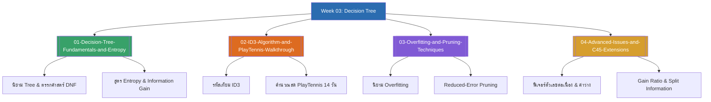

# Week 03 — Decision Tree Learning & C4.5 (MOC)

arrow_back สัปดาห์ก่อนหน้า: [[Week02-MOC|MOC สัปดาห์ 02]]

## check_circle เช็คลิสต์ก่อนเข้าเรียน

- [ ] ฝึกคำนวณ Entropy ($-\sum p \log_2 p$) และเข้าใจความหมายทางสารสนเทศ — ดู [[01-Decision-Tree-Fundamentals-and-Entropy]]
- [ ] ไล่สเต็ปการเลือก Root Node และ Subtree ด้วย Information Gain บน PlayTennis Dataset — ดู [[02-ID3-Algorithm-and-PlayTennis-Walkthrough]]
- [ ] ทำความเข้าใจสาเหตุของ Overfitting และขั้นตอน Reduced-Error Pruning — ดู [[03-Overfitting-and-Pruning-Techniques]]
- [ ] เข้าใจการแก้ปัญหาฟีเจอร์ตัวเลขต่อเนื่อง, ค่าว่าง, และการคำนวณ Gain Ratio ใน C4.5 — ดู [[04-Advanced-Issues-and-C45-Extensions]]

## assignment ภาพรวมสัปดาห์ 03 (สรุปย่อ)

สัปดาห์ที่ 3 ครอบคลุมหนึ่งในอัลกอริทึมที่นิยมและนำไปประยุกต์ใช้แพร่หลายที่สุดใน Machine Learning:
1. **ทฤษฎีสารสนเทศและเอนโทรปี (Information Theory & Entropy):** การแปลงความไม่แน่นอนเป็นตัวเลขเชิงปริมาณด้วย Shannon Entropy และการประเมินการลดทอนความไม่แน่นอนด้วย Information Gain
2. **อัลกอริทึม ID3 (Quinlan's ID3):** กระบวนการสร้างต้นไม้แบบ Top-down, Greedy Search โดยการแกะรอยการคำนวณตัวเลขสดทั้ง 14 ตัวอย่างของชุดข้อมูล PlayTennis จนได้โครงสร้างต้นไม้ที่สมบูรณ์
3. **การจัดการ Overfitting และการตัดแต่งกิ่ง (Pruning):** นิยามทางคณิตศาสตร์ของ Overfitting, การแบ่งชุดข้อมูล Validation, และเทคนิค Reduced-Error Pruning กับ Rule Post-Pruning
4. **การต่อยอดสู่อัลกอริทึม C4.5:** การจัดการข้อมูลตัวเลขต่อเนื่องด้วย Threshold Discretization, การจัดการค่าสูญหาย (Missing values), และการป้องกันปัญหา Bias ต่อฟีเจอร์ที่มีจำนวนค่าย่อยมากด้วย Gain Ratio

## map แผนที่หัวข้อสัปดาห์ 03

## collections_bookmark โน้ตรายหัวข้อ

| หัวข้อ | เนื้อหาหลัก | หน้าสไลด์ |
| :--- | :--- | :--- |
| [[01-Decision-Tree-Fundamentals-and-Entropy]] | โครงสร้างต้นไม้ตัดสินใจ, นิยามความบริสุทธิ์ (Purity), สูตรเอนโทรปีของแชนนอน, และสมการ Information Gain | สไลด์ 1–23 |
| [[02-ID3-Algorithm-and-PlayTennis-Walkthrough]] | อัลกอริทึม ID3, การคำนวณ Gain ละเอียดทุกแอตทริบิวต์บน PlayTennis, และผังต้นไม้ผลลัพธ์ | สไลด์ 24–37 |
| [[03-Overfitting-and-Pruning-Techniques]] | ปัญหา Overfitting, สาเหตุ, ยุทธวิธี Pre-pruning vs Post-pruning, Reduced-Error Pruning และ Rule Conversion | สไลด์ 38–51 |
| [[04-Advanced-Issues-and-C45-Extensions]] | การประมวลผลข้อมูลจริงใน C4.5: จุดตัดค่าต่อเนื่อง, การจัดการ Missing Values, และสูตร Gain Ratio | สไลด์ 52–62 |

> [!tip] ข้อควรระวังในห้องสอบสัปดาห์ที่ 03
> 1. ค่า $\log_2(x)$: ในห้องสอบหากไม่มีเครื่องคิดเลขวิทยาศาสตร์ จำค่าพื้นฐาน: $\log_2(2) = 1$, $\log_2(4) = 2$, $\log_2(8) = 3$, และ $\log_2(0.5) = -1$
> 2. อย่าลืมนำสัดส่วนขนาดข้อมูล $\frac{|S_v|}{|S|}$ ไปคูณถ่วงน้ำหนักเอนโทรปีก่อนนำมาลบออกจากเอนโทรปีตั้งต้นของโหนดแม่เสมอ

---
arrow_forward สัปดาห์ถัดไป: [[Week04-MOC|MOC สัปดาห์ 04]]
