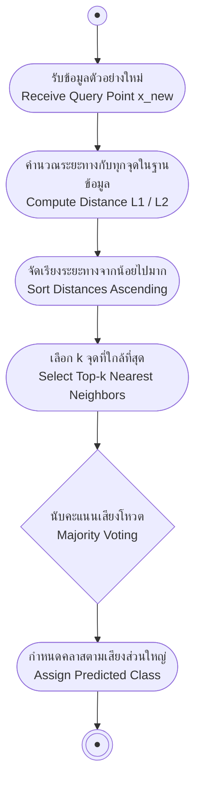

# อัลกอริทึม k-NN และมาตรวัดระยะทางในปริภูมิเวกเตอร์ (k-NN & Distance Metrics)

arrow_back กลับไปที่ [[Week04-MOC|MOC สัปดาห์ 04]]

## key Keyword

- **k-Nearest Neighbors (k-NN)** — อัลกอริทึมการเรียนรู้แบบไม่อิงพารามิเตอร์ (Non-parametric) ที่จำแนกประเภทข้อมูลใหม่โดยอาศัยคลาสของเพื่อนบ้านที่อยู่ใกล้ที่สุดจำนวน $k$ ตัว
- **Lazy Learning (Instance-based)** — การเรียนรู้ที่ไม่มีขั้นตอนการสร้างแบบจำลองล่วงหน้า (No Training Phase) แต่จะเก็บข้อมูลทั้งหมดไว้แล้วคำนวณจริงเมื่อมีคำถามเข้ามา (Inference time)
- **Norm (บรรทัดฐาน)** — ฟังก์ชันที่วัดความยาวหรือขนาดของเวกเตอร์ในปริภูมิเวกเตอร์ตามหลักคณิตศาสตร์
- **Euclidean Distance ($L_2$)** — ระยะทางเส้นตรงระหว่างจุดสองจุดในปริภูมิเรขาคณิต
- **Manhattan Distance ($L_1$)** — ระยะทางตามแนวแกนตารางหมากรุกหรือบล็อกถนนในเมือง (City block distance)
- **Chebyshev Distance ($L_\infty$)** — ระยะทางที่วัดตามค่าความต่างสูงสุดเพียงมิติเดียว (Supremum norm)

## menu_book Theory (เข้าใจง่าย)

### 1. หลักการทำงานของ k-NN (Working Principle)

k-NN วางอยู่บนสมมติฐานทางเรขาคณิตว่า: *"ข้อมูลที่มีคุณลักษณะคล้ายกันย่อมอยู่ใกล้กันในปริภูมิเวกเตอร์ และควรอยู่ในคลาสเดียวกัน"*

#### ขั้นตอนการทำงาน (Classification Procedure):
1. เก็บข้อมูลตัวอย่างที่มีป้ายกำกับทั้งหมดไว้ในฐานข้อมูล (Training Phase = $O(1)$)
2. เมื่อได้รับข้อมูลใหม่ที่ต้องการทำนาย $x_{new}$:
   - คำนวณระยะห่าง (Distance $d$) ระหว่าง $x_{new}$ กับทุกตัวอย่างในฐานข้อมูล
   - เรียงลำดับระยะทางจากน้อยไปมาก
   - คัดเลือกเพื่อนบ้านที่อยู่ใกล้ที่สุดจำนวน $k$ ตัวแรก
   - ทำนายคลาสของ $x_{new}$ ด้วย **คะแนนเสียงข้างมาก (Majority Vote)** ของเพื่อนบ้านทั้ง $k$ ตัว

#### ผลกระทบของการเลือกค่า $k$:
- **$k = 1$ (Nearest Neighbor):** ตัดสินใจตามจุดที่ใกล้ที่สุดจุดเดียว เส้นแบ่งเขตตัดสินใจ (Decision Boundary) จะมีความซับซ้อนสูงมาก ไวต่อสัญญาณรบกวน (Noise/Outliers) และเสี่ยงต่อ Overfitting
- **$k$ มีค่ามากเกินไป:** ขอบเขตการตัดสินใจจะเรียบเนียนขึ้น แต่ถ้า $k$ มากจนเข้าใกล้จำนวนข้อมูลทั้งหมด ผลการทำนายจะถูกกลืนด้วยคลาสประชากรส่วนใหญ่ (Underfitting)
- **ข้อแนะนำ:** สำหรับปัญหา 2 คลาส ควรเลือก $k$ เป็น **จำนวนคี่** (เช่น 3, 5, 7) เพื่อป้องกันปัญหานับคะแนนโหวตเสมอกัน

---

### 2. มาตรวัดความคล้ายคลึงและระยะทาง (Distance Metrics & Norms)

ความคล้ายคลึงมีความสัมพันธ์แปรผกผันกับระยะทาง ($\text{similarity} \propto \frac{1}{\text{distance}}$) โดยระยะทางในปริภูมิเวกเตอร์นิยามผ่าน **Norm ($\|\cdot\|$)** ซึ่งต้องมีคุณสมบัติ 3 ประการ:
1. $\|\mathbf{x}\| \ge 0$ และ $\|\mathbf{x}\| = 0 \iff \mathbf{x} = \mathbf{0}$ (Positive Definiteness)
2. $\|\alpha \mathbf{x}\| = |\alpha| \|\mathbf{x}\|$ (Absolute Scalability)
3. $\|\mathbf{x} + \mathbf{y}\| \le \|\mathbf{x}\| + \|\mathbf{y}\|$ (Triangle Inequality)

#### ตระกูล $L_p$ Norm (Minkowski Distance):
กำหนดให้เวกเตอร์ $\mathbf{x}, \mathbf{y} \in \mathbb{R}^n$:
$$D_p(\mathbf{x}, \mathbf{y}) = \|\mathbf{x} - \mathbf{y}\|_p = \left( \sum_{i=1}^{n} |x_i - y_i|^p \right)^{\frac{1}{p}}$$

| ประเภท Norm | สูตรคณิตศาสตร์ | ชื่อเรียกอื่น | คุณลักษณะเชิงเรขาคณิต |
| :--- | :--- | :--- | :--- |
| **$L_1$-norm** | $\|\mathbf{x}\|_1 = \sum_{i=1}^n \|x_i\|$ | Manhattan, City Block, Taxicab | วัดระยะตามแนวแกนมุมฉาก เหมาะกับข้อมูลแบบ Grid หรือ High-dimensional sparse |
| **$L_2$-norm** | $\|\mathbf{x}\|_2 = \sqrt{\sum_{i=1}^n x_i^2}$ | Euclidean Distance | ระยะทางเส้นตรงที่สั้นที่สุด นิยมใช้มากที่สุดในทางปฏิบัติ |
| **$L_\infty$-norm** | $\|\mathbf{x}\|_\infty = \max_{i} \|x_i\|$ | Chebyshev, Supremum, Uniform | วัดระยะจากผลต่างแกนที่ห่างกันมากที่สุดเพียงแกนเดียว |

> [!important] ความสำคัญของการทำ Feature Normalization (Min-Max หรือ Z-score)
> การคำนวณระยะทางขึ้นอยู่กับหน่วยวัดของฟีเจอร์อย่างยิ่ง หากฟีเจอร์หนึ่งมีค่าหลักล้าน (เช่น รายได้ต่อปี) ขณะที่อีกฟีเจอร์มีค่าหลักหน่วย (เช่น อายุ 20–60 ปี) ผลรวมระยะทางจะถูกครอบงำด้วยฟีเจอร์รายได้เพียงตัวเดียว จึงจำเป็นต้อง Normalize ข้อมูลให้อยู่ในช่วง $[0, 1]$ หรือ Standardize ก่อนรัน k-NN เสมอ

---

### 3. ข้อดีและข้อจำกัดของ k-NN (Pros & Cons)

- **ข้อดี:**
  - เรียบง่าย ไม่ต้องมีสมมติฐานเกี่ยวกับการกระจายตัวของข้อมูล (Non-parametric)
  - ไม่เสียเวลาในการฝึกโมเดล (Zero training time)
  - รองรับทั้งงาน Classification และ Regression (ใช้ค่าเฉลี่ยของ $k$ เพื่อนบ้าน)
- **ข้อจำกัด:**
  - มีต้นทุนการคำนวณตอนทำนายสูงมาก ($O(N \cdot D)$ ต่อ 1 คำถาม) เมื่อชุดข้อมูล $N$ ขนาดใหญ่
  - ใช้หน่วยความจำมหาศาลเพราะต้องเก็บข้อมูลทุกจุดไว้ตลอดเวลา
  - ประสิทธิภาพลดลงอย่างรวดเร็วเมื่อข้อมูลมีมิติจำนวนมาก (Curse of Dimensionality)

## schema Diagram

**ตัวอย่าง:** ผังขั้นตอนการอนุมานผลลัพธ์ของ k-NN เมื่อมีข้อมูลใหม่เข้ามาในระบบ

---
arrow_forward ต่อไป: [[02-Instance-Reduction-and-Fast-Search-kdTree-LSH]]
