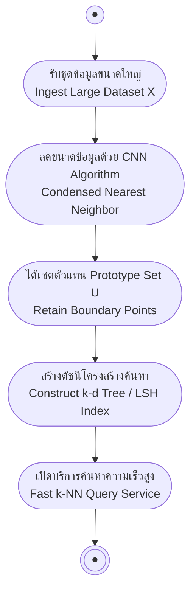

# การลดขนาดข้อมูลและการค้นหาอย่างรวดเร็วด้วย kd-Tree และ LSH (Fast k-NN & Indexing)

<span class="material-symbols-outlined">arrow_back</span> กลับไปที่ [[Week04-MOC|MOC สัปดาห์ 04]] | ก่อนหน้า: [[01-kNN-Algorithm-and-Distance-Metrics]]

## <span class="material-symbols-outlined">key</span> Keyword

- **Condensed Nearest Neighbor (CNN)** — อัลกอริทึมลดทอนจำนวนตัวอย่างฝึกฝนโดยคัดกรองเฉพาะตัวอย่างที่เป็นตัวแทน (Prototype) บริเวณรอยต่อขอบเขตคลาส
- **Prototype Set ($U$)** — เซตย่อยของข้อมูลขนาดเล็กที่ถูกคัดเลือกมาเพื่อใช้แทนชุดข้อมูลทั้งหมดในการทำนาย 1-NN
- **k-d Tree (k-dimensional tree)** — โครงสร้างข้อมูลแบบต้นไม้ทวิภาคที่แบ่งย่อยปริภูมิหลายมิติตามแนวแกน เพื่อเร่งความเร็วในการค้นหาเพื่อนบ้านใกล้สุด
- **Locality-Sensitive Hashing (LSH)** — เทคนิคการทำแฮชที่ออกแบบให้จุดที่อยู่ใกล้กันในปริภูมิมิติสูงมีโอกาสตกในกล่องแฮชเดียวกันสูง สำหรับ Approximate Nearest Neighbor (ANN)

## <span class="material-symbols-outlined">menu_book</span> Theory (เข้าใจง่าย)

เนื่องจาก k-NN แบบมาตรฐาน (Brute-force) ต้องคำนวณระยะทางกับทุกจุดในฐานข้อมูล ทำให้ช้ามากเมื่อข้อมูลมีขนาดใหญ่ จึงมีการคิดค้นเทคนิคเพิ่มประสิทธิภาพ 2 ด้าน:
1. **ด้านการลดจำนวนข้อมูล (Data Reduction):** ตัดข้อมูลที่ซ้ำซ้อนออก เหลือเฉพาะจุดจำเป็น
2. **ด้านโครงสร้างดัชนี (Indexing & Fast Search):** จัดโครงสร้างพื้นที่เพื่อให้ค้นหาได้เร็วขึ้นโดยไม่ต้องเปรียบเทียบทุกจุด

---

### 1. อัลกอริทึม Condensed Nearest Neighbor (CNN)

เป้าหมายคือการสร้างชุดตัวแทน $U \subset X$ ที่มีขนาดเล็กมาก แต่ยังคงความแม่นยำในการทำนายแบบ 1-NN เทียบเท่าชุดข้อมูลเต็ม $X$:

```text
1. กำหนดเซตตัวแทนเริ่มต้น U = {สุ่มเลือก 1 ตัวอย่างจาก X}
2. ทำซ้ำ (Repeat):
     สำหรับแต่ละตัวอย่าง x ใน X:
       ทดลองทำนายคลาสของ x โดยใช้ 1-NN เทียบกับข้อมูลใน U
       ถ้า 1-NN ทำนายคลาสของ x ผิดพลาด (Misclassified):
         ย้าย x ออกจาก X และนำไปเพิ่มในเซตตัวแทน U
   จนกระทั่ง: สแกนผ่านข้อมูลทั้งหมดใน X ครบ 1 รอบแล้วไม่มีการเพิ่มสมาชิกเข้า U อีก
3. คืนค่าเซตตัวแทน U สำหรับใช้เป็นฐานข้อมูล k-NN จริง
```

> [!tip] ข้อสังเกตเชิงลึกของ CNN
> จุดข้อมูลที่อยู่ตรงกลางกลุ่ม (Interior points) มักจะถูกทำนายได้ถูกต้องตั้งแต่แรก จึงไม่ถูกดึงเข้า $U$ ในขณะที่จุดข้อมูลบริเวณ **ขอบเขตระหว่างคลาส (Decision Boundary)** มักถูกทำนายผิดและถูกดึงเข้า $U$ ดังนั้น CNN จึงเป็นการเก็บบันทึกเฉพาะจุดที่กำหนดรูปทรงของเส้นแบ่งคลาสเท่านั้น

---

### 2. โครงสร้างต้นไม้ k-d Tree

k-d Tree เป็นการแบ่งพื้นที่เชิงเรขาคณิตแบบสลับแกน (Axis-aligned splitting):
1. **การสร้างต้นไม้ (Tree Construction):**
   - เลือกลำดับมิติ เช่น ใน 2 มิติ สลับระหว่างแกน $X$ และแกน $Y$
   - หาค่ามัธยฐาน (Median) ของจุดข้อมูลในมิตินั้น เพื่อแบ่งข้อมูลออกเป็น 2 ฝั่งซ้าย-ขวาเท่า ๆ กัน
   - ทำซ้ำแบบเรียกซ้ำ (Recursive) จนกระทั่งแต่ละโหนดใบมีจำนวนจุดตามที่กำหนด
2. **การค้นหา (Query Time):**
   - ลดความซับซ้อนเวลาในการค้นหาจาก $O(N)$ เหลือเฉลี่ย $O(\log N)$
   - ข้อจำกัด: เมื่อจำนวนมิติ $D$ สูงขึ้นมาก (High dimensions เช่น $D > 20$) ประสิทธิภาพจะลดลงกลับไปใกล้เคียงกับ $O(N)$ เนื่องจากปรากฏการณ์ Curse of Dimensionality

---

### 3. Locality-Sensitive Hashing (LSH)

เมื่อข้อมูลมีมิติสูงมาก (เช่น ข้อมูลภาพ หรือ Text Embeddings ที่มีหลายร้อยมิติ):
- LSH จะฉาย (Project) ข้อมูลลงบนเวกเตอร์สุ่มหลาย ๆ เส้น และแปลงเป็นรหัสบิต (Bit Code / Hash Signature)
- จุดที่อยู่ใกล้กันทางเรขาคณิต จะได้รหัสบิตที่ตรงกันเกือบทั้งหมด
- เวลาค้นหา จะค้นหาเฉพาะจุดที่อยู่ใน Bucket เดียวกัน ทำให้ได้คำตอบใกล้เคียงเร็วขึ้นหลายเท่าตัว (Sub-linear time)

## <span class="material-symbols-outlined">schema</span> Diagram



**ตัวอย่าง:** สายพานการเพิ่มประสิทธิภาพ k-NN จากข้อมูลดิบ สู่การลดขนาดด้วย CNN และการทำ Indexing ด้วย k-d Tree

---
<span class="material-symbols-outlined">arrow_forward</span> กลับไปที่: [[Week04-MOC|MOC สัปดาห์ 04]]
