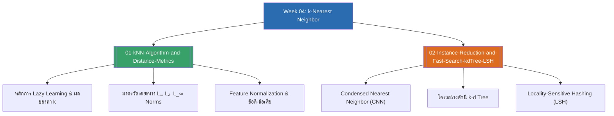

# Week 04 — k-Nearest Neighbors & Distance Metrics (MOC)

arrow_back สัปดาห์ก่อนหน้า: [[Week03-MOC|MOC สัปดาห์ 03]]

## check_circle เช็คลิสต์ก่อนเข้าเรียน

- [ ] ทำความเข้าใจแนวคิด Lazy Learning เปรียบเทียบกับ Eager Learning — ดู [[01-kNN-Algorithm-and-Distance-Metrics]]
- [ ] จำสูตรและความแตกต่างของ $L_1$ (Manhattan), $L_2$ (Euclidean), และ $L_\infty$ (Chebyshev) — ดู [[01-kNN-Algorithm-and-Distance-Metrics]]
- [ ] เข้าใจขั้นตอนอัลกอริทึม Condensed Nearest Neighbor (CNN) ในการคัดเลือก Prototype — ดู [[02-Instance-Reduction-and-Fast-Search-kdTree-LSH]]
- [ ] ทำความเข้าใจหลักการทำงานของ k-d Tree ในการแบ่งพื้นที่ค้นหา — ดู [[02-Instance-Reduction-and-Fast-Search-kdTree-LSH]]

## assignment ภาพรวมสัปดาห์ 04 (สรุปย่อ)

สัปดาห์ที่ 4 ศึกษาหนึ่งในอัลกอริทึมการเรียนรู้แบบไม่อิงพารามิเตอร์ (Non-parametric) ที่สำคัญที่สุด:
1. **หลักการของ k-NN (Instance-based Learning):** กลไกการจำแนกประเภทข้อมูลโดยอาศัยเพื่อนบ้านที่ใกล้ที่สุดจำนวน $k$ ตัว และการวิเคราะห์ผลกระทบของค่า $k$ ต่อเส้นแบ่งการตัดสินใจ (Decision Boundary)
2. **เรขาคณิตและมาตรวัดระยะทาง (Vector Norms):** คุณสมบัติของ Norm ในปริภูมิเวกเตอร์, รายละเอียดตระกูล $L_p$ Norm ($L_1, L_2, L_\infty$), และความสำคัญยิ่งยวดของการทำ Feature Normalization
3. **การเพิ่มความเร็วและลดขนาดข้อมูล (Efficiency & Indexing):** การบีบอัดข้อมูลด้วย Condensed Nearest Neighbor (CNN), โครงสร้างต้นไม้ดัชนี k-d Tree สำหรับมิติขนาดกลาง, และเทคนิค Locality-Sensitive Hashing (LSH) สำหรับข้อมูลมิติสูง

## map แผนที่หัวข้อสัปดาห์ 04

## collections_bookmark โน้ตรายหัวข้อ

| หัวข้อ | เนื้อหาหลัก | หน้าสไลด์ |
| :--- | :--- | :--- |
| [[01-kNN-Algorithm-and-Distance-Metrics]] | แนวคิด Lazy Learning, กลไก k-NN, อิทธิพลของค่า $k$, ตระกูล $L_p$ Norms ($L_1, L_2, L_\infty$), และข้อดี-ข้อจำกัด | สไลด์ 1–14 |
| [[02-Instance-Reduction-and-Fast-Search-kdTree-LSH]] | การเพิ่มประสิทธิภาพ k-NN: อัลกอริทึม CNN คัดเลือก Prototype, การแบ่งพื้นที่ด้วย k-d Tree, และการทำ LSH | สไลด์ 15–18 |

> [!tip] เคล็ดลับการจำสำหรับข้อสอบสัปดาห์ที่ 04
> - $L_1$ (Manhattan): นึกถึงการเดินตามตารางบล็อกถนนในนิวยอร์ก นำผลต่างสัมบูรณ์ของแต่ละแกนมารวมกัน ($|x_1 - y_1| + |x_2 - y_2|$)
> - $L_2$ (Euclidean): พีทาโกรัสเส้นตรง ($\sqrt{\Delta x^2 + \Delta y^2}$)
> - $L_\infty$ (Chebyshev): การเดินของ King ในหมากรุก (วัดที่ค่าความต่างสูงสุดแกนเดียว $\max |\Delta x_i|$)

---
arrow_forward สัปดาห์ถัดไป: [[Week05-MOC|MOC สัปดาห์ 05]]
