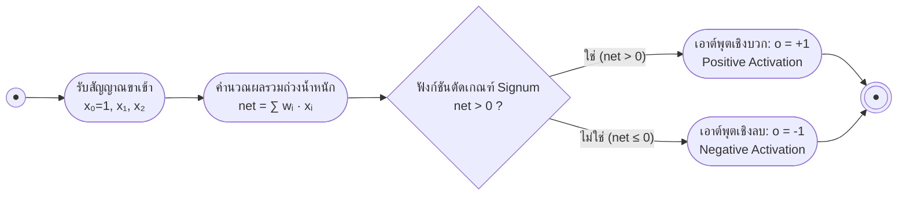

# รากฐานทางชีววิทยาและเพอร์เซปตรอนชั้นเดียว (Biological Foundations & Single-Layer Perceptron)

arrow_back กลับไปที่ [[Week05-MOC|MOC สัปดาห์ 05]]

## key Keyword

- **Artificial Neural Network (ANN)** — โมเดลการคำนวณที่ได้รับแรงบันดาลใจจากโครงสร้างการส่งสัญญาณของโครงข่ายประสาทในสมองมนุษย์
- **Perceptron** — แบบจำลองเซลล์ประสาทเทียมพื้นฐานที่คิดค้นโดย Frank Rosenblatt ใช้ฟังก์ชันขั้นบันได (Hard-limit / Step function) เพื่อจำแนกประเภทเชิงเส้น
- **Activation Function** — ฟังก์ชันทางคณิตศาสตร์ที่แปลงผลรวมถ่วงน้ำหนัก (Net input) ของเซลล์ประสาทให้อยู่ในรูปสัญญาณเอาต์พุต
- **Linear Separability** — คุณสมบัติของชุดข้อมูลที่สามารถแบ่งแยกคลาสออกจากกันได้อย่างสมบูรณ์ด้วยเส้นตรง (ใน 2 มิติ) หรือระนาบไฮเปอร์เพลน (ใน $n$ มิติ)
- **XOR Problem** — ปัญหาฟังก์ชันตรรกศาสตร์ Exclusive-OR ที่ข้อมูลไม่สามารถแบ่งแยกเชิงเส้นได้ ซึ่งพิสูจน์ข้อจำกัดของเพอร์เซปตรอนชั้นเดียว

## menu_book Theory (เข้าใจง่าย)

### 1. การเปรียบเทียบระหว่างเซลล์ประสาทชีววิทยากับเซลล์ประสาทเทียม

สมองมนุษย์ประกอบด้วยเซลล์ประสาท (Neurons) ประมาณ $10^{11}$ เซลล์ และมีจุดเชื่อมต่อ (Synapses) มากกว่า $10^{14}$ จุด:

| โครงสร้างชีววิทยา (Biological Neuron) | องค์ประกอบในเซลล์ประสาทเทียม (Artificial Neuron) |
| :--- | :--- |
| **เดนไดรต์ (Dendrites):** แขนงรับสัญญาณเคมีไฟฟ้าจากเซลล์อื่น | **อินพุต ($x_1, x_2, \dots, x_n$):** ค่าคุณลักษณะนำเข้า |
| **ไซแนปส์ (Synapse):** จุดประสานประสาทที่ปรับความเข้มสัญญาณ | **ค่าน้ำหนัก ($w_1, w_2, \dots, w_n$):** น้ำหนักความสำคัญ |
| **ตัวเซลล์ (Soma / Cell body):** รวบรวมศักย์ไฟฟ้า | **ผลรวมถ่วงน้ำหนัก ($\sum w_i x_i + \text{bias}$):** ผลรวมเชิงเส้น |
| **แอกซอน (Axon):** ท่อส่งกระแสประสาทแบบ Action Potential | **ฟังก์ชันกระตุ้น (Activation Function):** ส่งค่าเอาต์พุต $o$ |

---

### 2. โครงสร้างและการคำนวณของเพอร์เซปตรอน (Perceptron)

เพอร์เซปตรอนรับเวกเตอร์อินพุต $\mathbf{x} = [x_1, x_2, \dots, x_n]^T$ และค่าน้ำหนัก $\mathbf{w} = [w_1, w_2, \dots, w_n]^T$ พร้อมค่า Bias $w_0$:
$$net = \sum_{i=0}^n w_i x_i = \mathbf{w}^T \mathbf{x} \quad (\text{โดยกำหนด } x_0 = 1)$$

ใช้ฟังก์ชันกระตุ้นแบบ **Symmetric Hard-limit (Signum function)**:
$$o(\mathbf{x}) = \begin{cases} +1 & \text{ถ้า } net > 0 \\ -1 & \text{ถ้า } net \le 0 \end{cases}$$

สมการ $\mathbf{w}^T \mathbf{x} = 0$ ทำหน้าที่เป็น **Hyperplane** แบ่งปริภูมิ $n$ มิติออกเป็นสองฝั่ง

#### กฎการเรียนรู้ของเพอร์เซปตรอน (Perceptron Learning Rule):
ปรับค่าน้ำหนักเมื่อโมเดลทำนายผิดพลาด ($t \neq o$):
$$w_i \leftarrow w_i + \Delta w_i$$
$$\Delta w_i = \eta (t - o) x_i$$
โดย:
- $t$ คือค่าเป้าหมายจริง (Target $\in \{+1, -1\}$)
- $o$ คือค่าที่เพอร์เซปตรอนทำนาย (Output $\in \{+1, -1\}$)
- $\eta$ คืออัตราการเรียนรู้ (Learning Rate เช่น $0.1$)

> [!important] ทฤษฎีการลู่เข้าของเพอร์เซปตรอน (Perceptron Convergence Theorem)
> กฎการเรียนรู้ของเพอร์เซปตรอนรับประกันว่าจะลู่เข้าสู่ชุดค่าน้ำหนักที่จำแนกข้อมูลได้ถูกต้อง 100% เสมอภายในจำนวนรอบจำกัด **ก็ต่อเมื่อข้อมูลนั้นสามารถแบ่งแยกเชิงเส้นได้ (Linearly Separable)**

---

### 3. การแก้ปัญหา AND, OR และข้อจำกัดของปัญหา XOR

เพอร์เซปตรอนชั้นเดียวสามารถแก้ปัญหาตรรกศาสตร์พื้นฐานได้โดยง่าย:
- **AND Problem:** ใช้ระนาบ $0.5 x_1 + 0.5 x_2 - 0.5 = 0 \implies x_2 = -x_1 + 1$
- **OR Problem:** ใช้ระนาบ $0.5 x_1 + 0.5 x_2 + 0.5 = 0 \implies x_2 = -x_1 - 1$

#### วิกฤตปัญหา XOR (The XOR Problem):
ตารางค่าความจริงของ XOR:
- $\langle -1, -1 \rangle \to -1$
- $\langle -1, +1 \rangle \to +1$
- $\langle +1, -1 \rangle \to +1$
- $\langle +1, +1 \rangle \to -1$

เมื่อพล็อตจุดลงบนพิกัด 2 มิติ จะพบว่าจุดบวกและจุดลบเรียงตัวทะแยงมุมข้ามกัน **ไม่สามารถลากเส้นตรงเส้นเดียวเพื่อแบ่งแยกกลุ่มข้อมูลทั้งสองได้** ความล้มเหลวในการแก้ปัญหา XOR ทำให้งานวิจัยด้านโครงข่ายประสาทหยุดชะงักไปหลายปี (AI Winter ยุคแรก) จนกระทั่งมีการพัฒนาโครงข่ายประสาทแบบหลายชั้น (Multi-Layer Perceptron) ขึ้นมาแก้ปัญหา

## schema Diagram

**ตัวอย่าง:** โครงสร้างทางคณิตศาสตร์ของเซลล์ประสาทเทียมเพอร์เซปตรอนชั้นเดียว

---
arrow_forward ต่อไป: [[02-Gradient-Descent-and-Linear-Units]]
