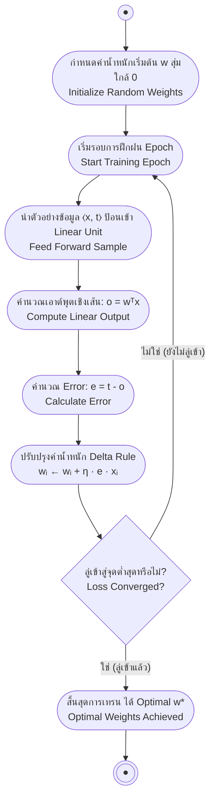

# การลดระดับตามความชันและเซลล์ประสาทเชิงเส้น (Gradient Descent & Linear Units)

arrow_back กลับไปที่ [[Week05-MOC|MOC สัปดาห์ 05]] | ก่อนหน้า: [[01-Biological-Foundations-and-Single-Layer-Perceptron]]

## key Keyword

- **Linear Unit** — เซลล์ประสาทเทียมที่ใช้ฟังก์ชันกระตุ้นเชิงเส้น ($o = \mathbf{w}^T \mathbf{x}$) ส่งผลลัพธ์เป็นจำนวนจริงต่อเนื่อง
- **Mean Square Error (MSE)** — ฟังก์ชันความสูญเสีย (Loss Function) ที่วัดผลรวมของกำลังสองของความคลาดเคลื่อนระหว่างค่าจริงกับค่าทำนาย
- **Gradient ($\nabla E$)** — เวกเตอร์ของอนุพันธ์ย่อยที่ชี้ไปยังทิศทางที่ฟังก์ชันพื้นผิวมีความชันเพิ่มขึ้นเร็วที่สุด
- **Gradient Descent** — อัลกอริทึมการค้นหาค่าต่ำสุดของฟังก์ชันความคลาดเคลื่อนโดยก้าวเดินไปในทิศทางตรงกันข้ามกับเกรเดียนต์ ($-\nabla E$)
- **Batch vs Stochastic Gradient Descent (SGD)** — การปรับค่าน้ำหนักโดยรวบรวมข้อมูลครบทั้งชุดเปรียบเทียบกับการปรับทันทีทีละตัวอย่าง
- **Epoch** — จำนวนรอบที่ชุดข้อมูลฝึกฝนทั้งหมดถูกป้อนผ่านโมเดลการเรียนรู้ครบหนึ่งรอบ

## menu_book Theory (เข้าใจง่าย)

### 1. ปัญหาของ Perceptron และที่มาของ Linear Unit

เพอร์เซปตรอนใช้ฟังก์ชันขั้นบันได (Hard-limit) ซึ่งมีจุดบกพร่องทางคณิตศาสตร์คือ **ไม่สามารถหาอนุพันธ์ได้ (Non-differentiable / Discontinuous)** ทำให้ไม่สามารถใช้ทฤษฎีแคลคูลัสมาปรับค่าน้ำหนักได้อย่างต่อเนื่อง เพื่อแก้ปัญหานี้ จึงนำ **Linear Unit** มาใช้:
$$o = \sum_{i=0}^n w_i x_i = \mathbf{w}^T \mathbf{x}$$

---

### 2. ฟังก์ชันความคลาดเคลื่อนและการอนุพันธ์ Gradient Descent

เรากำหนดฟังก์ชันความสูญเสียแบบ Mean Square Error บนชุดข้อมูล $D$:
$$E(\mathbf{w}) \equiv \frac{1}{2} \sum_{d \in D} (t_d - o_d)^2$$
*(ตัวคูณ $\frac{1}{2}$ ใส่ไว้เพื่อตัดทอนกับเลขชี้กำลัง 2 เมื่อทำการดิฟเฟอเรนชิเอต)*

เพื่อลดค่า $E(\mathbf{w})$ ให้เหลือน้อยที่สุด เราต้องคำนวณอนุพันธ์ย่อยเทียบกับน้ำหนักแต่ละตัว $w_i$:
$$\frac{\partial E}{\partial w_i} = \frac{\partial}{\partial w_i} \left[ \frac{1}{2} \sum_{d \in D} (t_d - o_d)^2 \right] = \sum_{d \in D} (t_d - o_d) \frac{\partial}{\partial w_i} (t_d - \mathbf{w} \cdot \mathbf{x}_d)$$
$$\frac{\partial E}{\partial w_i} = \sum_{d \in D} (t_d - o_d) (-x_{i,d}) = -\sum_{d \in D} (t_d - o_d) x_{i,d}$$

ดังนั้น กฎการปรับค่าน้ำหนักในทิศทางตรงข้ามความชัน ($-\nabla E$):
$$w_i \leftarrow w_i + \Delta w_i$$
$$\Delta w_i = -\eta \frac{\partial E}{\partial w_i} = \eta \sum_{d \in D} (t_d - o_d) x_{i,d}$$

---

### 3. การเปรียบเทียบ Batch Gradient Descent กับ Incremental/Stochastic (SGD)

| คุณสมบัติ | Batch Gradient Descent | Stochastic Gradient Descent (SGD) |
| :--- | :--- | :--- |
| **ความถี่การอัปเดต** | ปรับน้ำหนัก 1 ครั้งหลังคำนวณครบ **ทุกตัวอย่างใน $D$** | ปรับน้ำหนักทันทีหลังจากคำนวณผ่าน **ทีละ 1 ตัวอย่าง** ($d$) |
| **สูตรการปรับ** | $\Delta w_i = \eta \sum_{d \in D} (t_d - o_d) x_{i,d}$ | $\Delta w_i = \eta (t_d - o_d) x_{i,d}$ |
| **เส้นทางการเดิน** | ราบเรียบ ลู่เข้าหาจุดต่ำสุดโดยตรง | เคลื่อนที่ซิกแซก มีความผันผวน (Fluctuations) |
| **การหลบหลีก Local Minima** | อาจติดกับดัก Local Minima หรือ Saddle Points ได้ง่าย | แรงสั่นไหวช่วยให้โมเดลกระโดดข้ามหลุมตื้น ๆ ได้ดีกว่า |
| **ประสิทธิภาพ** | ช้ามากเมื่อข้อมูลมีขนาดระดับล้านตัวอย่าง | ประมวลผลเร็ว เหมาะกับระบบสตรีมมิ่ง (Online Learning) |

---

### 4. ความแตกต่างสำคัญระหว่าง Perceptron Rule กับ Delta Rule (มักออกสอบ)

- **Perceptron Learning Rule:** ปรับน้ำหนักโดยใช้ผลต่างระหว่างเป้าหมายกับเอาต์พุตที่ผ่านการตัดเกณฑ์แล้ว ($t - o$ โดย $o \in \{+1, -1\}$) หากข้อมูลไม่เป็นเชิงเส้น การปรับจะไม่ลู่เข้าและแกว่งไปมาไม่สิ้นสุด
- **Delta Rule (Gradient Descent):** ปรับน้ำหนักโดยใช้ผลต่างของค่าจำนวนจริงที่ยังไม่ตัดเกณฑ์ ($t - o$ โดย $o \in \mathbb{R}$) การันตีว่าจะลู่เข้าสู่จุดที่ค่าความผิดพลาดเฉลี่ยต่ำที่สุดเสมอ แม้ว่าข้อมูลจะไม่สามารถแบ่งแยกเชิงเส้นได้ก็ตาม

## schema Diagram

**ตัวอย่าง:** ผังขั้นตอนการวนลูปปรับค่าน้ำหนักด้วย Stochastic Gradient Descent (Delta Rule)

---
arrow_forward ต่อไป: [[03-Multilayer-Perceptrons-and-Backpropagation]]
