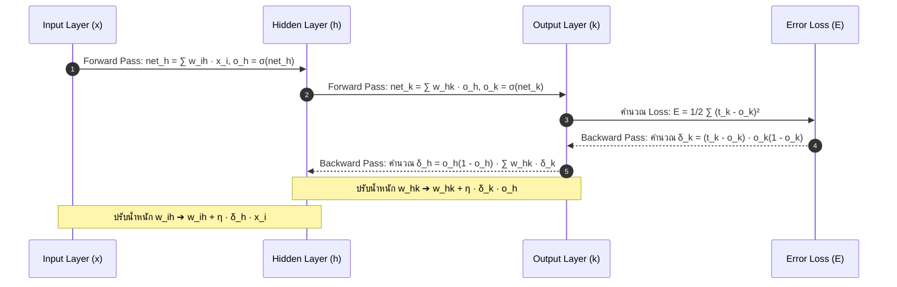

# โครงข่ายประสาทเทียมหลายชั้นและการแพร่ย้อนกลับ (Multilayer Networks & Backpropagation)

arrow_back กลับไปที่ [[Week05-MOC|MOC สัปดาห์ 05]] | ก่อนหน้า: [[02-Gradient-Descent-and-Linear-Units]]

## key Keyword

- **Multilayer Perceptron (MLP)** — โครงข่ายประสาทเทียมแบบส่งต่อ (Feedforward) ที่มีชั้นซ่อน (Hidden Layers) คั่นระหว่างชั้นอินพุตและเอาต์พุต
- **Hidden Unit Representation** — การที่เซลล์ในชั้นซ่อนทำหน้าที่สร้างคุณลักษณะใหม่ (Feature of Features) ทำให้ข้อมูลที่ไม่เป็นเชิงเส้นสามารถแบ่งแยกได้
- **Sigmoid (Logistic) Function** — ฟังก์ชันกระตุ้นไม่เป็นเชิงเส้นรูปตัว S ที่มีอนุพันธ์ราบเรียบและสวยงาม: $\sigma'(y) = \sigma(y)(1 - \sigma(y))$
- **Backpropagation** — อัลกอริทึมการคำนวณเกรเดียนต์โดยอาศัยกฎลูกโซ่ (Chain Rule) ย้อนกลับจากชั้นเอาต์พุตมายังชั้นซ่อน
- **Momentum ($\alpha$)** — พจน์ความเฉื่อยที่นำค่าการปรับน้ำหนักในรอบก่อนหน้ามาบวกเสริม เพื่อช่วยให้โมเดลกระโดดข้ามหลุมจุดต่ำสุดท้องถิ่น (Local Minima)
- **Early Stopping** — เทคนิคหยุดการฝึกโมเดลล่วงหน้าเมื่อค่าความคลาดเคลื่อนบนชุดตรวจสอบ (Validation Error) เริ่มพุ่งสูงขึ้น เพื่อป้องกัน Overfitting

## menu_book Theory (เข้าใจง่าย)

### 1. พลังของชั้นซ่อนและการพิชิตปัญหา XOR (Hidden Layers)

เพื่อเอาชนะข้อจำกัดของเพอร์เซปตรอนชั้นเดียว เราได้เพิ่ม **Hidden Layer** เข้าไปตรงกลาง:
- ชั้นซ่อนทำหน้าที่แปลงพิกัดของอินพุตเดิม ($x_1, x_2$) ให้อยู่ในปริภูมิคุณลักษณะใหม่ ($v_1, v_2$)
- ในกรณีของปัญหา XOR:
  - โหนดซ่อนตัวที่ 1 ทำหน้าที่เรียนรู้เส้นแบ่ง $x_1 + x_2 - 0.5 = 0$
  - โหนดซ่อนตัวที่ 2 ทำหน้าที่เรียนรู้เส้นแบ่ง $x_1 + x_2 + 0.5 = 0$
  - เมื่อนำผลลัพธ์ $v_1, v_2$ ส่งต่อไปยัง Output Layer ข้อมูลจะกลายเป็น **Linearly Separable** ในปริภูมิใหม่ และสามารถแยกแยะ XOR ได้อย่างสมบูรณ์แบบ

---

### 2. ฟังก์ชันกระตุ้นซิกมอยด์ (Sigmoid Activation Function)

ฟังก์ชัน Sigmoid เป็นสะพานเชื่อมระหว่างคุณสมบัติความไม่เป็นเชิงเส้นและความสามารถในการหาอนุพันธ์:
$$\sigma(y) \equiv \frac{1}{1 + e^{-y}}$$

#### อนุพันธ์อันแสนงดงามของ Sigmoid (Derivation):
$$\frac{d\sigma(y)}{dy} = \frac{d}{dy} (1 + e^{-y})^{-1} = -(1 + e^{-y})^{-2} (-e^{-y}) = \frac{e^{-y}}{(1 + e^{-y})^2}$$
$$= \frac{1}{1 + e^{-y}} \left( \frac{e^{-y}}{1 + e^{-y}} \right) = \frac{1}{1 + e^{-y}} \left( 1 - \frac{1}{1 + e^{-y}} \right) = \mathbf{\sigma(y)(1 - \sigma(y))}$$

---

### 3. การอนุพันธ์สมการ Backpropagation ด้วยกฎลูกโซ่ (Chain Rule)

กำหนดให้โครงข่ายมีชั้น Input ($i$), ชั้น Hidden ($h$), และชั้น Output ($k$):
- ค่าผลรวมที่โหนด $j$: $net_j = \sum_i w_{ji} x_i$
- เอาต์พุตที่โหนด $j$: $o_j = \sigma(net_j)$
- ฟังก์ชันความสูญเสียต่อหนึ่งตัวอย่าง $d$:
  $$E_d = \frac{1}{2} \sum_{k \in \text{outputs}} (t_k - o_k)^2$$

#### ขั้นที่ 1: การคำนวณ Error Term ของชั้นเอาต์พุต ($\delta_k$)
$$\frac{\partial E_d}{\partial w_{hk}} = \frac{\partial E_d}{\partial net_k} \frac{\partial net_k}{\partial w_{hk}} = \left( \frac{\partial E_d}{\partial o_k} \frac{\partial o_k}{\partial net_k} \right) o_h$$
- $\frac{\partial E_d}{\partial o_k} = -(t_k - o_k)$
- $\frac{\partial o_k}{\partial net_k} = o_k(1 - o_k)$
กำหนดนิยาม $\delta_k \equiv -\frac{\partial E_d}{\partial net_k}$:
$$\mathbf{\delta_k = (t_k - o_k) o_k (1 - o_k)}$$
สูตรปรับค่าน้ำหนักชั้นเอาต์พุต:
$$\mathbf{\Delta w_{hk} = \eta \, \delta_k \, o_h}$$

#### ขั้นที่ 2: การคำนวณ Error Term ของชั้นซ่อน ($\delta_h$)
เนื่องจากผลลัพธ์ของโหนดซ่อน $h$ กระจายไปยังทุกโหนดเอาต์พุต $k$:
$$\delta_h \equiv -\frac{\partial E_d}{\partial net_h} = -\sum_{k \in \text{outputs}} \frac{\partial E_d}{\partial net_k} \frac{\partial net_k}{\partial o_h} \frac{\partial o_h}{\partial net_h}$$
- $-\frac{\partial E_d}{\partial net_k} = \delta_k$
- $\frac{\partial net_k}{\partial o_h} = w_{hk}$
- $\frac{\partial o_h}{\partial net_h} = o_h(1 - o_h)$
สรุปได้สูตร:
$$\mathbf{\delta_h = o_h (1 - o_h) \sum_{k \in \text{outputs}} w_{hk} \, \delta_k}$$
สูตรปรับค่าน้ำหนักชั้นซ่อน:
$$\mathbf{\Delta w_{ih} = \eta \, \delta_h \, x_i}$$

---

### 4. การเพิ่ม Momentum และการป้องกัน Overfitting

#### พจน์ความเฉื่อย (Momentum $\alpha$):
$$\Delta w_{ji}(n) = \eta \, \delta_j \, x_{ji} + \alpha \, \Delta w_{ji}(n-1)$$
- โดย $\alpha \in [0, 1)$ ทำหน้าที่เหมือนแรงส่งของลูกบอลที่กลิ้งลงเนิน
- ช่วยเร่งความเร็วบนพื้นผิวที่ราบเรียบ และช่วยส่งแรงพุ่งข้ามหลุม **Local Minima** ตื้น ๆ ได้

#### การป้องกัน Overfitting ด้วย Early Stopping:
- ในระหว่างการเทรน Training Error จะลดลงเรื่อย ๆ ตามจำนวน Epoch
- แต่ Validation Error จะลดลงถึงจุดหนึ่งแล้วเริ่มวกกลับสูงขึ้น (จุดที่โมเดลเริ่มจดจำ Noise)
- **Early Stopping:** บันทึกค่าน้ำหนัก ณ จุดที่ Validation Error ต่ำที่สุด แล้วหยุดกระบวนการฝึกฝนทันที

## schema Diagram

**ตัวอย่าง:** ผังลำดับการทำงานแบบ Forward Pass และ Backward Pass ในการฝึกฝนโครงข่ายประสาทเทียม

---
arrow_forward กลับไปที่: [[Week05-MOC|MOC สัปดาห์ 05]]
