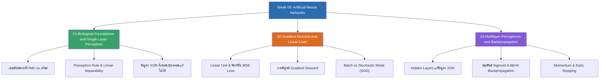

# Week 05 — Artificial Neural Networks & Backpropagation (MOC)

arrow_back สัปดาห์ก่อนหน้า: [[Week04-MOC|MOC สัปดาห์ 04]]

## check_circle เช็คลิสต์ก่อนเข้าเรียน

- [ ] ทำความเข้าใจการทำงานของ Single-layer Perceptron และสาเหตุที่ล้มเหลวในปัญหา XOR — ดู [[01-Biological-Foundations-and-Single-Layer-Perceptron]]
- [ ] ไล่การพิสูจน์ทางคณิตศาสตร์ของการหาเกรเดียนต์บน Mean Square Error (Delta Rule) — ดู [[02-Gradient-Descent-and-Linear-Units]]
- [ ] จำอนุพันธ์ของฟังก์ชัน Sigmoid: $\sigma'(y) = \sigma(y)(1 - \sigma(y))$ — ดู [[03-Multilayer-Perceptrons-and-Backpropagation]]
- [ ] เข้าใจสมการ Backpropagation ทั้งในชั้นเอาต์พุต ($\delta_k$) และชั้นซ่อน ($\delta_h$) — ดู [[03-Multilayer-Perceptrons-and-Backpropagation]]

## assignment ภาพรวมสัปดาห์ 05 (สรุปย่อ)

สัปดาห์ที่ 5 สำรวจหัวใจของโครงข่ายประสาทเทียม (Artificial Neural Networks) ซึ่งเป็นรากฐานของ Deep Learning ยุคปัจจุบัน:
1. **รากฐานเซลล์ประสาทและเพอร์เซปตรอน (Biological to Artificial):** แบบจำลอง McCulloch-Pitts, กฎการเรียนรู้ของ Perceptron, ความสามารถในการแบ่งแยกเชิงเส้น (Linear Separability), และวิกฤตความล้มเหลวในการแก้ฟังก์ชัน XOR
2. **การเรียนรู้ด้วยการลดระดับตามความชัน (Gradient Descent):** เซลล์ประสาทเชิงเส้น (Linear Units), การคำนวณและหาอนุพันธ์ของฟังก์ชัน MSE Loss, ความแตกต่างระหว่าง Batch Gradient Descent กับ Stochastic Gradient Descent (SGD), และข้อแตกต่างระหว่าง Perceptron Rule กับ Delta Rule
3. **โครงข่ายหลายชั้นและการแพร่ย้อนกลับ (MLP & Backpropagation):** กลไกของ Hidden Units ในการแปลงพิกัดเพื่อพิชิต XOR, คุณสมบัติของฟังก์ชัน Sigmoid, การพิสูจน์สมการ Backpropagation ด้วยกฎลูกโซ่อย่างละเอียด, การเสริม Momentum เพื่อหนี Local Minima, และการประยุกต์ใช้ในระบบจริง เช่น ALVINN

## map แผนที่หัวข้อสัปดาห์ 05

## collections_bookmark โน้ตรายหัวข้อ

| หัวข้อ | เนื้อหาหลัก | หน้าสไลด์ |
| :--- | :--- | :--- |
| [[01-Biological-Foundations-and-Single-Layer-Perceptron]] | โครงสร้างเซลล์ประสาท, แบบจำลองเพอร์เซปตรอน, กฎการอัปเดตน้ำหนัก, การแก้ปัญหา AND/OR, และข้อจำกัดในปัญหา XOR | สไลด์ 1–19 |
| [[02-Gradient-Descent-and-Linear-Units]] | เซลล์ประสาทเชิงเส้น, การหาอนุพันธ์ MSE Loss, กฎเดลต้า (Delta Rule), การเปรียบเทียบ Batch vs SGD, และความแตกต่างระหว่าง Perceptron vs Gradient Descent | สไลด์ 29–37 |
| [[03-Multilayer-Perceptrons-and-Backpropagation]] | การแทนค่าในชั้นซ่อน, ฟังก์ชันซิกมอยด์, การพิสูจน์กฎ Backpropagation สำหรับชั้น $\delta_k$ และ $\delta_h$, พจน์โมเมนตัม, และการป้องกัน Overfitting | สไลด์ 20–28, 38–56 |

> [!tip] เคล็ดลับการจำสูตรในห้องสอบสัปดาห์ที่ 05
> สังเกตความสอดคล้องของพจน์ Error $\delta$:
> - **ชั้นเอาต์พุต ($\delta_k$):** รู้ผลต่างจริงทันที $\implies (t_k - o_k) \cdot o_k(1 - o_k)$
> - **ชั้นซ่อน ($\delta_h$):** ไม่รู้ค่า $t$ จริง ต้องดึง Error สะท้อนกลับมาจากชั้นถัดไป $\implies \left[\sum w_{hk} \delta_k\right] \cdot o_h(1 - o_h)$
> ส่วนการปรับน้ำหนักจำรูปแบบเดียวเสมอ: $\Delta w = \eta \times \delta \times \text{Input ของเส้นเชื่อมนั้น}$

---
arrow_forward สัปดาห์ถัดไป: [[Week06-MOC|MOC สัปดาห์ 06]]
