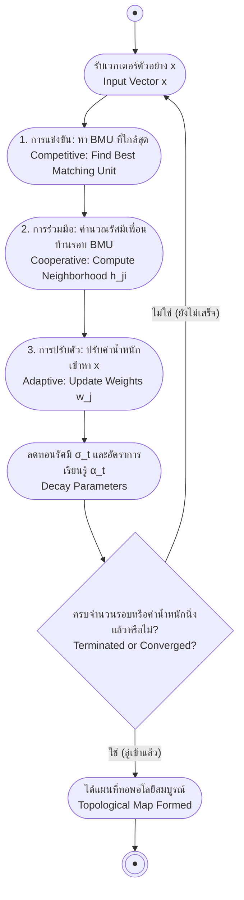

# แผนที่จัดระเบียบตนเองและโครงข่ายโคโฮเนน (Self-Organizing Maps & Kohonen Networks)

arrow_back กลับไปที่ [[Week06-MOC|MOC สัปดาห์ 06]]

## key Keyword

- **Unsupervised Learning** — การเรียนรู้แบบไม่มีผู้สอน โดยโมเดลต้องค้นหารูปแบบหรือโครงสร้างที่ซ่อนอยู่ภายในข้อมูลโดยไม่มีป้ายกำกับเฉลย (No Class Labels)
- **Self-Organizing Map (SOM)** — โครงข่ายประสาทเทียมแบบไม่มีผู้สอนที่คิดค้นโดย Teuvo Kohonen ซึ่งทำหน้าที่ลดมิติข้อมูลและรักษาความสัมพันธ์เชิงทอพอโลยี (Topology-preserving)
- **Best Matching Unit (BMU)** — โหนดในโครงข่ายโคโฮเนนที่มีเวกเตอร์ค่าน้ำหนักใกล้เคียงกับเวกเตอร์อินพุตมากที่สุด (ผู้ชนะใน Competitive Process)
- **Competitive Process** — กระบวนการแข่งขันระหว่างโหนดในแผนที่ โดยโหนดที่อยู่ใกล้ข้อมูลอินพุตที่สุดจะเป็นผู้ชนะเพียงหนึ่งเดียว (Winner-Take-All)
- **Cooperative Process** — กระบวนการร่วมมือที่ดึงให้โหนดเพื่อนบ้านในรัศมีรอบ BMU ได้รับการปรับค่าน้ำหนักตามไปด้วย

## menu_book Theory (เข้าใจง่าย)

### 1. สถาปัตยกรรมของแผนที่จัดระเบียบตนเอง (SOM Architecture)

SOM ทำหน้าที่ฉาย (Project) ข้อมูลที่มีมิติสูง ($n$-dimensional input) ลงบนกริดมิติต่ำ (มักเป็น 1D หรือ 2D Lattice Grid) โดยยังคงรักษาความใกล้ชิดเชิงพื้นที่ของข้อมูลไว้:
- **Input Layer:** รับเวกเตอร์คุณลักษณะ $\mathbf{x} = [x_1, x_2, \dots, x_n]^T$
- **Kohonen Map Layer:** ประกอบด้วยเซลล์ประสาทที่จัดเรียงเป็นโครงร่างตาราง แต่ละโหนด $j$ มีเวกเตอร์ค่าน้ำหนักของตนเอง $\mathbf{w}_j = [w_{j1}, w_{j2}, \dots, w_{jn}]^T$

---

### 2. อัลกอริทึมการเรียนรู้ของ SOM (The 3 Core Processes)

การทำงานของ SOM ในแต่ละรอบประกอบด้วย 3 กระบวนการทางคณิตศาสตร์:

#### 1. กระบวนการแข่งขัน (Competitive Process):
ค้นหาโหนดที่ชนะหรือ **Best Matching Unit (BMU)** ซึ่งมีระยะห่างแบบยุคลิด (Euclidean Distance) กับเวกเตอร์อินพุต $\mathbf{x}$ น้อยที่สุด:
$$i(\mathbf{x}) = \arg\min_j \|\mathbf{x} - \mathbf{w}_j\|$$

#### 2. กระบวนการร่วมมือ (Cooperative Process):
กำหนดฟังก์ชันเพื่อนบ้าน (Neighborhood Function) รอบจุด BMU โดยมักใช้ฟังก์ชันเกาส์เซียน:
$$h_{ji}(t) = \exp\left( -\frac{\|\mathbf{r}_j - \mathbf{r}_i\|^2}{2 \sigma(t)^2} \right)$$
โดย:
- $\mathbf{r}_i$ และ $\mathbf{r}_j$ คือตำแหน่งพิกัดทางภูมิศาสตร์ของโหนด $i$ (BMU) และโหนด $j$ บนตารางกริด
- $\sigma(t)$ คือรัศมีเพื่อนบ้าน ซึ่งจะค่อย ๆ หดเล็กลงตามเวลา (Shrinking Radius) ตามฟังก์ชันลดทอนแบบเอกซ์โพเนนเชียล: $\sigma(t) = \sigma_0 \exp(-t / \tau)$

#### 3. กระบวนการปรับตัว (Adaptive Process):
ปรับค่าน้ำหนักของโหนด BMU และโหนดเพื่อนบ้านให้ขยับเข้าใกล้เวกเตอร์อินพุต $\mathbf{x}$:
$$\mathbf{w}_j(t+1) = \mathbf{w}_j(t) + \alpha(t) \, h_{ji}(t) \, (\mathbf{x} - \mathbf{w}_j(t))$$
โดย $\alpha(t)$ คืออัตราการเรียนรู้ที่จะค่อย ๆ ลดลงตามเวลา (Decaying Learning Rate)

---

### 3. ตัวอย่างการคำนวณแกะรอยตามสไลด์ (4 Vectors into 2 Clusters)

กำหนดเวกเตอร์อินพุต 4 ตัวอย่างเพื่อแบ่งเป็น 2 กลุ่ม:
- $X = [\mathbf{x}_1, \mathbf{x}_2, \mathbf{x}_3, \mathbf{x}_4]$
- โหนดตัวแทนกลุ่มมี 2 ตัว: $\mathbf{w}_1$ และ $\mathbf{w}_2$

#### การแข่งขันในรอบที่ 1:
1. ป้อน $\mathbf{x}_1$: คำนวณ $d_1 = \|\mathbf{x}_1 - \mathbf{w}_1\| = 1.0245$ และ $d_2 = \|\mathbf{x}_1 - \mathbf{w}_2\| = 2.6537$  
   $\to d_1 < d_2 \implies \mathbf{w}_1$ เป็นผู้ชนะ (BMU) ปรับค่าน้ำหนัก $\mathbf{w}_1$ เข้าหา $\mathbf{x}_1$
2. ป้อน $\mathbf{x}_2$: คำนวณ $d_1 = 1.3788$ และ $d_2 = 2.0637 \implies \mathbf{w}_1$ เป็นผู้ชนะอีกครั้ง
3. ป้อน $\mathbf{x}_3$: คำนวณ $d_1 = 1.9006$ และ $d_2 = 1.6734 \implies \mathbf{w}_2$ เป็นผู้ชนะ ปรับ $\mathbf{w}_2$ เข้าหา $\mathbf{x}_3$
4. ป้อน $\mathbf{x}_4$: คำนวณ $d_1 = 1.5827$ และ $d_2 = 1.8556 \implies \mathbf{w}_1$ ชนะ

เมื่อวนซ้ำจนครบ Epochs เวกเตอร์น้ำหนัก $\mathbf{w}_1$ และ $\mathbf{w}_2$ จะกลายเป็นจุดศูนย์กลาง (Centroids) ที่เป็นตัวแทนของข้อมูล 2 กลุ่มได้อย่างแม่นยำ

## schema Diagram

**ตัวอย่าง:** วงจร 3 กระบวนการหลักของ Self-Organizing Map (Competitive $\to$ Cooperative $\to$ Adaptive)

---
arrow_forward ต่อไป: [[02-KMeans-and-Fuzzy-CMeans-Clustering]]
