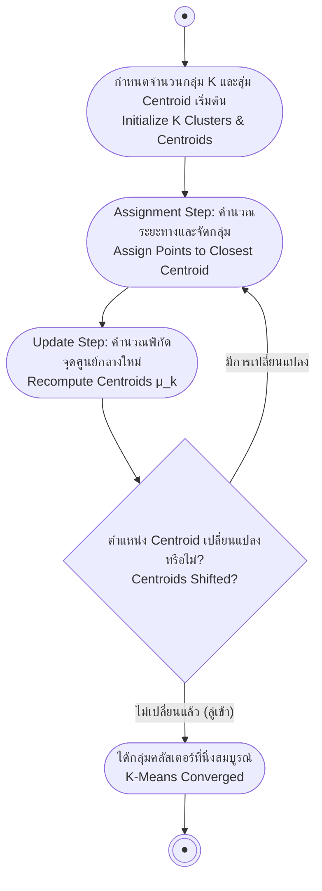

# การแบ่งกลุ่มข้อมูลด้วย K-Means และ Fuzzy C-Means (K-Means & Fuzzy C-Means)

arrow_back กลับไปที่ [[Week06-MOC|MOC สัปดาห์ 06]] | ก่อนหน้า: [[01-Self-Organizing-Maps-Kohonen-Networks]]

## key Keyword

- **Hard Clustering** — การจัดกลุ่มแบบเด็ดขาด โดยข้อมูลแต่ละจุดต้องสังกัดกลุ่มใดกลุ่มหนึ่งเพียงกลุ่มเดียวเท่านั้น (เช่น K-Means)
- **Soft (Fuzzy) Clustering** — การจัดกลุ่มแบบยืดหยุ่น โดยข้อมูลหนึ่งจุดสามารถเป็นสมาชิกของหลายกลุ่มพร้อมกันด้วยค่าระดับความเป็นสมาชิก (Membership Degree)
- **Centroid ($\mu_k$)** — จุดศูนย์กลางมวลหรือเวกเตอร์ค่าเฉลี่ยของข้อมูลทั้งหมดที่สังกัดอยู่ในคลัสเตอร์ $k$
- **Within-Cluster Sum of Squares (WCSS)** — ผลรวมของระยะทางกำลังสองระหว่างจุดข้อมูลกับจุดศูนย์กลางของกลุ่มตนเอง ใช้เป็นฟังก์ชันเป้าหมายที่ต้องลดทอน
- **Membership Matrix ($U$)** — เมทริกซ์ที่ระบุระดับความเป็นสมาชิกของข้อมูลแต่ละตัวเทียบกับทุกคลัสเตอร์ โดยผลรวมในแต่ละแถวต้องเท่ากับ 1 เสมอ

## menu_book Theory (เข้าใจง่าย)

### 1. อัลกอริทึม K-Means (Hard Clustering)

K-Means เป็นอัลกอริทึมแบ่งกลุ่มข้อมูลที่ได้รับความนิยมสูงสุดเนื่องจากเรียบง่ายและประมวลผลเร็ว:

#### ขั้นตอนการทำงาน 4 ขั้นตอน:
1. **กำหนดจำนวนกลุ่ม ($K$):** ผู้ใช้ต้องระบุจำนวนคลัสเตอร์ล่วงหน้า และทำการสุ่มตำแหน่งจุดศูนย์กลางเริ่มต้น $K$ จุด ($\mu_1, \mu_2, \dots, \mu_K$)
2. **ขั้นตอนการกำหนดกลุ่ม (Assignment Step):**
   - คำนวณระยะห่างแบบยุคลิดระหว่างข้อมูลทุกจุด $x_i$ กับจุดศูนย์กลางทั้ง $K$ ตัว
   - กำหนดให้ $x_i$ สังกัดกลุ่มที่อยู่ใกล้ที่สุด:
     $$c^{(i)} = \arg\min_k \|x_i - \mu_k\|^2$$
3. **ขั้นตอนการปรับตำแหน่งศูนย์กลาง (Update Step):**
   - คำนวณค่าเฉลี่ยใหม่ของจุดข้อมูลทั้งหมดที่สังกัดในกลุ่มนั้น:
     $$\mu_k = \frac{1}{|C_k|} \sum_{x \in C_k} x$$
4. **ตรวจสอบการลู่เข้า (Convergence Check):**
   - ทำซ้ำขั้นตอนที่ 2 และ 3 จนกระทั่งตำแหน่งของจุดศูนย์กลางไม่มีการเปลี่ยนแปลง หรือค่า WCSS ลดลงต่ำกว่าค่าขีดเริ่มเปลี่ยน

$$J = \sum_{k=1}^K \sum_{x \in C_k} \|x - \mu_k\|^2$$

---

### 2. อัลกอริทึม Fuzzy C-Means (Soft Clustering)

ในสถานการณ์จริง ข้อมูลบางจุดอาจอยู่ก้ำกึ่งระหว่างสองกลุ่มอย่างแยกไม่ออก K-Means จะบังคับเลือกกลุ่มใดกลุ่มหนึ่งแบบหยาบเกินไป **Fuzzy C-Means (FCM)** จึงเปิดโอกาสให้ข้อมูลมีระดับความเป็นสมาชิก ($u_{ik} \in [0, 1]$):

#### กฎและเงื่อนไขของระดับความเป็นสมาชิก:
1. สำหรับข้อมูลแต่ละจุด ผลรวมระดับความเป็นสมาชิกในทุกคลัสเตอร์ต้องเท่ากับ 1:
   $$\sum_{k=1}^C u_{ik} = 1 \quad \forall i$$
2. ระดับความเป็นสมาชิกแปรผกผันกับระยะทางไปยังจุดศูนย์กลาง:
   $$u_{ik} \propto \frac{1}{\|x_i - \mu_k\|^2}$$
   - หากจุดข้อมูลอยู่ใกล้จุดศูนย์กลางกลุ่มใดมาก ค่า $u_{ik}$ จะสูงเข้าใกล้ 1
   - หากจุดข้อมูลอยู่กึ่งกลางระหว่าง 2 กลุ่ม ค่าความเป็นสมาชิกอาจแบ่งเป็น $0.5$ และ $0.5$
3. การคำนวณจุดศูนย์กลางใหม่ใน FCM จะใช้ค่าระดับความเป็นสมาชิกมาเป็นน้ำหนักถ่วง:
   $$\mu_k = \frac{\sum_{i=1}^N u_{ik}^m x_i}{\sum_{i=1}^N u_{ik}^m}$$
   (โดย $m > 1$ คือ Fuzzifier parameter ที่ควบคุมความคลุมเครือ นิยมใช้ $m = 2$)

## schema Diagram

**ตัวอย่าง:** ผังขั้นตอนการวนซ้ำระหว่าง Assignment Step และ Update Step ในอัลกอริทึม K-Means

---
arrow_forward ต่อไป: [[03-Gaussian-Mixture-Models-and-EM-Algorithm]]
