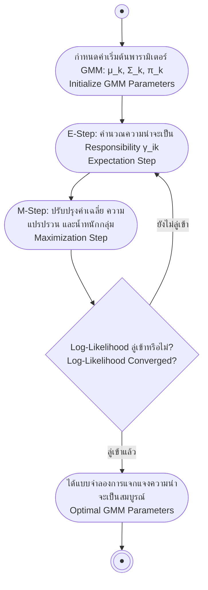

# ตัวแบบผสมเกาส์เซียนและอัลกอริทึม EM (Gaussian Mixture Models & Expectation-Maximization)

arrow_back กลับไปที่ [[Week06-MOC|MOC สัปดาห์ 06]] | ก่อนหน้า: [[02-KMeans-and-Fuzzy-CMeans-Clustering]]

## key Keyword

- **Gaussian Mixture Model (GMM)** — โมเดลความน่าจะเป็นที่จำลองการแจกแจงของข้อมูลที่ซับซ้อนด้วยผลรวมถ่วงน้ำหนักของการแจกแจงแบบปกติหลาย ๆ ตัว
- **Expectation-Maximization (EM)** — อัลกอริทึมการค้นหาพารามิเตอร์แบบภาวะน่าจะเป็นสูงสุด (Maximum Likelihood) ในระบบที่มีตัวแปรแฝง (Latent / Hidden Variables)
- **Latent Variable** — ตัวแปรที่ซ่อนอยู่และไม่สามารถสังเกตได้โดยตรงจากข้อมูล เช่น ตัวแปรที่ระบุว่าข้อมูลจุดนี้ถูกสร้างมาจากเกาส์เซียนตัวใด
- **Responsibility ($\gamma_{ik}$)** — ความน่าจะเป็นภายหลัง (Posterior Probability) ที่เกาส์เซียนองค์ประกอบที่ $k$ จะเป็นตัวให้กำเนิดข้อมูลจุดที่ $i$
- **Universal Density Approximator** — คุณสมบัติของ GMM ที่สามารถประมาณการฟังก์ชันความหนาแน่นความน่าจะเป็น (PDF) รูปร่างใด ๆ ก็ได้หากมีจำนวนองค์ประกอบมากพอ

## menu_book Theory (เข้าใจง่าย)

### 1. โครงสร้างของ Gaussian Mixture Models (GMM)

ในขณะที่ K-Means สันนิษฐานว่าคลัสเตอร์มีรูปทรงกลมขนาดเท่ากันเสมอ GMM ให้ความยืดหยุ่นสูงกว่ามากโดยเปิดให้คลัสเตอร์เป็น **รูปวงรี (Ellipsoid)** ที่มีความเอียงและขนาดต่างกันได้ตามเมทริกซ์ความแปรปรวนร่วม (Covariance Matrix):

ฟังก์ชันความหนาแน่นความน่าจะเป็นของ GMM:
$$p(\mathbf{x}) = \sum_{k=1}^K \pi_k \, \mathcal{N}(\mathbf{x} \mid \boldsymbol{\mu}_k, \boldsymbol{\Sigma}_k)$$

โดยที่:
- $\pi_k$ คือค่าน้ำหนักผสม (Mixture Weights) โดยที่ $\sum_{k=1}^K \pi_k = 1$ และ $\pi_k \ge 0$
- $\mathcal{N}(\mathbf{x} \mid \boldsymbol{\mu}_k, \boldsymbol{\Sigma}_k)$ คือ **Multivariate Normal Distribution** ในมิติ $D$:
  $$\mathcal{N}(\mathbf{x} \mid \boldsymbol{\mu}, \boldsymbol{\Sigma}) = \frac{1}{(2\pi)^{D/2} |\boldsymbol{\Sigma}|^{1/2}} \exp\left( -\frac{1}{2} (\mathbf{x} - \boldsymbol{\mu})^T \boldsymbol{\Sigma}^{-1} (\mathbf{x} - \boldsymbol{\mu}) \right)$$

---

### 2. อัลกอริทึม Expectation-Maximization (EM)

เนื่องจากเราไม่รู้ว่าข้อมูลจุดใดมาจากคลัสเตอร์ใด (ข้อมูลคลาสเป็นตัวแปรแฝง) เราจึงไม่สามารถหาอนุพันธ์สมการ Likelihood ได้โดยตรง จึงต้องสลับทำ 2 ขั้นตอน:

#### ขั้นเตรียมการ (Initialization):
กำหนดค่าเริ่มต้นให้กับ $\boldsymbol{\mu}_k$ (เวกเตอร์ค่าเฉลี่ย), $\boldsymbol{\Sigma}_k$ (เมทริกซ์ความแปรปรวนร่วม), และ $\pi_k$ (น้ำหนักผสม) โดยมักนำผลลัพธ์จาก K-Means มาตั้งเป็นค่าเริ่มต้น

#### ขั้น E-Step (Expectation):
คำนวณค่า Responsibility ($\gamma_{ik}$) ซึ่งเป็นความน่าจะเป็นว่าข้อมูลจุด $x_i$ สังกัดกลุ่ม $k$ โดยใช้กฎของเบย์ส:
$$\gamma_{ik} = \frac{\pi_k \, \mathcal{N}(\mathbf{x}_i \mid \boldsymbol{\mu}_k, \boldsymbol{\Sigma}_k)}{\sum_{j=1}^K \pi_j \, \mathcal{N}(\mathbf{x}_i \mid \boldsymbol{\mu}_j, \boldsymbol{\Sigma}_j)}$$

#### ขั้น M-Step (Maximization):
นำค่า Responsibility มาคำนวณปรับปรุงพารามิเตอร์ใหม่ทั้งหมดของเกาส์เซียนแต่ละตัว:
1. จำนวนข้อมูลยังผลของกลุ่ม $k$:
   $$N_k = \sum_{i=1}^N \gamma_{ik}$$
2. ปรับปรุงเวกเตอร์ค่าเฉลี่ย ($\boldsymbol{\mu}_k^{new}$):
   $$\boldsymbol{\mu}_k^{new} = \frac{1}{N_k} \sum_{i=1}^N \gamma_{ik} \mathbf{x}_i$$
3. ปรับปรุงเมทริกซ์ความแปรปรวนร่วม ($\boldsymbol{\Sigma}_k^{new}$):
   $$\boldsymbol{\Sigma}_k^{new} = \frac{1}{N_k} \sum_{i=1}^N \gamma_{ik} (\mathbf{x}_i - \boldsymbol{\mu}_k^{new})(\mathbf{x}_i - \boldsymbol{\mu}_k^{new})^T$$
4. ปรับปรุงค่าน้ำหนักผสม ($\pi_k^{new}$):
   $$\pi_k^{new} = \frac{N_k}{N}$$

ทำซ้ำสลับระหว่าง E-step และ M-step จนกระทั่งค่า Log-Likelihood ของข้อมูลลู่เข้าสู่นิ่ง

> [!important] ความไวต่อค่าเริ่มต้น (Sensitivity to Initialization)
> อัลกอริทึม EM มีความไวสูงมากต่อค่าพารามิเตอร์เริ่มต้น หากสุ่มจุดเริ่มต้นไม่ดี อาจลู่เข้าสู่ Local Optima หรือเกิดปัญหาเมทริกซ์ $\boldsymbol{\Sigma}$ กลายเป็น Singularity (ความแปรปรวนเข้าใกล้ศูนย์) ดังนั้นจึงนิยมรัน K-Means ก่อนหนึ่งรอบแล้วนำ Centroids มาตั้งเป็นค่าเฉลี่ยเริ่มต้นของ EM

## schema Diagram

**ตัวอย่าง:** ผังขั้นตอนการสลับวนลูประหว่าง E-Step และ M-Step ในอัลกอริทึม Expectation-Maximization

---
arrow_forward กลับไปที่: [[Week06-MOC|MOC สัปดาห์ 06]]
