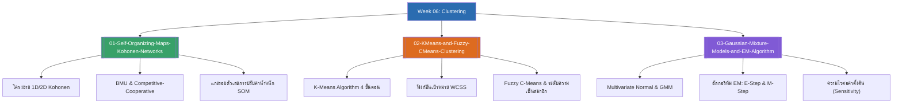

# Week 06 — Clustering & Unsupervised Learning (MOC)

arrow_back สัปดาห์ก่อนหน้า: [[Week05-MOC|MOC สัปดาห์ 05]]

## check_circle เช็คลิสต์ก่อนเข้าเรียน

- [ ] ทำความเข้าใจความแตกต่างของ Unsupervised Learning กับ Supervised Learning — ดู [[01-Self-Organizing-Maps-Kohonen-Networks]]
- [ ] ไล่ 3 กระบวนการหลักของ Self-Organizing Map (Competitive, Cooperative, Adaptive) — ดู [[01-Self-Organizing-Maps-Kohonen-Networks]]
- [ ] เปรียบเทียบข้อแตกต่างระหว่าง Hard Clustering (K-Means) กับ Soft Clustering (FCM) — ดู [[02-KMeans-and-Fuzzy-CMeans-Clustering]]
- [ ] เข้าใจสมการ E-Step และ M-Step ของ Gaussian Mixture Models — ดู [[03-Gaussian-Mixture-Models-and-EM-Algorithm]]

## assignment ภาพรวมสัปดาห์ 06 (สรุปย่อ)

สัปดาห์ที่ 6 ก้าวเข้าสู่โลกของการเรียนรู้แบบไม่มีผู้สอน (Unsupervised Learning) ที่เน้นการจัดกลุ่มข้อมูล (Clustering):
1. **แผนที่จัดระเบียบตนเอง (Self-Organizing Maps):** โครงข่ายโคโฮเนน (Kohonen Networks), กลไกการหา Best Matching Unit (BMU), การคำนวณเพื่อนบ้านแบบเกาส์เซียนที่หดเล็กลงตามกาลเวลา, และการแกะรอยตัวเลขการจัดกลุ่มเวกเตอร์ตัวอย่างสด
2. **การจัดกลุ่มเชิงสถิติ (K-Means & Fuzzy C-Means):** ขั้นตอนการกำหนดกลุ่ม (Assignment) และปรับจุดศูนย์กลาง (Update) ของ K-Means และการเปิดรับความคลุมเครือด้วยเมทริกซ์ระดับความเป็นสมาชิกใน Fuzzy C-Means
3. **การสร้างโมเดลความหนาแน่นและความน่าจะเป็น (GMM & EM Algorithm):** การแทนกลุ่มข้อมูลด้วยการแจกแจงแบบปกติหลายมิติ (Multivariate Normal), ทฤษฎีตัวแปรแฝง, และขั้นตอนการทำงานของอัลกอริทึม Expectation-Maximization (E-Step และ M-Step)

## map แผนที่หัวข้อสัปดาห์ 06

## collections_bookmark โน้ตรายหัวข้อ

| หัวข้อ | เนื้อหาหลัก | หน้าสไลด์ |
| :--- | :--- | :--- |
| [[01-Self-Organizing-Maps-Kohonen-Networks]] | นิยาม Unsupervised Learning, สถาปัตยกรรม SOM, การหา BMU, กฎการปรับน้ำหนัก, และการแกะรอยตัวอย่างคำนวณ | สไลด์ 1–18 |
| [[02-KMeans-and-Fuzzy-CMeans-Clustering]] | การจัดกลุ่ม K-Means, WCSS, การคำนวณจุดศูนย์กลางใหม่, และการขยายผลสู่ Fuzzy C-Means (Membership degrees) | สไลด์ 19–20 |
| [[03-Gaussian-Mixture-Models-and-EM-Algorithm]] | ตัวแบบผสมเกาส์เซียน (GMM), ตัวแปรแฝง, ฟังก์ชันความหนาแน่นหลายมิติ, และสมการ E-Step / M-Step ในอัลกอริทึม EM | สไลด์ 21–27 |

> [!tip] ข้อควรจำสำหรับข้อสอบสัปดาห์ที่ 06
> - **K-Means vs GMM:** K-Means คือรูปแบบพิเศษของ GMM ที่จำกัดให้ Covariance Matrix มีรูปทรงกลมเท่ากันหมดทุกกลุ่ม ($\boldsymbol{\Sigma} = \sigma^2 \mathbf{I}$) และใช้ Hard Assignment แทนความน่าจะเป็น
> - ในอัลกอริทึม SOM: จำไว้ว่าในระยะยาว ทั้งรัศมีเพื่อนบ้าน $\sigma(t)$ และอัตราการเรียนรู้ $\alpha(t)$ จะต้องลดลงแบบเอกซ์โพเนนเชียล เพื่อให้โมเดลลู่เข้าสู่จุดสมดุล

---
arrow_forward สัปดาห์ถัดไป: [[Week07-MOC|MOC สัปดาห์ 07]]
