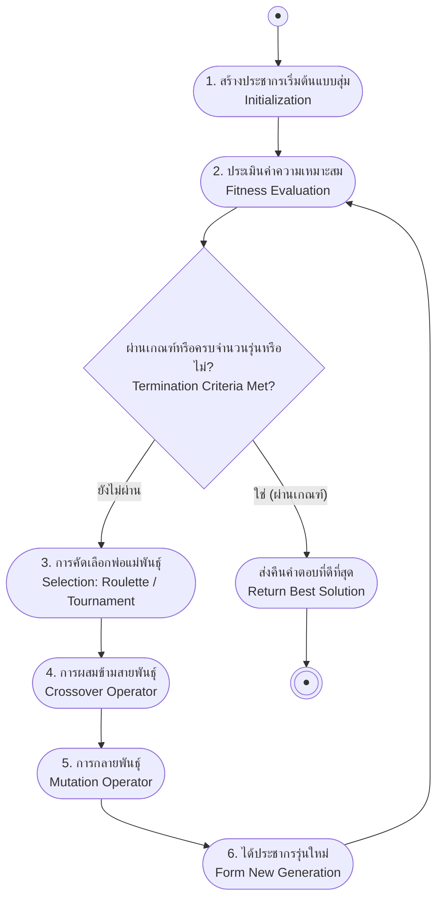

# รากฐานขั้นตอนวิธีทางพันธุกรรมและตัวดำเนินการทางพันธุศาสตร์ (Genetic Algorithms & Genetic Operators)

<span class="material-symbols-outlined">arrow_back</span> กลับไปที่ [[Week07-MOC|MOC สัปดาห์ 07]]

## <span class="material-symbols-outlined">key</span> Keyword

- **Genetic Algorithm (GA)** — ขั้นตอนวิธีการค้นหาและการหาค่าเหมาะสมที่สุด (Optimization) แบบฮิวริสติกที่จำลองกระบวนการคัดเลือกตามธรรมชาติของดาร์วิน (Charles Darwin)
- **Chromosome (โครโมโซม)** — โครงสร้างข้อมูลที่ใช้แทนคำตอบที่เป็นไปได้หนึ่งคำตอบในปริภูมิการค้นหา (เรียกว่า Genotype)
- **Fitness Function** — ฟังก์ชันประเมินความเหมาะสมหรือความยอดเยี่ยมของคำตอบ เพื่อใช้เป็นเกณฑ์ตัดสินการอยู่รอด
- **Roulette Wheel Selection** — วิธีการคัดเลือกพ่อแม่พันธุ์โดยความน่าจะเป็นในการถูกเลือกแปรผันตรงกับค่า Fitness
- **Crossover (การผสมข้ามสายพันธุ์)** — ตัวดำเนินการทางพันธุศาสตร์ที่สลับแลกเปลี่ยนชิ้นส่วนยีนระหว่างโครโมโซมพ่อแม่เพื่อสร้างโครโมโซมลูก
- **Mutation (การกลายพันธุ์)** — การสุ่มดัดแปลงยีนบางตำแหน่งด้วยความน่าจะเป็นต่ำ เพื่อรักษาความหลากหลายทางพันธุกรรมและป้องกันการติดกับดัก Local Optima

## <span class="material-symbols-outlined">menu_book</span> Theory (เข้าใจง่าย)

### 1. ปรัชญาการวิวัฒนาการและแบบจำลอง GA (Evolutionary Metaphor)

คิดค้นโดย John Holland (1975) และพัฒนาต่อยอดโดย John Koza (1992):
- **ปัญหาการค้นหาคำตอบ (Word Guessing Analogy):**  
  หากต้องการเดาคำว่า `THAILAND` (8 ตัวอักษร) การสุ่มเดาแบบ Brute Force ต้องใช้เวลาถึง $26^8 \approx 2.08 \times 10^{11}$ ครั้ง แต่หากใช้ GA โดยให้คำที่มีตัวอักษรตรงตำแหน่งได้รับคะแนน Fitness สูง และผสมพันธุ์ข้ามรุ่น จะลู่เข้าสู่คำตอบได้ภายในไม่กี่สิบรอบ
- **การเทียบเคียงทางชีววิทยา:**
  - **Gene:** ตัวแปรหรือคุณลักษณะย่อย 1 ตัว
  - **Chromosome / Genotype:** สายรหัสแทนคำตอบ เช่น บิตสตริง `11010010`
  - **Phenotype:** คำตอบหรือโมเดลจริงที่ถูกถอดรหัสออกมาประเมิน
  - **Population:** กลุ่มของประชากรคำตอบในแต่ละเจเนอเรชัน

---

### 2. รูปแบบการเข้ารหัส (Chromosome Encoding)

1. **Binary Bit Strings:** รหัสเลขฐานสอง (`0101...1100`) นิยมที่สุดในงานดั้งเดิม
2. **Real-Valued Arrays:** อาเรย์ของจำนวนจริง (`[43.2, -33.1, 0.0, 89.2]`) นิยมใช้หาค่าน้ำหนักของโมเดล
3. **Permutation of Elements:** ลำดับการเรียงสับเปลี่ยน (`[3, 1, 4, 2]`) ใช้ในปัญหาเชิงจัดหมู่ เช่น การจัดตารางและ TSP

---

### 3. ตัวดำเนินการทางพันธุศาสตร์ (Genetic Operators)

#### 1. การคัดเลือก (Selection):
- **Roulette Wheel Selection (วงล้อรูเล็ตต์):** ความน่าจะเป็นที่โครโมโซม $h_i$ จะถูกเลือกเป็นพ่อแม่พันธุ์:
  $$P(h_i) = \frac{Fitness(h_i)}{\sum_{j=1}^p Fitness(h_j)}$$
- **Rank Selection / Truncation:** จัดอันดับประชากรตามคะแนน แล้วคัดเฉพาะกลุ่ม Top-K มาผสมพันธุ์

#### 2. การผสมข้ามสายพันธุ์ (Crossover):
- **Single-Point Crossover:** สุ่มจุดตัด 1 จุด แล้วสลับส่วนหางระหว่างพ่อกับแม่:
  - แม่: `11101 | 001000` $\to$ ลูก 1: `11101 | 010101`
  - พ่อ: `00001 | 010101` $\to$ ลูก 2: `00001 | 001000`
- **Two-Point Crossover:** สุ่มจุดตัด 2 จุด แล้วสลับเฉพาะท่อนตรงกลาง
- **Uniform Crossover:** สุ่มสลับยีนแต่ละตำแหน่งอย่างอิสระด้วยความน่าจะเป็น (เช่น $0.5$)

#### 3. การกลายพันธุ์ (Mutation):
- **Bit-flip Mutation:** สุ่มกลับบิตจาก 0 เป็น 1 หรือ 1 เป็น 0 ด้วยความน่าจะเป็นต่ำมาก ($p_m \approx 0.001 - 0.01$)
- **Swap Mutation:** สลับตำแหน่งยีน 2 ตัวในโครโมโซมเดียวกัน (เหมาะกับ Permutation)

---

### 4. อัลกอริทึม Simple GA (SGA Algorithm)

```text
1. สุ่มสร้างประชากรเริ่มต้น P จำนวน p โครโมโซม
2. คำนวณค่า Fitness(h) สำหรับทุกโครโมโซม h ใน P
3. ทำซ้ำจนกระทั่ง max(Fitness) ผ่านเกณฑ์ หรือครบจำนวนรอบ:
     ก. สร้างประชากรใหม่ P_next ว่างเปล่า
     ข. ทำซ้ำจนขนาดของ P_next เท่ากับ p:
          - สุ่มคัดเลือกพ่อแม่พันธุ์ 2 ตัวจาก P ด้วยความน่าจะเป็นตาม Fitness
          - สุ่มทำการ Crossover ด้วยอัตราความน่าจะเป็น r_c ได้ลูก 2 ตัว
          - สุ่มทำการ Mutation ด้วยอัตราความน่าจะเป็น r_m บนยีนของลูก
          - นำลูกเข้าสู่ประชากร P_next
     ค. P = P_next
     ง. ประเมินค่า Fitness ของประชากรรอบใหม่
4. คืนค่าโครโมโซมที่ได้คะแนน Fitness สูงสุด
```

## <span class="material-symbols-outlined">schema</span> Diagram



**ตัวอย่าง:** วงจรอัลกอริทึมการวิวัฒนาการของ Genetic Algorithm ในแต่ละรุ่น

---
<span class="material-symbols-outlined">arrow_forward</span> ต่อไป: [[02-GA-Applications-Curve-Fitting-and-TSP]]
