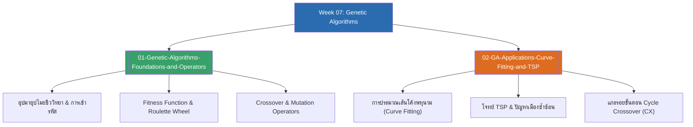

# Week 07 — Genetic Algorithms & Evolutionary Search (MOC)

arrow_back สัปดาห์ก่อนหน้า: [[Week06-MOC|MOC สัปดาห์ 06]]

## check_circle เช็คลิสต์ก่อนเข้าเรียน

- [ ] ทำความเข้าใจแนวคิดการค้นหาเชิงวิวัฒนาการและแบบจำลอง Genotype vs Phenotype — ดู [[01-Genetic-Algorithms-Foundations-and-Operators]]
- [ ] เปรียบเทียบวิธีการคัดเลือกพ่อแม่พันธุ์ (Roulette Wheel vs Truncation) — ดู [[01-Genetic-Algorithms-Foundations-and-Operators]]
- [ ] จำรูปแบบของ Crossover (Single-point, Two-point, Uniform) และ Mutation — ดู [[01-Genetic-Algorithms-Foundations-and-Operators]]
- [ ] ฝึกแกะรอยการทำงานของ Cycle Crossover (CX) สำหรับโจทย์ TSP — ดู [[02-GA-Applications-Curve-Fitting-and-TSP]]

## assignment ภาพรวมสัปดาห์ 07 (สรุปย่อ)

สัปดาห์ที่ 7 มุ่งเน้นกระบวนทัศน์การค้นหาและการหาค่าเหมาะสมที่สุดเชิงวิวัฒนาการ (Evolutionary Computation):
1. **รากฐานขั้นตอนวิธีทางพันธุกรรม (Genetic Algorithms Foundations):** ปรัชญาการปรับปรุงสายพันธุ์ของ Holland, รูปแบบการเข้ารหัสโครโมโซม (Bit string, Real numbers, Permutations), และฟังก์ชันประเมินความเหมาะสม (Fitness Function)
2. **ตัวดำเนินการทางพันธุศาสตร์ (Genetic Operators):** การคัดเลือกด้วยวงล้อรูเล็ตต์ (Roulette Wheel Selection), การผสมข้ามสายพันธุ์ (Crossover) รูปแบบต่าง ๆ, และการกลายพันธุ์ (Mutation) เพื่อรักษาความหลากหลาย
3. **การประยุกต์ใช้งานเชิงปฏิบัติ (GA Applications):** การหาเส้นโค้งพหุนาม (Curve Fitting) ด้วยโครโมโซมจำนวนจริง และการแก้ปัญหาเส้นทางของพนักงานขาย (TSP) โดยใช้ตัวดำเนินการ Cycle Crossover (CX) เพื่อรับประกันความถูกต้องของการเรียงสับเปลี่ยน

## map แผนที่หัวข้อสัปดาห์ 07

## collections_bookmark โน้ตรายหัวข้อ

| หัวข้อ | เนื้อหาหลัก | หน้าสไลด์ |
| :--- | :--- | :--- |
| [[01-Genetic-Algorithms-Foundations-and-Operators]] | นิยาม GA, การเปรียบเทียบกับวิวัฒนาการชีววิทยา, รูปแบบการเข้ารหัสโครโมโซม, Fitness Function, และตัวดำเนินการ Selection/Crossover/Mutation | สไลด์ 1–18 |
| [[02-GA-Applications-Curve-Fitting-and-TSP]] | การประยุกต์ใช้กับโจทย์จริง: Polynomial Curve Fitting, ปัญหา Traveling Salesperson Problem (TSP), และอัลกอริทึม Cycle Crossover (CX) | สไลด์ 19–22 |

> [!tip] เทคนิคช่วยจำสำหรับข้อสอบสัปดาห์ที่ 07
> - **ทำไมต้องมี Mutation?** การทำ Crossover เพียงอย่างเดียวทำได้แค่ "สลับข้อมูลที่มีอยู่เดิม" หากประชากรรุ่นแรกไม่มีสารพันธุกรรมบางตัวอยู่เลย จะไม่มีวันสร้างมันขึ้นมาได้ Mutation คือตัวเดียวที่สามารถ "สร้างข้อมูลใหม่ที่ไม่เคยมีมาก่อน" เข้ามาในระบบได้
> - **สูตรวงล้อรูเล็ตต์:** ความน่าจะเป็นในการถูกเลือก = $\frac{\text{Fitness ของตนเอง}}{\text{ผลรวม Fitness ของประชากรทั้งหมด}}$

---
arrow_forward สัปดาห์ถัดไป: [[Week08-MOC|MOC สัปดาห์ 08]]
