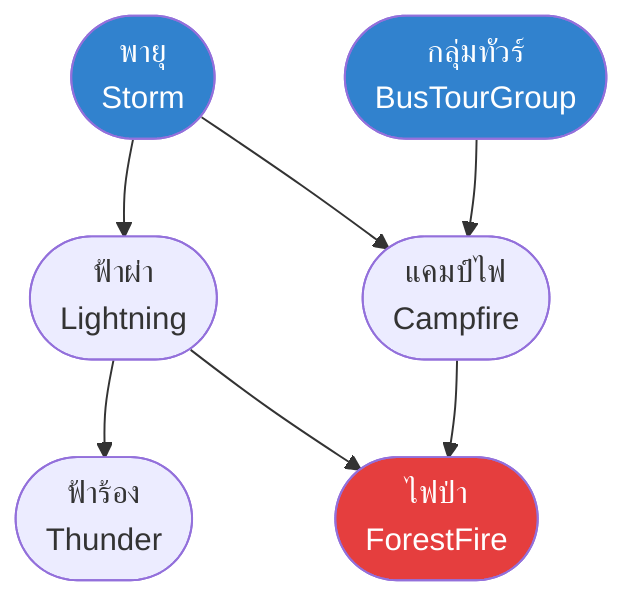

# โครงข่ายความเชื่อแบบเบย์ส (Bayesian Belief Networks)

arrow_back กลับไปที่ [[Week08-MOC|MOC สัปดาห์ 08]] | ก่อนหน้า: [[02-Naive-Bayes-Classifier-and-Text-Categorization]]

## key Keyword

- **Bayesian Belief Network (BBN)** — ตัวแบบเชิงกราฟแบบมีความน่าจะเป็น (Probabilistic Graphical Model) ในรูปกราฟระบุทิศทางแบบไม่มีวงวน (DAG) ที่แสดงความสัมพันธ์เชิงสาเหตุและความเป็นอิสระแบบมีเงื่อนไข
- **Directed Acyclic Graph (DAG)** — กราฟที่เส้นเชื่อมมีทิศทางและไม่มีเส้นทางใดที่สามารถเดินวนกลับมาที่โหนดเดิมได้
- **Conditional Probability Table (CPT)** — ตารางความน่าจะเป็นแบบมีเงื่อนไขประจำแต่ละโหนด ที่ระบุการแจกแจงความน่าจะเป็นของโหนดนั้นเมื่อกำหนดค่าของโหนดพ่อแม่ (Parents)
- **Local Markov Property** — คุณสมบัติที่ระบุว่าแต่ละโหนดจะมีความเป็นอิสระแบบมีเงื่อนไขจากโหนดที่ไม่ใช่ลูกหลาน (Non-descendants) เมื่อทราบค่าของโหนดพ่อแม่โดยตรง
- **Joint Probability Factorization** — การแยกตัวประกอบของความน่าจะเป็นร่วมขนาดใหญ่ให้กลายเป็นผลคูณของความน่าจะเป็นเฉพาะที่ตามโครงสร้างกราฟ

## menu_book Theory (เข้าใจง่าย)

### 1. การผ่อนปรนข้อจำกัดของ Naïve Bayes สู่ BBN

- ใน Naïve Bayes มีข้อจำกัดรุนแรงคือต้องสมมติให้ทุกตัวแปรเป็นอิสระต่อกันโดยสิ้นเชิง ซึ่งมักไม่ตรงกับความเป็นจริง เช่น อาการไอ ไข้สูง และปอดบวม ต่างมีความสัมพันธ์เชื่อมโยงกัน
- **Bayesian Belief Network (BBN)** ยอมให้เรากำหนดได้ว่าตัวแปรใดขึ้นต่อกัน และตัวแปรใดเป็นอิสระต่อกัน จึงสะท้อนความเป็นจริงได้แม่นยำกว่ามาก

---

### 2. โครงสร้างและการแยกตัวประกอบความน่าจะเป็นร่วม (Factorization)

โครงข่ายประกอบด้วย 2 ส่วนหลัก:
1. **โครงสร้างกราฟ (DAG):**
   - **โหนด (Nodes):** แทนตัวแปรสุ่ม (Random Variables เช่น `Storm`, `ForestFire`, `Lightning`)
   - **เส้นเชื่อมมีทิศทาง (Directed Edges):** แทนอิทธิพลเชิงสาเหตุโดยตรง (Direct Causal Dependency) จากโหนดต้นทางสู่โหนดปลายทาง
2. **ตาราง CPT ประจำโหนด:**
   - สำหรับโหนดที่ไม่มีพ่อแม่ (Root Node): ระบุความน่าจะเป็นล่วงหน้า $P(Y)$
   - สำหรับโหนดที่มีพ่อแม่: ระบุความน่าจะเป็นแบบมีเงื่อนไข $P(Y \mid Parents(Y))$

#### ทฤษฎีบทการแยกตัวประกอบ (Chain Rule for Bayesian Networks):
$$\mathbf{P(X_1, X_2, \dots, X_n) = \prod_{i=1}^n P(X_i \mid Parents(X_i))}$$

#### ตัวอย่างจากสไลด์:
หากมีตัวแปร `Storm` ($S$), `BusTourGroup` ($B$), `Lightning` ($L$), `Campfire` ($C$), `ForestFire` ($F$), `Thunder` ($T$):
- `Storm` ส่งผลต่อ `Lightning` และ `Thunder`
- `Storm` และ `BusTourGroup` ส่งผลต่อ `Campfire`
- `Lightning` และ `Campfire` เป็นสาเหตุของ `ForestFire`
สามารถคำนวณความน่าจะเป็นร่วมของทั้งระบบได้โดย:
$$P(S, B, L, C, F, T) = P(S) \cdot P(B) \cdot P(L \mid S) \cdot P(T \mid L) \cdot P(C \mid S, B) \cdot P(F \mid L, C)$$

---

### 3. การอนุมานและการเรียนรู้โครงข่าย (Inference & Training)

1. **การอนุมาน (Probabilistic Inference):**  
   การคำนวณหาความน่าจะเป็นของตัวแปรที่สนใจเมื่อทราบค่าของหลักฐานบางตัวแปร (เช่น ทราบว่ามีฟ้าผ่า $L=True$ ต้องการหาโอกาสเกิดไฟป่า $P(ForestFire \mid L=True)$)
2. **การเรียนรู้พารามิเตอร์เมื่อข้อมูลไม่สมบูรณ์ (Partially Observable Data):**  
   หากมีบางตัวแปรที่ไม่สามารถสังเกตได้โดยตรง จะใช้เทคนิค **Gradient Ascent บน Maximum Likelihood** หรืออัลกอริทึม **Expectation-Maximization (EM)** เพื่อปรับปรุงค่าความน่าจะเป็นในตาราง CPT ให้สอดคล้องกับชุดข้อมูลตัวอย่างมากที่สุด

## schema Diagram

**ตัวอย่าง:** โครงข่ายความเชื่อแบบเบย์สแสดงความสัมพันธ์เชิงสาเหตุของเหตุการณ์ไฟป่าตามตัวอย่างในสไลด์

---
arrow_forward กลับไปที่: [[Week08-MOC|MOC สัปดาห์ 08]]
