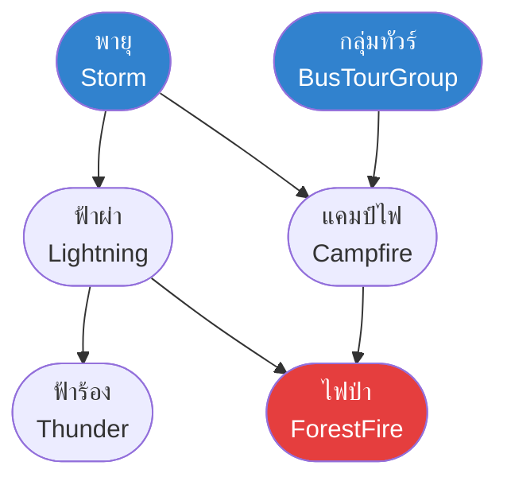

# โครงข่ายความเชื่อแบบเบย์ส (Bayesian Belief Networks)

arrow_back กลับไปที่ [[Week08-MOC|MOC สัปดาห์ 08]] | ก่อนหน้า: [[02-Naive-Bayes-Classifier-and-Text-Categorization]]

## key Keyword

- **Bayesian Belief Network (BBN)** — ตัวแบบเชิงกราฟแบบมีความน่าจะเป็น (Probabilistic Graphical Model) ในรูปกราฟระบุทิศทางแบบไม่มีวงวน (DAG) ที่แสดงความสัมพันธ์เชิงสาเหตุและความเป็นอิสระแบบมีเงื่อนไข
- **Directed Acyclic Graph (DAG)** — กราฟที่เส้นเชื่อมมีทิศทางและไม่มีเส้นทางใดที่สามารถเดินวนกลับมาที่โหนดเดิมได้
- **Conditional Probability Table (CPT)** — ตารางความน่าจะเป็นแบบมีเงื่อนไขประจำแต่ละโหนด ที่ระบุการแจกแจงความน่าจะเป็นของโหนดนั้นเมื่อกำหนดค่าของโหนดพ่อแม่ (Parents)
- **Local Markov Property** — คุณสมบัติที่ระบุว่าแต่ละโหนดจะมีความเป็นอิสระแบบมีเงื่อนไขจากโหนดที่ไม่ใช่ลูกหลาน (Non-descendants) เมื่อทราบค่าของโหนดพ่อแม่โดยตรง
- **Joint Probability Factorization** — การแยกตัวประกอบของความน่าจะเป็นร่วมขนาดใหญ่ให้กลายเป็นผลคูณของความน่าจะเป็นเฉพาะที่ตามโครงสร้างกราฟ
- **Gradient Ascent Training of BBN** — วิธีปรับค่าในตาราง CPT ทีละน้อยตามทิศทางเกรเดียนต์ของ $\ln P(D \mid h)$ เพื่อเพิ่มค่า Likelihood ของข้อมูลฝึกที่สังเกตได้บางส่วน (Partially Observable Data)

## menu_book Theory (เข้าใจง่าย)

### 1. การผ่อนปรนข้อจำกัดของ Naïve Bayes สู่ BBN

- ใน Naïve Bayes มีข้อจำกัดรุนแรงคือต้องสมมติให้ทุกตัวแปรเป็นอิสระต่อกันโดยสิ้นเชิง ซึ่งมักไม่ตรงกับความเป็นจริง เช่น อาการไอ ไข้สูง และปอดบวม ต่างมีความสัมพันธ์เชื่อมโยงกัน
- **Bayesian Belief Network (BBN)** ยอมให้เรากำหนดได้ว่าตัวแปรใดขึ้นต่อกัน และตัวแปรใดเป็นอิสระต่อกัน จึงสะท้อนความเป็นจริงได้แม่นยำกว่ามาก

---

### 2. โครงสร้างและการแยกตัวประกอบความน่าจะเป็นร่วม (Factorization)

โครงข่ายประกอบด้วย 2 ส่วนหลัก:
1. **โครงสร้างกราฟ (DAG):**
   - **โหนด (Nodes):** แทนตัวแปรสุ่ม (Random Variables เช่น `Storm`, `ForestFire`, `Lightning`)
   - **เส้นเชื่อมมีทิศทาง (Directed Edges):** แทนอิทธิพลเชิงสาเหตุโดยตรง (Direct Causal Dependency) จากโหนดต้นทางสู่โหนดปลายทาง
2. **ตาราง CPT ประจำโหนด:**
   - สำหรับโหนดที่ไม่มีพ่อแม่ (Root Node): ระบุความน่าจะเป็นล่วงหน้า $P(Y)$
   - สำหรับโหนดที่มีพ่อแม่: ระบุความน่าจะเป็นแบบมีเงื่อนไข $P(Y \mid Parents(Y))$

#### ทฤษฎีบทการแยกตัวประกอบ (Chain Rule for Bayesian Networks):
$$\mathbf{P(X_1, X_2, \dots, X_n) = \prod_{i=1}^n P(X_i \mid Parents(X_i))}$$

#### ตัวอย่างจากสไลด์:
หากมีตัวแปร `Storm` ($S$), `BusTourGroup` ($B$), `Lightning` ($L$), `Campfire` ($C$), `ForestFire` ($F$), `Thunder` ($T$):
- `Storm` ส่งผลต่อ `Lightning` และ `Thunder`
- `Storm` และ `BusTourGroup` ส่งผลต่อ `Campfire`
- `Lightning` และ `Campfire` เป็นสาเหตุของ `ForestFire`
สามารถคำนวณความน่าจะเป็นร่วมของทั้งระบบได้โดย:
$$P(S, B, L, C, F, T) = P(S) \cdot P(B) \cdot P(L \mid S) \cdot P(T \mid L) \cdot P(C \mid S, B) \cdot P(F \mid L, C)$$

---

### 3. การอนุมานและการเรียนรู้โครงข่าย (Inference & Training)

1. **การอนุมาน (Probabilistic Inference):**  
   การคำนวณหาความน่าจะเป็นของตัวแปรที่สนใจเมื่อทราบค่าของหลักฐานบางตัวแปร (เช่น ทราบว่ามีฟ้าผ่า $L=True$ ต้องการหาโอกาสเกิดไฟป่า $P(ForestFire \mid L=True)$) โดยทั่วไปการอนุมานแบบแม่นตรง (Exact Inference) เป็นปัญหา NP-hard ในกรณีทั่วไป แต่ในทางปฏิบัติใช้ได้ดีกับโครงสร้างกราฟบางแบบ หรือใช้ **Monte Carlo Methods** จำลองโครงข่ายซ้ำ ๆ เพื่อประมาณค่าคำตอบ
2. **การเรียนรู้พารามิเตอร์เมื่อข้อมูลไม่สมบูรณ์ (Partially Observable Data):**  
   หากโครงสร้างกราฟทราบอยู่แล้ว แต่บางตัวแปรไม่สามารถสังเกตได้โดยตรง (เช่นในตัวอย่าง Storm/BusTourGroup/Campfire — สังเกตได้แค่ ForestFire, Storm, BusTourGroup, Thunder แต่สังเกต Lightning และ Campfire ไม่ได้) สถานการณ์นี้คล้ายกับการฝึกโครงข่ายประสาทเทียมที่มี Hidden Units (ดู [[03-Multilayer-Perceptrons-and-Backpropagation]]) จึงใช้เทคนิค **Gradient Ascent บน Maximum Likelihood** ปรับค่าตาราง CPT ทีละน้อยจนโครงข่าย $h$ ลู่เข้าสู่จุดที่ Maximize $P(D \mid h)$ แบบ Local Maximum

#### การอนุพันธ์: Gradient Ascent Training of BBN

กำหนดสัญกรณ์:
- $D$ = ชุดข้อมูลฝึก (Training data)
- $Y$ = ตัวแปรใดตัวแปรหนึ่งในโครงข่าย, $U$ = โหนดพ่อแม่ (Immediate Parents) ของ $Y$
- $w_{ijk}$ = ค่าหนึ่งช่องในตาราง CPT ของตัวแปร $Y_i$ นั่นคือ:
  $$w_{ijk} = P(Y_i = y_{ij} \mid U_i = u_{ik})$$
  (ความน่าจะเป็นที่ตัวแปร $Y_i$ จะมีค่าเท่ากับ $y_{ij}$ เมื่อโหนดพ่อแม่ $U_i$ มีค่าเท่ากับ $u_{ik}$ พอดี — ตัวอย่างเช่น $y = C$ (Campfire), $u = \langle S{=}T, B{=}F \rangle$)

เป้าหมายคือ maximize log-likelihood ของข้อมูล $\ln P(D \mid h)$ เทียบกับ $w_{ijk}$ แต่ละตัว โดยอยู่ภายใต้เงื่อนไขบังคับ (Constraint) ว่า $0 \le w_{ijk} \le 1$ และผลรวมของแต่ละแถวต้องเป็น 1: $\sum_j w_{ijk} = 1$

**อนุพันธ์ของ Log-Likelihood เทียบกับแต่ละ $w_{ijk}$:**
$$\frac{\partial \ln P(D \mid h)}{\partial w_{ijk}} = \sum_{d \in D} \frac{P(y_{ij}, u_{ik} \mid d)}{w_{ijk}}$$

โดยที่ $P(y_{ij}, u_{ik} \mid d)$ คือความน่าจะเป็นที่ตัวแปร $Y_i=y_{ij}$ และพ่อแม่ $U_i=u_{ik}$ จะเกิดร่วมกัน เมื่อกำหนดข้อมูลตัวอย่าง $d$ หนึ่งตัว — คำนวณได้ด้วยกระบวนการอนุมาน (Inference) บนโครงข่ายปัจจุบัน แม้ตัวแปรบางตัวใน $d$ จะสังเกตไม่ได้ก็ตาม

**กฎการปรับค่า (Update Rule) แบบ Gradient Ascent:**
$$w_{ijk} \leftarrow w_{ijk} + \eta \sum_{d \in D} \frac{P(y_{ij}, u_{ik} \mid d)}{w_{ijk}}$$

โดยที่ $\eta$ คือ Learning Rate ค่าเล็ก ๆ (คล้ายกับ Backpropagation ใน ANN)

**BBN: ขั้นตอนวิธีการฝึก (Training Algorithm):**
1. คำนวณ $P(y_{ij}, u_{ik} \mid d)$ สำหรับทุกช่อง $w_{ijk}$ และทุกตัวอย่าง $d \in D$ ด้วยกระบวนการอนุมานบนโครงข่ายปัจจุบัน
2. ปรับค่าทุก $w_{ijk}$ ด้วยกฎ Gradient Ascent ข้างต้น
3. **Renormalize** ค่า $w_{ijk}$ ในแต่ละแถว (แต่ละคู่ $i,k$) ให้ผลรวมยังคงเป็น 1 เสมอ:
   $$w_{ijk} \leftarrow \frac{w_{ijk}}{\sum_j w_{ijk}}$$
4. ทำซ้ำขั้นตอน 1–3 จนกว่า $\ln P(D \mid h)$ จะลู่เข้า (Converge)

> [!important] ทำไมต้อง Renormalize
> เพราะ Gradient Ascent ปรับ $w_{ijk}$ แต่ละตัวอย่างอิสระต่อกัน จึงไม่รับประกันว่าผลรวมของแต่ละแถวยังเป็น 1 อยู่ (เงื่อนไขของการเป็นความน่าจะเป็น) ต้อง Renormalize ทุกรอบเพื่อให้ค่ายังคงตีความเป็น Conditional Probability Table ได้ถูกต้อง

## schema Diagram

```mermaid
flowchart TD
    Storm([พายุ<br>Storm]) --> Light([ฟ้าผ่า<br>Lightning])
    Storm --> Camp([แคมป์ไฟ<br>Campfire])
    Bus([กลุ่มทัวร์<br>BusTourGroup]) --> Camp
    Light --> Thunder([ฟ้าร้อง<br>Thunder])
    Light --> Fire([ไฟป่า<br>ForestFire])
    Camp --> Fire

    style Storm fill:#3182ce,color:#fff
    style Bus fill:#3182ce,color:#fff
    style Fire fill:#e53e3e,color:#fff
```

**ตัวอย่าง:** โครงข่ายความเชื่อแบบเบย์สแสดงความสัมพันธ์เชิงสาเหตุของเหตุการณ์ไฟป่าตามตัวอย่างในสไลด์

---
arrow_forward กลับไปที่: [[Week08-MOC|MOC สัปดาห์ 08]]
