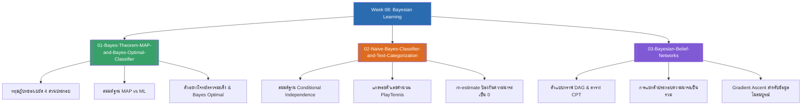

# Week 08 — Bayesian Learning & Graphical Models (MOC)

arrow_back สัปดาห์ก่อนหน้า: [[Week07-MOC|MOC สัปดาห์ 07]]

## check_circle เช็คลิสต์ก่อนเข้าเรียน

- [ ] จำและประยุกต์ใช้ทฤษฎีบทของเบย์ส ($P(h \mid D) = \frac{P(D \mid h)P(h)}{P(D)}$) — ดู [[01-Bayes-Theorem-MAP-and-Bayes-Optimal-Classifier]]
- [ ] ไล่การคำนวณโจทย์ตรวจโรคมะเร็ง (Medical Diagnosis) และเข้าใจผลกระทบของ Prior — ดู [[01-Bayes-Theorem-MAP-and-Bayes-Optimal-Classifier]]
- [ ] ทำความเข้าใจสมมติฐาน Conditional Independence ใน Naïve Bayes และวิธีแก้ความถี่ศูนย์ด้วย $m$-estimate — ดู [[02-Naive-Bayes-Classifier-and-Text-Categorization]]
- [ ] เข้าใจการแยกตัวประกอบความน่าจะเป็นร่วมใน Bayesian Belief Networks (DAG + CPT) — ดู [[03-Bayesian-Belief-Networks]]

## assignment ภาพรวมสัปดาห์ 08 (สรุปย่อ)

สัปดาห์ที่ 8 ศึกษาการอนุมานและการเรียนรู้เชิงความน่าจะเป็น (Probabilistic Learning) ซึ่งเป็นเสาหลักทางสถิติของ AI:
1. **ทฤษฎีบทของเบย์สและสมมติฐาน MAP (Bayes' Theorem & MAP):** องค์ประกอบ 4 ส่วน (Prior, Likelihood, Evidence, Posterior), เกณฑ์การคัดเลือก MAP และ ML, การวิเคราะห์ความน่าจะเป็นในการวินิจฉัยโรคจริง, และขีดความสามารถสูงสุดของ Bayes Optimal Classifier
2. **ตัวจำแนกแบบนาอีฟเบย์ส (Naïve Bayes Classification):** สมมติฐานความอิสระแบบมีเงื่อนไข, การคำนวณคะแนนตัดสินใจบนชุดข้อมูล PlayTennis สดครบทุกฟีเจอร์, การใช้ $m$-estimate (Laplace smoothing) ป้องกันความน่าจะเป็นศูนย์, และการจำแนกประเภทข้อความด้วย Bag-of-Words
3. **โครงข่ายความเชื่อแบบเบย์ส (Bayesian Belief Networks):** การผ่อนปรนสมมติฐานความอิสระด้วยแบบจำลองเชิงกราฟ DAG, ตาราง CPT, การแยกตัวประกอบความน่าจะเป็นร่วม, และการเรียนรู้พารามิเตอร์ด้วย Gradient Ascent

## map แผนที่หัวข้อสัปดาห์ 08

## collections_bookmark โน้ตรายหัวข้อ

| หัวข้อ | เนื้อหาหลัก | หน้าสไลด์ |
| :--- | :--- | :--- |
| [[01-Bayes-Theorem-MAP-and-Bayes-Optimal-Classifier]] | ทฤษฎีบทของเบย์ส, สมมติฐาน MAP, Maximum Likelihood, การแกะรอยตัวเลขตรวจโรค, และตัวจำแนก Bayes Optimal | สไลด์ 1–19 |
| [[02-Naive-Bayes-Classifier-and-Text-Categorization]] | กลไก Naïve Bayes, การคำนวณสด PlayTennis, ปัญหา Zero Frequency และ $m$-estimate, และการประยุกต์กับเอกสารข้อความ | สไลด์ 20–29 |
| [[03-Bayesian-Belief-Networks]] | โครงข่ายความเชื่อเบย์ส (BBN), กราฟ DAG, ตาราง CPT, คุณสมบัติความอิสระตามเงื่อนไขพ่อแม่, และการฝึกฝนด้วย Gradient Ascent | สไลด์ 30–37 |

> [!tip] เคล็ดลับการทำข้อสอบสัปดาห์ที่ 08
> 1. เมื่อคำนวณ Naïve Bayes ในห้องสอบ: ตัวหาร $P(\mathbf{x})$ มีค่าเท่ากันทุกคลาส จึงไม่จำเป็นต้องคำนวณตัวหารตอนเปรียบเทียบ เพียงแค่นำ Prior คูณกับ Likelihood ของแต่ละฟีเจอร์แล้วเทียบว่าฝั่งใดมีค่ามากกว่าได้ทันที
> 2. ถ้าข้อสอบถามหาความน่าจะเป็นร้อยละจริง ($P(Yes \mid \mathbf{x})$) ให้นำคะแนนของ $Yes$ หารด้วยผลรวมของคะแนน $Yes + No$ (Normalizing)

---
arrow_forward สัปดาห์ถัดไป: [[Week09-MOC|MOC สัปดาห์ 09]]
