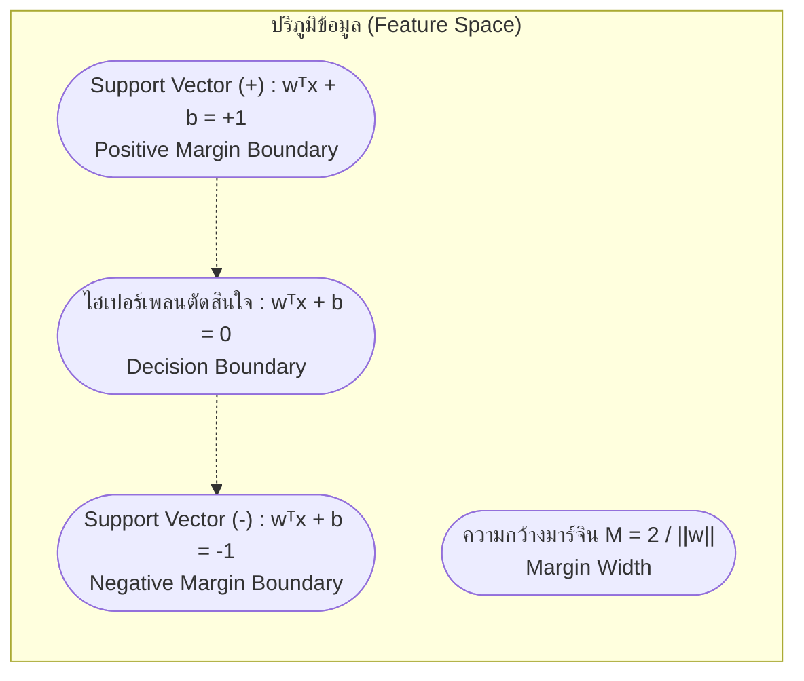

# การหาขอบเขตสูงสุดและซัพพอร์ตเวกเตอร์แมชชีนแบบฮาร์ดมาร์จิน (Maximal Margin & Hard-Margin SVM)

arrow_back กลับไปที่ [[Week09-MOC|MOC สัปดาห์ 09]]

## key Keyword

- **Support Vector Machine (SVM)** — ตัวแบบการเรียนรู้แบบมีผู้สอนที่มุ่งค้นหาระนาบไฮเปอร์เพลนที่แบ่งแยกคลาสข้อมูลโดยมีระยะขอบ (Margin) กว้างที่สุด
- **Hyperplane** — ระนาบการตัดสินใจในปริภูมิ $n$ มิติ นิยามโดยสมการ $\mathbf{w}^T \mathbf{x} + b = 0$
- **Margin ($M$)** — ระยะทางตั้งฉากที่สั้นที่สุดระหว่างระนาบแบ่งเขตไปยังจุดข้อมูลที่อยู่ใกล้ที่สุดของแต่ละคลาส ($M = \frac{2}{\|\mathbf{w}\|}$)
- **Support Vectors** — จุดข้อมูลตัวอย่างที่ตั้งอยู่บนขอบของมาร์จินพอดี ซึ่งเป็นจุดวิกฤตที่กำหนดตำแหน่งและมุมเอียงของไฮเปอร์เพลน
- **Primal vs Dual Problem** — การแปลงปัญหาการหาค่าเหมาะสมที่สุดที่มีเงื่อนไขบังคับ ให้อยู่ในรูปปัญหาทวิภาคที่ขึ้นกับตัวคูณลากรองจ์ ($\alpha_i$)
- **KKT Conditions** — เงื่อนไข Karush-Kuhn-Tucker ซึ่งเป็นเงื่อนไขจำเป็นและเพียงพอสำหรับคำตอบที่เหมาะสมที่สุดใน Quadratic Programming

## menu_book Theory (เข้าใจง่าย)

### 1. ทำไมต้องเป็น Maximal Margin Hyperplane?

ในโจทย์การจำแนกข้อมูลเชิงเส้น (Linearly Separable):
- เพอร์เซปตรอนสามารถลากเส้นตรงแบ่งข้อมูลได้นับไม่ถ้วนแบบ (ขึ้นอยู่กับค่าน้ำหนักเริ่มต้น)
- แต่เส้นใดเล่าที่จะ **มีประสิทธิภาพสูงสุดเมื่อนำไปใช้กับข้อมูลใหม่ (Best Generalization)?**
- ทฤษฎีสถิติการเรียนรู้ (Vapnik-Chervonenkis / VC Dimension) ระบุว่า: เส้นแบ่งที่ดีที่สุดคือเส้นที่ **อยู่กึ่งกลางและมีระยะห่างจากข้อมูลทั้งสองฝั่งมากที่สุด** เรียกว่า **Maximal Margin Hyperplane** เพราะทนทานต่อการรบกวนของข้อมูลได้ดีที่สุด

---

### 2. คณิตศาสตร์ของมาร์จิน (Derivation of Margin)

กำหนดให้คลาสเป้าหมาย $y_i \in \{-1, +1\}$:
- ระนาบแบ่งเขต: $\mathbf{w}^T \mathbf{x} + b = 0$
- กำหนดให้ Canonical Hyperplane สำหรับขอบล่างและขอบบนคือ:
  $$\mathbf{w}^T \mathbf{x} + b = +1 \quad (\text{สำหรับคลาส } +1)$$
  $$\mathbf{w}^T \mathbf{x} + b = -1 \quad (\text{สำหรับคลาส } -1)$$

ระยะห่างตั้งฉากจากจุดใด ๆ บนเส้น $+1$ ไปยังเส้น $-1$ สามารถคำนวณได้โดยการฉายเวกเตอร์ลงบนเวกเตอร์แนวฉากหนึ่งหน่วย $\frac{\mathbf{w}}{\|\mathbf{w}\|}$:
$$\text{Margin} = \frac{2}{\|\mathbf{w}\|}$$

ดังนั้น การเพิ่มระยะมาร์จินให้กว้างที่สุด ($\max \frac{2}{\|\mathbf{w}\|}$) จึงเทียบเท่ากับการ **ลดทอนขนาดของ $\|\mathbf{w}\|$ ให้เหลือน้อยที่สุด**:

#### สมการปัญหาปฐมภูมิ (Primal Optimization Problem):
$$\min_{\mathbf{w}, b} \frac{1}{2} \|\mathbf{w}\|^2$$
ภายใต้เงื่อนไขบังคับ (Constraints):
$$y_i (\mathbf{w}^T \mathbf{x}_i + b) \ge 1 \quad \forall i = 1, \dots, N$$

---

### 3. การแก้ปัญหาด้วยตัวคูณลากรองจ์และปัญหาทวิภาค (Dual Problem)

สร้างฟังก์ชันลากรองเจียน (Lagrangian) โดยเพิ่มตัวคูณลากรองจ์ $\alpha_i \ge 0$:
$$L(\mathbf{w}, b, \boldsymbol{\alpha}) = \frac{1}{2} \|\mathbf{w}\|^2 - \sum_{i=1}^N \alpha_i \left[ y_i (\mathbf{w}^T \mathbf{x}_i + b) - 1 \right]$$

หาอนุพันธ์ย่อยเทียบกับ $\mathbf{w}$ และ $b$ แล้วเซตให้เท่ากับศูนย์:
1. $\frac{\partial L}{\partial \mathbf{w}} = 0 \implies \mathbf{w} = \sum_{i=1}^N \alpha_i y_i \mathbf{x}_i$
2. $\frac{\partial L}{\partial b} = 0 \implies \sum_{i=1}^N \alpha_i y_i = 0$

แทนค่า $\mathbf{w}$ และเงื่อนไขกลับเข้าไปในสมการลากรองเจียน จะได้ **ปัญหาทวิภาค (Dual Quadratic Optimization Problem)**:

$$\mathbf{\max_{\boldsymbol{\alpha}} \sum_{i=1}^N \alpha_i - \frac{1}{2} \sum_{i=1}^N \sum_{j=1}^N \alpha_i \alpha_j y_i y_j (\mathbf{x}_i^T \mathbf{x}_j)}$$
ภายใต้เงื่อนไข:
$$\alpha_i \ge 0 \quad \text{และ} \quad \sum_{i=1}^N \alpha_i y_i = 0$$

> [!important] ความมหัศจรรย์ของ Support Vectors และ KKT Conditions
> ตามเงื่อนไข KKT Complementary Slackness:
> $$\alpha_i \left[ y_i (\mathbf{w}^T \mathbf{x}_i + b) - 1 \right] = 0$$
> - ข้อมูลเกือบทั้งหมดที่อยู่นอกเขตมาร์จิน ($y_i (\mathbf{w}^T \mathbf{x}_i + b) > 1$) จะได้ค่า $\mathbf{\alpha_i = 0}$ (ไม่มีผลต่อน้ำหนัก)
> - มีเฉพาะข้อมูลที่อยู่ชิดติดขอบมาร์จินพอดี ($y_i (\mathbf{w}^T \mathbf{x}_i + b) = 1$) เท่านั้นที่จะมีค่า $\mathbf{\alpha_i > 0}$
> ข้อมูลกลุ่มพิเศษนี้เรียกว่า **Support Vectors** ซึ่งหากเราลบข้อมูลจุดอื่น ๆ ในดาต้าเซ็ตทิ้งไปทั้งหมด โมเดลก็ยังคงได้เส้นแบ่งเดิม 100%!

## schema Diagram

**ตัวอย่าง:** โครงสร้างระนาบตัดสินใจของ Hard-Margin SVM โดยมี Support Vectors เป็นจุดค้ำยันระนาบ

---
arrow_forward ต่อไป: [[02-Soft-Margin-SVM-and-Slack-Variables]]
