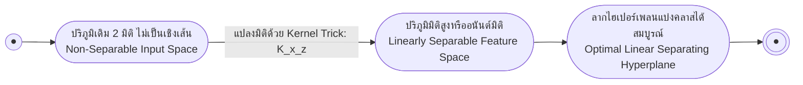

# เคล็ดวิธีเคอร์เนลและการจำแนกหลายกลุ่ม (Kernel Trick & Multiclass SVM)

arrow_back กลับไปที่ [[Week09-MOC|MOC สัปดาห์ 09]] | ก่อนหน้า: [[02-Soft-Margin-SVM-and-Slack-Variables]]

## key Keyword

- **Kernel Trick** — เทคนิคอันชาญฉลาดในการคำนวณผลคูณจุด (Dot Product) ในปริภูมิที่มีมิติสูงมากหรือมิติอนันต์ โดยไม่ต้องแปลงพิกัดจริงของข้อมูล
- **Feature Mapping ($\phi(\mathbf{x})$)** — ฟังก์ชันการแปลงข้อมูลจากปริภูมิอินพุตเดิมที่แบ่งไม่ได้เชิงเส้น ไปสู่ปริภูมิคุณลักษณะใหม่ที่มีมิติสูงขึ้น
- **Mercer's Theorem** — ทฤษฎีบทที่กำหนดเงื่อนไขว่าฟังก์ชันใด ๆ ที่มีความต่อเนื่อง สมมาตร และมีค่ากึ่งบวกแน่นอน (Positive Semi-definite) จะเป็นฟังก์ชันเคอร์เนลที่ถูกต้อง
- **Radial Basis Function (RBF / Gaussian)** — เคอร์เนลฐานรัศมีที่แปลงข้อมูลเข้าสู่ปริภูมิฮิลเบิร์ตมิติอนันต์ นิยมใช้งานมากที่สุดในงานไม่เป็นเชิงเส้น
- **One-vs-Rest (OvR) & One-vs-One (OvO)** — ยุทธวิธีในการขยายตัวจำแนกทวิภาคของ SVM เพื่อรองรับการจำแนกข้อมูลที่มีหลายคลาส (Multiclass)
- **Sequential Minimal Optimization (SMO)** — อัลกอริทึมแก้ปัญหา Quadratic Programming ของ SVM อย่างรวดเร็วด้วยการแก้สมการตัวแปร $\alpha$ ทีละคู่เชิงวิเคราะห์

## menu_book Theory (เข้าใจง่าย)

### 1. ปัญหาข้อมูลที่ไม่เป็นเชิงเส้น (Nonlinear Classification)

เมื่อข้อมูลมีการกระจายตัวแบบไม่เป็นเชิงเส้น (เช่น วงกลมซ้อนกัน หรือรูปทรงพระจันทร์เสี้ยว) เราไม่สามารถใช้เส้นตรงแบ่งได้:
- แนวคิดดั้งเดิม: แปลงข้อมูล $\mathbf{x} \in \mathbb{R}^2$ สู่มิติที่สูงขึ้น เช่น $\phi(\mathbf{x}) = [x_1^2, \sqrt{2}x_1 x_2, x_2^2]^T \in \mathbb{R}^3$ ซึ่งข้อมูลจะกลายเป็น Linearly Separable ในมิติ 3D ทันที
- **อุปสรรค:** การแปลงข้อมูลมิติสูงตรง ๆ ทำให้เกิดปัญหา **Curse of Dimensionality** และต้นทุนการคำนวณมหาศาล

---

### 2. เคล็ดวิธีเคอร์เนล (The Kernel Trick)

สังเกตว่าในสมการปัญหาทวิภาค (Dual Problem) และสมการฟังก์ชันตัดสินใจของ SVM:
$$f(\mathbf{x}) = \text{sign}\left( \sum_{i \in SV} \alpha_i y_i (\mathbf{x}_i^T \mathbf{x}) + b \right)$$
ข้อมูลปรากฏตัวในรูปของ **ผลคูณจุด (Dot Product: $\mathbf{x}_i^T \mathbf{x}_j$) เพียงอย่างเดียวเท่านั้น!**

ดังนั้น หากเราต้องการฉายข้อมูลไปยังมิติ $\phi(\mathbf{x})$ เราเพียงแค่แทนที่ผลคูณจุดด้วย **ฟังก์ชันเคอร์เนล $K(\mathbf{x}_i, \mathbf{x}_j)$**:
$$\mathbf{K(\mathbf{x}_i, \mathbf{x}_j) \equiv \phi(\mathbf{x}_i)^T \phi(\mathbf{x}_j)}$$

> [!important] หัวใจของ Kernel Trick
> เราสามารถคำนวณผลลัพธ์ของผลคูณจุดในมิติที่สูงมาก (หรือแม้แต่มิติอนันต์) ได้โดยตรงจากพิกัดในมิติเดิม โดยที่**ไม่จำเป็นต้องรู้หรือคำนวณเวกเตอร์ $\phi(\mathbf{x})$ ออกมาจริงเลยแม้แต่ครั้งเดียว!**

---

### 3. ฟังก์ชันเคอร์เนลยอดนิยม (Common Kernel Functions)

1. **Linear Kernel:**
   $$K(\mathbf{x}, \mathbf{z}) = \mathbf{x}^T \mathbf{z}$$
2. **Polynomial Kernel (ดีกรี $d$):**
   $$K(\mathbf{x}, \mathbf{z}) = (\mathbf{x}^T \mathbf{z} + c)^d$$
3. **Radial Basis Function (RBF / Gaussian Kernel):**
   $$K(\mathbf{x}, \mathbf{z}) = \exp\left( -\gamma \|\mathbf{x} - \mathbf{z}\|^2 \right) \quad \text{โดย } \gamma = \frac{1}{2\sigma^2}$$
   - มีคุณสมบัติพิเศษคือเทียบเท่ากับการฉายข้อมูลเข้าสู่ **ปริภูมิอนันต์มิติ (Infinite-Dimensional Hilbert Space)**
   - พารามิเตอร์ $\gamma$ (Gamma): หาก $\gamma$ สูง เส้นแบ่งจะหยักลึกตามจุดข้อมูล (เสี่ยง Overfitting), หาก $\gamma$ ต่ำ เส้นแบ่งจะเรียบมน
4. **Sigmoid Kernel:**
   $$K(\mathbf{x}, \mathbf{z}) = \tanh(\kappa \mathbf{x}^T \mathbf{z} + c)$$

---

### 4. การขยายสู่โจทย์หลายคลาส (Multiclass SVM)

เนื่องจาก SVM โดยธรรมชาติถูกออกแบบมาสำหรับ 2 คลาส จึงมี 3 แนวทางในการขยายผลสำหรับ $K$ คลาส:

| กลยุทธ์ | จำนวนโมเดลที่ต้องสร้าง | วิธีการตัดสินใจ |
| :--- | :--- | :--- |
| **One-vs-Rest (OvR / One-vs-All)** | $K$ โมเดล | แต่ละโมเดลฝึกแยก 1 คลาสออกจากคลาสที่เหลือทั้งหมด แล้วเลือกคลาสที่มีค่าคะแนนความมั่นใจสูงสุด |
| **One-vs-One (OvO)** | $\frac{K(K-1)}{2}$ โมเดล | สร้างโมเดลจับคู่ดวลระหว่างทุกคู่คลาส แล้วตัดสินผลด้วยคะแนนเสียงข้างมาก (Majority Voting) |
| **DAG-SVM** | $\frac{K(K-1)}{2}$ โมเดล | จัดโครงสร้างโมเดลเป็นกราฟ DAG เพื่อคัดคลาสที่ไม่ใช่ออกทีละระดับ ตัดสินใจได้เร็วภายใน $K-1$ ครั้ง |

---

### 5. อัลกอริทึม Sequential Minimal Optimization (SMO)

John Platt (1998) ได้คิดค้นอัลกอริทึม **SMO** เพื่อแก้ปัญหา Quadratic Programming ของ SVM:
- แทนที่จะแก้สมการ QP ขนาดใหญ่ระดับเมทริกซ์ $N \times N$ พร้อมกันทั้งหมด
- SMO จะ **เลือกตัวคูณลากรองจ์มาปรับทีละคู่ ($\alpha_1, \alpha_2$) ในแต่ละก้าว**
- ปัญหาขนาดย่อย 2 ตัวแปรนี้สามารถแก้หาคำตอบที่ดีที่สุดได้โดยตรงทางพีชคณิต (Closed-form Analytical Solution) ทำให้ฝึกฝน SVM ได้เร็วกว่าตัวแก้ QP ดั้งเดิมหลายสิบเท่า

## schema Diagram

**ตัวอย่าง:** การทำงานของ Kernel Trick ที่แปลงปัญหาไม่เป็นเชิงเส้นให้กลายเป็นปัญหาเชิงเส้นในมิติสูง

---
arrow_forward กลับไปที่: [[Week09-MOC|MOC สัปดาห์ 09]]
