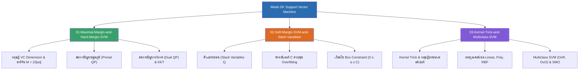

# Week 09 — Support Vector Machine & Kernel Methods (MOC)

arrow_back สัปดาห์ก่อนหน้า: [[Week08-MOC|MOC สัปดาห์ 08]]

## check_circle เช็คลิสต์ก่อนเข้าเรียน

- [ ] ทำความเข้าใจแนวคิด Maximal Margin และที่มาของสูตรระยะห่าง $\frac{2}{\|\mathbf{w}\|}$ — ดู [[01-Maximal-Margin-and-Hard-Margin-SVM]]
- [ ] ไล่สมการปัญหาปฐมภูมิ (Primal) สู่ปัญหาทวิภาค (Dual) และบทบาทของ Support Vectors — ดู [[01-Maximal-Margin-and-Hard-Margin-SVM]]
- [ ] เข้าใจหน้าที่ของตัวแปรหย่อน ($\xi_i$) และการจูนพารามิเตอร์ $C$ ใน Soft-Margin — ดู [[02-Soft-Margin-SVM-and-Slack-Variables]]
- [ ] ทำความเข้าใจหลักการ Kernel Trick (Mercer's Theorem) และการประยุกต์ใช้ RBF Kernel — ดู [[03-Kernel-Trick-and-Multiclass-SVM]]

## assignment ภาพรวมสัปดาห์ 09 (สรุปย่อ)

สัปดาห์ที่ 9 ศึกษาโมเดลการจำแนกประเภทที่มีรากฐานทฤษฎีการเรียนรู้เชิงสถิติ (Statistical Learning Theory) แข็งแกร่งที่สุด:
1. **การหาขอบเขตสูงสุด (Maximal Margin & Hard-Margin):** ทฤษฎีมิติ VC, การกำหนดสมการระนาบมาตรฐาน (Canonical Hyperplane), การลดทอนขนาด $\|\mathbf{w}\|$, การแก้ปัญหา Quadratic Programming ด้วยตัวคูณลากรองจ์, และเงื่อนไข KKT ที่พิสูจน์ว่ามีเพียง Support Vectors เท่านั้นที่มีผลต่อระนาบ
2. **การผ่อนปรนด้วยซอฟต์มาร์จิน (Soft-Margin SVM):** การรับมือกับสัญญาณรบกวนด้วยตัวแปรหย่อน (Slack Variables $\xi_i$), การควบคุม Overfitting ด้วยพารามิเตอร์ $C$, และเงื่อนไข Box Constraint บนตัวแปรทวิภาค
3. **เคล็ดวิธีเคอร์เนลและการจำแนกหลายคลาส (Kernels & Multiclass):** การแปลงพิกัดสู่มิติสูงโดยไม่ต้องคำนวณเวกเตอร์จริงด้วย Kernel Trick, การใช้งานเคอร์เนล Polynomial และ Gaussian RBF, กลยุทธ์ One-vs-Rest / One-vs-One / DAG-SVM, และอัลกอริทึมการคำนวณความเร็วสูง SMO

## map แผนที่หัวข้อสัปดาห์ 09

## collections_bookmark โน้ตรายหัวข้อ

| หัวข้อ | เนื้อหาหลัก | หน้าสไลด์ |
| :--- | :--- | :--- |
| [[01-Maximal-Margin-and-Hard-Margin-SVM]] | ทฤษฎีมาร์จินสูงสุด, การพิสูจน์สูตรระยะห่าง $\frac{2}{\|\mathbf{w}\|}$, ฟังก์ชันลากรองเจียน, ปัญหาทวิภาค, และบทบาทของ Support Vectors | สไลด์ 1–18 |
| [[02-Soft-Margin-SVM-and-Slack-Variables]] | การจัดการข้อมูลที่มี Noise, ตัวแปรหย่อน $\xi_i$, การควบคุมความกว้างมาร์จินด้วยพารามิเตอร์ $C$, และเงื่อนไข Box Constraint | สไลด์ 19–24 |
| [[03-Kernel-Trick-and-Multiclass-SVM]] | การแปลงพิกัดไม่เป็นเชิงเส้น, ทฤษฎีบทของเมอร์เซอร์, สูตรเคอร์เนลยอดนิยม (Polynomial, RBF), การจัดการหลายคลาส (OvR, OvO, DAG), และอัลกอริทึม SMO | สไลด์ 25–40 |

> [!tip] เคล็ดลับการจำสำหรับข้อสอบสัปดาห์ที่ 09
> - **ทำไมต้องกลับด้านจาก $\max \frac{2}{\|\mathbf{w}\|}$ เป็น $\min \frac{1}{2}\|\mathbf{w}\|^2$?** เพราะฟังก์ชัน $\frac{1}{2}\|\mathbf{w}\|^2$ เป็นฟังก์ชันคอนเวกซ์ (Convex Quadratic) ที่มีจุดต่ำสุดสัมบูรณ์เพียงจุดเดียว ทำให้สามารถใช้ตัวแก้ Quadratic Programming หาคำตอบที่ดีที่สุดได้เสมอโดยไม่ติด Local Optima
> - **ความหมายของ Support Vectors:** จุดที่มีค่า $\alpha_i > 0$ มีเพียง Support Vectors เท่านั้น จุดอื่น ๆ จะมี $\alpha_i = 0$ ทั้งสิ้น

<!-- สัปดาห์ที่ 9 เป็นสัปดาห์สุดท้ายของชุดสไลด์บรรยายในรอบนี้ -->
